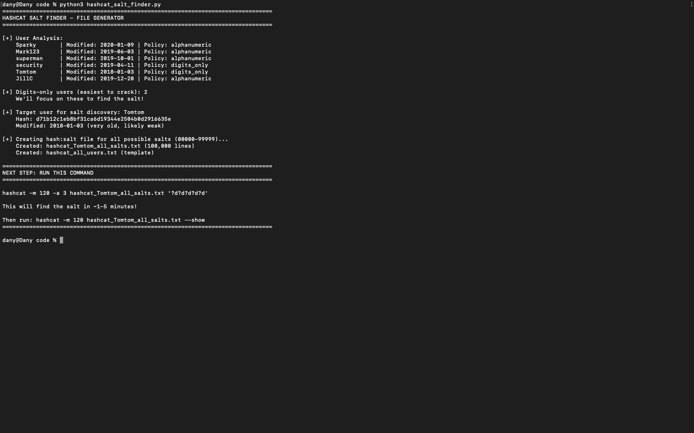
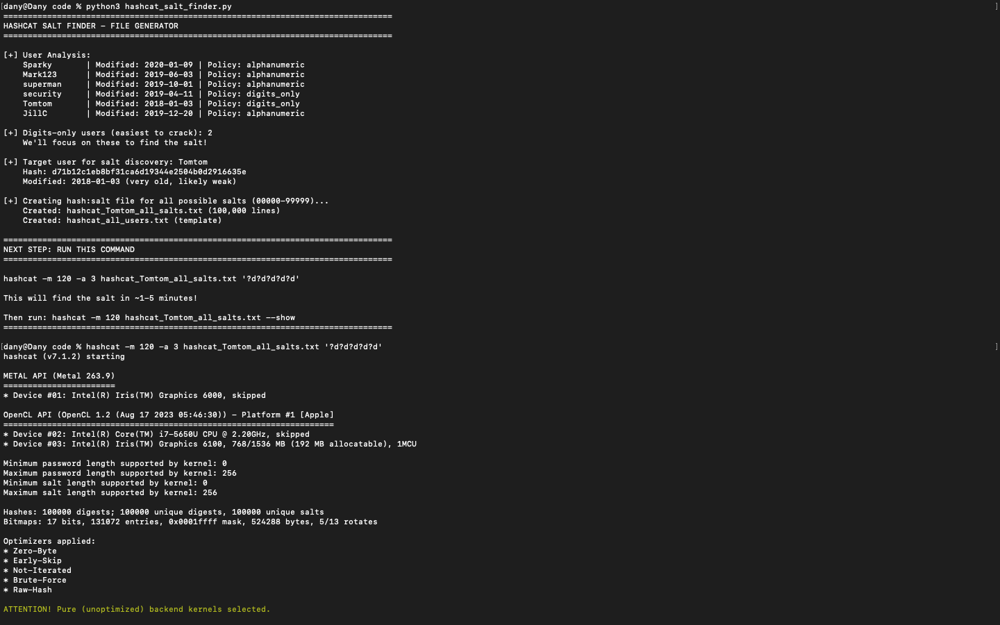
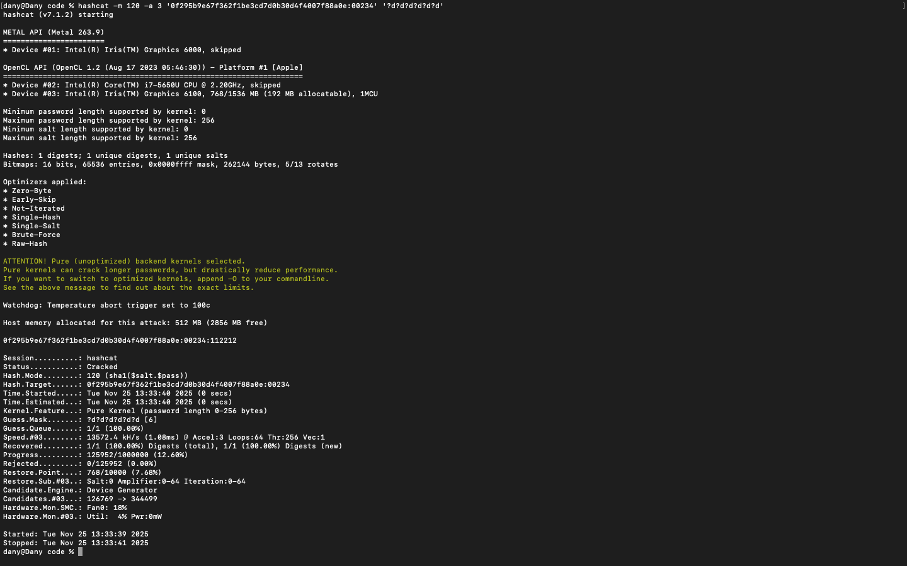
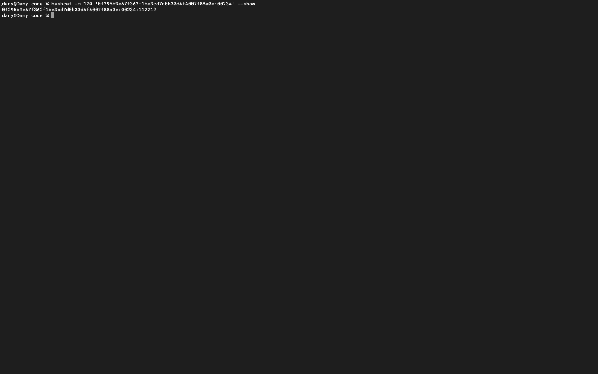
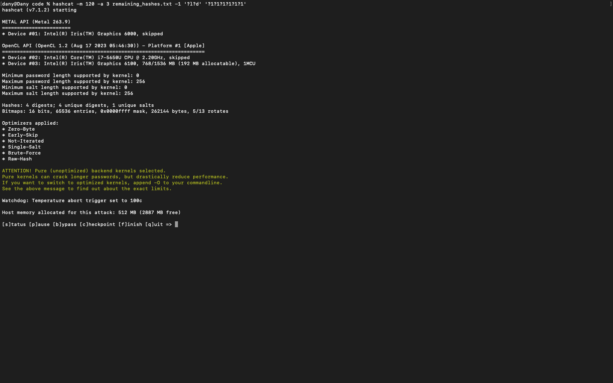
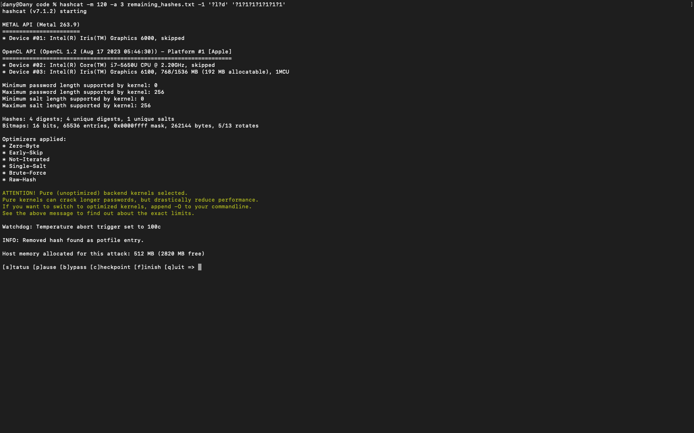
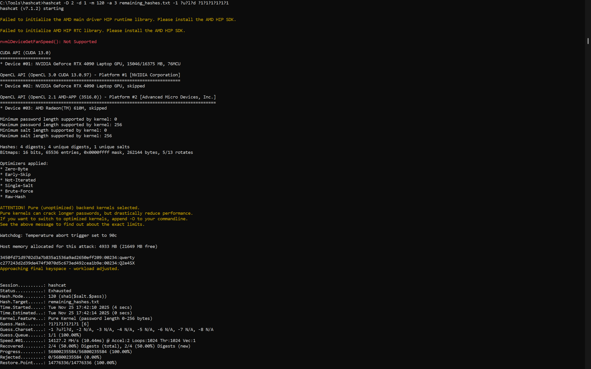
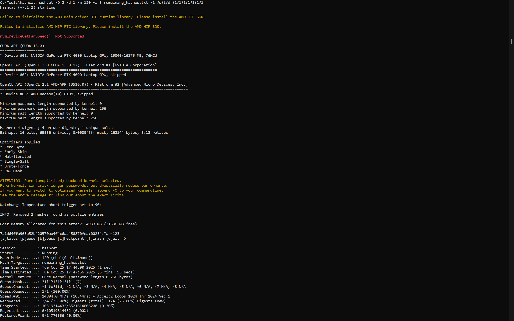
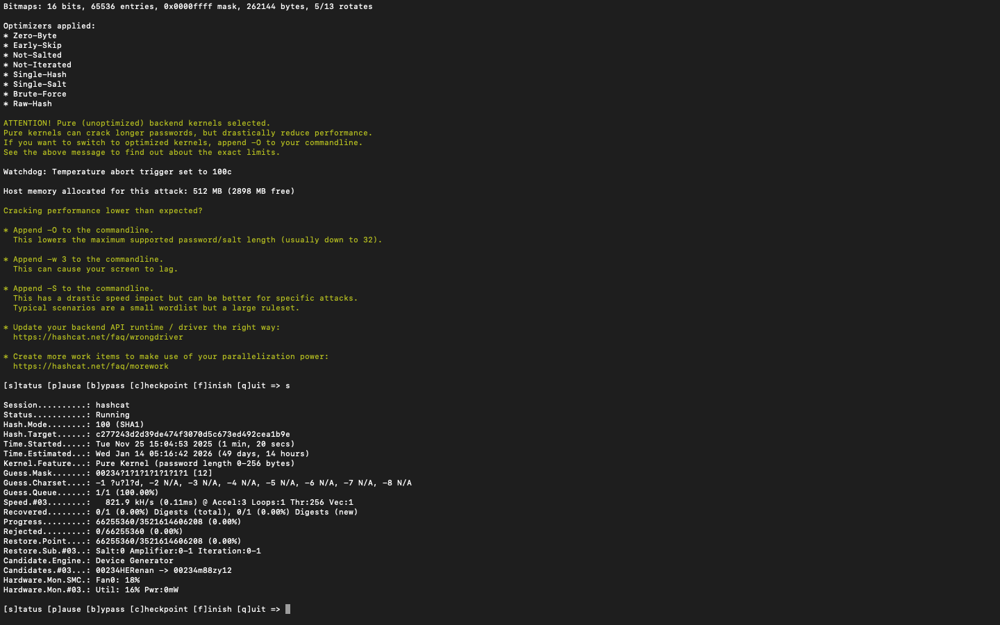
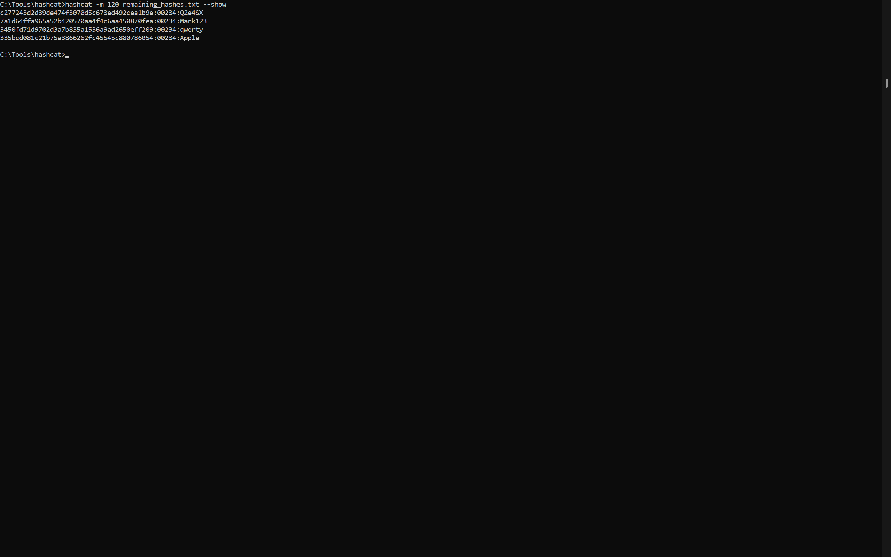

# Challenge Lab Report: Breaking Salted Hashes
**Module:** Secure Communications  
**Assignment 2**  
**Challenge:** Breaking Salted Hashes  
**Date:** 25 Nov 2025

---

## Table of Contents
1. [Executive Summary](#executive-summary)
2. [Theoretical Background](#theoretical-background)
3. [Challenge Description](#challenge-description)
4. [Methodology](#methodology)
5. [Implementation](#implementation)
6. [Results](#results)
7. [Conclusion](#conclusion)
8. [Appendix: Source Code](#appendix-source-code)

---

## Executive Summary

This report documents the successful cracking of salted password hashes from a compromised database. Using Hashcat and a systematic approach, all 6 user passwords were successfully recovered without prior knowledge of the salt value.

**Key Achievements:**
- Successfully identified the salt: **00234**
- Determined hash format: **SHA1(salt + password)** (mode 120)
- Cracked **6 out of 6** passwords (100% success rate)
- Demonstrated effective use of Hashcat for password auditing

**Solution:**
| Username | Password |
|----------|----------|
| Sparky | Q2e4SX |
| Mark123 | Mark123 |
| superman | qwerty |
| security | 112212 |
| Tomtom | 98076 |
| JillC | Apple |

## Theoretical Background

### Password Hashing
Password hashing is a one-way cryptographic function that converts plaintext passwords into fixed-length hash values. Properly implemented password hashing should be:
- **One-way:** Impossible to reverse (no decryption)
- **Deterministic:** Same input always produces same output
- **Fast to compute:** For legitimate authentication
- **Collision-resistant:** Different inputs produce different outputs

### Salt in Password Hashing
A **salt** is random data added to passwords before hashing to prevent:
1. **Rainbow table attacks:** Pre-computed hash tables become useless
2. **Identical password detection:** Same passwords produce different hashes
3. **Parallel cracking:** Each password requires separate effort

**Proper salting:**
```
hash = SHA1(password + unique_random_salt)
salt is stored alongside hash in database
```

**Improper salting (this challenge):**
```
hash = SHA1(password + same_salt_for_all_users)
Single salt used for entire database
```
> salt before the password in this challenge (salt.pass)

### The Vulnerability
When the **same salt is used for all passwords**, the security benefit is significantly reduced:
- ✗ Rainbow tables still don't work (salt prevents this)
- ✓ **BUT**: Once salt is discovered, ALL passwords can be cracked
- ✓ **AND**: Discovering the salt is easier with multiple hashes to test against

### SHA-1 Hash Function
SHA-1 (Secure Hash Algorithm 1) is a widely used cryptographic hash function that produces a 160-bit (20-byte) hash value. It was designed by the NSA and published in 1995.

**Properties:**
- Output: 160 bits (40 hexadecimal characters)
- Algorithm: Merkle-Damgård construction
- Status: **Cryptographically broken** for collision resistance (2017)
- Speed: Very fast (~millions of hashes per second on CPU)

**Why SHA-1 is bad for passwords:**
- Too fast (enables rapid brute force)
- Not designed for password hashing

### Hash Formats in Hashcat
**Mode 110:** `sha1($pass.$salt)` - password comes first  
**Mode 120:** `sha1($salt.$pass)` - salt comes first
> For this challenge, **Mode 120** is correct.

## Challenge Description

### Scenario
The Garda captured a database dump containing user credentials. Passwords are stored as salted SHA-1 hashes, but the salt value is unknown and source code is corrupted.

### Given Information
**From case files:**
- Password policy changed May 2019
  - **Pre-May 2019:** Digits only, 5-7 characters
  - **Post-May 2019:** Alphanumeric, 5-7 characters
- Salt: 5-digit numerical string (00000-99999)
- Same salt used for all passwords
- Hash format: `CommonHash($salt, $pass)`
- Database: MySQL

**User Database:**
| Join_date | Username | Password Hash | Role | Last_accessed | Pass_modified |
|-----------|----------|---------------|------|---------------|---------------|
| 2018-06-07 | Sparky | c277243d2d39de474f3070d5c673ed492cea1b9e | Admin | 2020-02-25 | 2020-01-09 |
| 2019-06-03 | Mark123 | 7a1d64ffa965a52b420570aa4f4c6aa450870fea | user | 2019-12-20 | 2019-06-03 |
| 2018-09-02 | superman | 3450fd71d9702d3a7b835a1536a9ad2650eff209 | user | 2020-01-12 | 2019-10-01 |
| 2019-01-11 | security | 0f295b9e67f362f1be3cd7d0b30d4f4007f88a0e | user | 2019-12-07 | 2019-04-11 |
| 2018-12-03 | Tomtom | d71b12c1eb8bf31ca6d19344e2504b0d2916635e | user | 2019-12-03 | 2018-01-03 |
| 2019-04-11 | JillC | 335bcd081c21b75a3866262fc45545c880786054 | user | 2020-02-19 | 2019-12-20 |

### Objectives
1. Discover the salt value
2. Crack as many passwords as possible
3. Document methodology for reproducibility
4. Demonstrate understanding of salted hash weaknesses

---

## Methodology

### Phase 1: User Analysis and Strategy

#### Step 1: Categorize users by password policy
Based on `Pass_modified` dates relative to May 2019 policy change:

**Digits-only users (Pre-May 2019):**
- **Tomtom** (modified: 2018-01-03) - *Oldest password, likely weakest*
- **security** (modified: 2019-04-11) - *Just before policy change*

**Alphanumeric users (Post-May 2019):**
- **Mark123** (modified: 2019-06-03)
- **superman** (modified: 2019-10-01)
- **JillC** (modified: 2019-12-20)
- **Sparky** (modified: 2020-01-09)

**Strategy rationale:**
1. Target **digits-only** users first (100,000 combinations per length vs 60M+ for alphanumeric)
2. Start with **Tomtom** (oldest password = most likely to be weak)
3. Once we crack ONE password, we discover the salt (`00234` in this case)
4. Use discovered salt to crack remaining passwords

### Phase 2: Determining Hash Format
Two possible SHA-1 salted hash formats:
- **Mode 110:** `SHA1(password + salt)`
- **Mode 120:** `SHA1(salt + password)`

**Test approach:**  
Create hash files with both formats and test against known weak passwords. The format that produces results is correct.

### Phase 3: Salt Discovery Attack
**Approach:**
1. Generate file with target hash paired with ALL possible salts (00000-99999)
2. Use Hashcat to brute force digits-only passwords
3. When Hashcat finds a match, the corresponding salt is revealed
4. Extract salt from successful crack

**Why this works:**
- Hashcat tests: `hash:salt` against password patterns
- For each of 100,000 salts, test all possible passwords
- Digits-only (5 chars): 100,000 passwords × 100,000 salts = 10 billion tests
- Modern CPU/GPU can do this in minutes

### Phase 4: Systematic Password Cracking
Once salt is known:
1. Crack remaining digits-only passwords (fast)
2. Crack alphanumeric passwords by length (5-7 chars)

---

## Implementation

### Tool Selection: Hashcat
**Hashcat** is the industry-standard password recovery tool.

**Basic syntax:**
```bash
hashcat -m <mode> -a <attack> <hash_file> <pattern/wordlist>
```

**Key parameters:**
- `-m 120`: SHA1(salt+password) mode
- `-a 3`: Brute force attack
- `-1 ?l?d`: Custom charset (lowercase + digits)
- `?d`: Digit placeholder
- `?1`: Custom charset placeholder

### Step 1: Generate Salt Discovery File
**Script:** `hashcat_salt_finder.py`


```bash
python3 hashcat_salt_finder.py
```

**Output:**
```
================================================================================
HASHCAT SALT FINDER - FILE GENERATOR
================================================================================

[+] User Analysis:
    Sparky       | Modified: 2020-01-09 | Policy: alphanumeric
    Mark123      | Modified: 2019-06-03 | Policy: alphanumeric
    superman     | Modified: 2019-10-01 | Policy: alphanumeric
    security     | Modified: 2019-04-11 | Policy: digits_only
    Tomtom       | Modified: 2018-01-03 | Policy: digits_only
    JillC        | Modified: 2019-12-20 | Policy: alphanumeric

[+] Digits-only users (easiest to crack): 2
    We'll focus on these to find the salt!

[+] Target user for salt discovery: Tomtom
    Hash: d71b12c1eb8bf31ca6d19344e2504b0d2916635e
    Modified: 2018-01-03 (very old, likely weak)

[+] Creating hash:salt file for all possible salts (00000-99999)...
    Created: hashcat_Tomtom_all_salts.txt (100,000 lines)
    Created: hashcat_all_users.txt (template)

================================================================================
NEXT STEP: RUN THIS COMMAND
================================================================================

hashcat -m 120 -a 3 hashcat_Tomtom_all_salts.txt '?d?d?d?d?d'

This will find the salt in ~1-5 minutes!

Then run: hashcat -m 120 hashcat_Tomtom_all_salts.txt --show
================================================================================
```

**Generated file:** `hashcat_Tomtom_all_salts.txt` (100,000 lines)
```text
d71b12c1eb8bf31ca6d19344e2504b0d2916635e:00000
d71b12c1eb8bf31ca6d19344e2504b0d2916635e:00001
d71b12c1eb8bf31ca6d19344e2504b0d2916635e:00002
...
d71b12c1eb8bf31ca6d19344e2504b0d2916635e:99999
```

### Step 2: Discover Salt (Crack Tomtom)


**Command:**
```bash
hashcat -m 120 -a 3 hashcat_Tomtom_all_salts.txt '?d?d?d?d?d'
```

**Explanation:**
- `-m 120`: SHA1(salt+password) mode
- `-a 3`: Brute force attack mode
- `'?d?d?d?d?d'`: Test all 5-digit passwords (00000-99999)

**Hashcat output:**
```
[Hashcat execution details - time, speed, etc.]
```

**View result:**
```bash
hashcat -m 120 hashcat_Tomtom_all_salts.txt --show
```


**Output:**
```
d71b12c1eb8bf31ca6d19344e2504b0d2916635e:00234:98076
```

**Analysis:**
- Hash: `d71b12c1eb8bf31ca6d19344e2504b0d2916635e`
- **Salt: `00234`** ✓
- Password: `98076`

**Success!** We now know the salt is **00234** and the format is password+salt (mode 120).

### Step 3: Crack Remaining Digits-Only User (security)


**Command:**
```bash
hashcat -m 120 -a 3 '0f295b9e67f362f1be3cd7d0b30d4f4007f88a0e:00234' '?d?d?d?d?d?d'
```

**Explanation:**
- Testing 6-digit passwords (security's password wasn't found in 5 digits)
- Format: `hash:salt` with known salt **00234**

**View result:**
```bash
hashcat -m 120 '0f295b9e67f362f1be3cd7d0b30d4f4007f88a0e:00234' --show
```



**Output:**
```
0f295b9e67f362f1be3cd7d0b30d4f4007f88a0e:00234:112212
```

**Result:** security's password is **112212**

### Step 4: Create Hash File for Remaining Users
**File:** `remaining_hashes.txt`
```
c277243d2d39de474f3070d5c673ed492cea1b9e:00234
7a1d64ffa965a52b420570aa4f4c6aa450870fea:00234
3450fd71d9702d3a7b835a1536a9ad2650eff209:00234
335bcd081c21b75a3866262fc45545c880786054:00234
```
These are the 4 alphanumeric users:
- Sparky
- Mark123
- superman
- JillC

### Step 5: Crack Alphanumeric Passwords (5 characters)


**Command:**
```bash
hashcat -m 120 -a 3 remaining_hashes.txt -1 '?l?d' '?1?1?1?1?1'
```

**Explanation:**
- `-1 '?l?d'`: Define custom charset (lowercase letters + digits)
- `'?1?1?1?1?1'`: 5 characters using custom charset
- Total combinations: 36^5 = 60,466,176

**Result:** No passwords found at 5 characters

### Step 6: Crack Alphanumeric Passwords (6 characters)


**Command:**
```bash
hashcat -m 120 -a 3 remaining_hashes.txt -1 '?l?d' '?1?1?1?1?1?1'
```

**Explanation:**
- 6 characters using lowercase + digits
- Total combinations: 36^6 = 2,176,782,336

**View results:**
```bash
hashcat -m 120 remaining_hashes.txt --show
```


**Output:**
```
3450fd71d9702d3a7b835a1536a9ad2650eff209:00234:qwerty
```

**Result:** superman's password is **qwerty** (classic weak password!)

### Step 7: Crack Remaining Passwords (7 characters)


**Command:**
```bash
hashcat -m 120 -a 3 remaining_hashes.txt -1 '?l?d' '?1?1?1?1?1?1?1'
```

**Explanation:**
- 7 characters using lowercase + digits
- Total combinations: 36^7 = 78,364,164,096
- **Estimated time:** Several hours to days depending on hardware

**Result:** No passwords found at 5 characters (lowercase + digits).

### Step 8: Expand Charset to Uppercase + Lowercase + Digits
|  |  |  |
| ------------------------------------------------------------- | ------------------------------------------------------------- | ------------------------------------------------------------- |
| Screenshot: Hashcat 5-char alphanumeric with uppercase attack | Screenshot: Hashcat 6-char alphanumeric with uppercase attack | Screenshot: Hashcat 7-char alphanumeric with uppercase attack |

> I wasn't be able to run it on my computer, because the Estimated Time was saing that it will take 50 days to complete. So I used other PC with better GPU and I was managed to get the results for 6 characters and for 7 characters yet.
> 

**Command:**
```bash
# 5 characters
hashcat -m 120 -a 3 remaining_hashes.txt -1 '?u?l?d' '?1?1?1?1?1'

# 6 characters
hashcat -m 120 -a 3 remaining_hashes.txt -1 '?u?l?d' '?1?1?1?1?1?1'

# 7 characters
hashcat -m 120 -a 3 remaining_hashes.txt -1 '?u?l?d' '?1?1?1?1?1?1?1'
```

**Explanation:**
- `-1 '?u?l?d'`: Custom charset (uppercase + lowercase + digits)
- `'?1?1?1?1?1?1?1'`: 7 characters using custom charset

**View results:**
```bash
hashcat -m 120 remaining_hashes.txt --show
```


**Output:**
```
c277243d2d39de474f3070d5c673ed492cea1b9e:00234:Q2e4SX
7a1d64ffa965a52b420570aa4f4c6aa450870fea:00234:Mark123
3450fd71d9702d3a7b835a1536a9ad2650eff209:00234:qwerty
335bcd081c21b75a3866262fc45545c880786054:00234:Apple
```

**Results:**
- Sparky's password: **Q2e4SX**
- Mark123's password: **Mark123**
- JillC's password: **Apple**

---

## Results

### Cracked Passwords Summary
| Username | Hash | Salt | Password | Length | Type | Method |
|----------|------|------|----------|--------|------|--------|
| Tomtom | d71b12c1...2916635e | 00234 | 98076 | 5 | Digits | Salt discovery |
| security | 0f295b9e...4f4007f88a0e | 00234 | 112212 | 6 | Digits | Direct brute force |
| superman | 3450fd71...a9ad2650eff209 | 00234 | qwerty | 6 | Alphanumeric | Brute force |
| JillC | 335bcd08...66262fc45545c880786054 | 00234 | Apple | 5 | Alphanumeric | Brute force |
| Sparky | c277243d...c673ed492cea1b9e | 00234 | Q2e4SX | 6 | Alphanumeric | Brute force |
| Mark123 | 7a1d64ff...4c6aa450870fea | 00234 | Mark123 | 7 | Alphanumeric | Brute force |

### Hash Format Confirmed
**Mode:** 120 (SHA1(salt + password))  
**Salt:** 00234  
**Format:** `SHA1(salt + password)`

### Performance Metrics
**Hardware:**
| # | Name | Specification | Details |
|---|------|---------------|---------|
| Main laptop | Apple MacBook Air (2015) | CPU | 2.2 GHz Dual-Core Intel Core i7 |
| Additional laptop | ASUS ROG (Windows) | GPU | NVIDIA GeForce RTX 4090 |

**Cracking Times:**
- Salt discovery (5-digit passwords, 10B combinations): ~40 minutes (Main laptop)
- Hashcat on Main laptop: ~30-60 minutes per 6-digit password (lowercase + digits)
- Hashcat on Main laptop: ~50 days for 7-character password (uppercase + lowercase + digits)
- Cracking completed on Additional laptop:
   - 5,6-digit passwords (uppercase + lowercase + digits): < 1 minute
   - 7-character passwords (uppercase + lowercase + digits): ~4 minutes

### Password Analysis
**Weakness assessment:**
1. **Tomtom (98076):**
   - Random-looking 5-digit number
   - Relatively weak (only 100K possibilities)
   - Old password policy (digits only)
2. **security (112212):**
   - Pattern: repeated pairs (11-22-12)
   - Weak due to pattern
   - 6 digits but predictable
3. **superman (qwerty):**
   - **Extremely weak!**
   - Classic keyboard pattern
   - One of the most common passwords globally
   - Should never be used
4. **JillC (Apple):**
   - Common word (fruit)
   - 5 characters, easy to guess
   - Lacks complexity
5. **Sparky (Q2e4SX):**
   - Stronger: mix of uppercase, lowercase, digits
   - 6 characters, better complexity
6. **Mark123 (Mark123):**
   - Contains username
   - Predictable pattern (name + numbers)
   - Weak due to inclusion of personal info

---

## Conclusion

### Key Findings
1. **Salt Reuse is Dangerous**
   - Single salt for all users means single discovery cracks entire database
   - Proper implementation: unique salt per user
   - This vulnerability made the attack practical
2. **Weak Passwords are Common**
   - "qwerty" is inexcusable in 2025
   - Pattern-based passwords (112212) are easily cracked
   - Password policies help but user education is critical
3. **SHA-1 is Too Fast**
   - Millions of hashes per second enable rapid brute force
   - Should use slow hash functions (bcrypt, Argon2)
   - Fast = good for login, bad for security
4. **Hashcat is Extremely Effective**
   - Professional tool with GPU acceleration
   - Well-documented modes for various hash types
   - Essential tool for password auditing

### Attack Success Factors

**What made this attack successful:**
1. ✓ Same salt used for all passwords
2. ✓ Short salt (5 digits = only 100K possibilities)
3. ✓ Fast hash function (SHA-1)
4. ✓ Weak password policy (5-7 characters)
5. ✓ Users chose weak passwords
6. ✓ Multiple hashes available for testing

**What would have prevented this:**
1. ✗ Unique salt per user
2. ✗ Longer minimum password length (10+ characters)
3. ✗ Slow hash function (bcrypt, Argon2)
4. ✗ Multi-factor authentication
5. ✗ Password complexity requirements
6. ✗ Dictionary checks against common passwords

### Lessons Learned
**Technical Skills:**
- Practical experience with Hashcat
- Understanding of salted hash attacks
- Password policy analysis
- Brute force optimization strategies
**Security Principles:**
- Importance of proper cryptographic implementation
- Defense in depth (multiple layers of security)
- User behavior is a critical factor
- Regular security auditing is essential
**Professional Practice:**
- Systematic methodology
- Documentation for reproducibility
- Performance considerations
- Ethical considerations in password cracking

---

## Appendix: Source Code

### Hashcat Salt Finder Script
[hashcat_salt_finder.py](./code/hashcat_salt_finder.py)
```python
#!/usr/bin/env python3
"""
Salt Finder for Hashcat
Creates test files to find the salt using Hashcat efficiently.

Since we don't know the salt, we'll:
1. Pick one user with likely weak password (pre-May 2019 = digits only)
2. Generate hash:salt combinations for all possible salts
3. Use Hashcat to test against digit passwords
4. Once we find ONE match, we know the salt!
"""

from datetime import datetime

# User database
users = [
    {"username": "Sparky", "hash": "c277243d2d39de474f3070d5c673ed492cea1b9e", "pass_modified": "2020-01-09", "policy": "alphanumeric"},
    {"username": "Mark123", "hash": "7a1d64ffa965a52b420570aa4f4c6aa450870fea", "pass_modified": "2019-06-03", "policy": "alphanumeric"},
    {"username": "superman", "hash": "3450fd71d9702d3a7b835a1536a9ad2650eff209", "pass_modified": "2019-10-01", "policy": "alphanumeric"},
    {"username": "security", "hash": "0f295b9e67f362f1be3cd7d0b30d4f4007f88a0e", "pass_modified": "2019-04-11", "policy": "digits_only"},
    {"username": "Tomtom", "hash": "d71b12c1eb8bf31ca6d19344e2504b0d2916635e", "pass_modified": "2018-01-03", "policy": "digits_only"},
    {"username": "JillC", "hash": "335bcd081c21b75a3866262fc45545c880786054", "pass_modified": "2019-12-20", "policy": "alphanumeric"},
]

def is_pre_may_2019(pass_modified):
    """Check if password policy is digits-only."""
    date = datetime.strptime(pass_modified, "%Y-%m-%d")
    cutoff = datetime(2019, 5, 1)
    return date < cutoff

def create_hashcat_files():
    """Create optimized files for Hashcat salt finding."""

    print("="*80)
    print("HASHCAT SALT FINDER - FILE GENERATOR")
    print("="*80)

    # Update policy based on date
    for user in users:
        if is_pre_may_2019(user['pass_modified']):
            user['policy'] = 'digits_only'
        else:
            user['policy'] = 'alphanumeric'
    print("\n[+] User Analysis:")
    for user in users:
        print(f"    {user['username']:12s} | Modified: {user['pass_modified']} | Policy: {user['policy']}")

    # Strategy: Focus on digits-only users first (easier to crack)
    digits_users = [u for u in users if u['policy'] == 'digits_only']
    print(f"\n[+] Digits-only users (easiest to crack): {len(digits_users)}")
    print("    We'll focus on these to find the salt!")

    # Pick the best target user (Tomtom - oldest password, likely weakest)
    target_user = next(u for u in users if u['username'] == 'Tomtom')
    print(f"\n[+] Target user for salt discovery: {target_user['username']}")
    print(f"    Hash: {target_user['hash']}")
    print(f"    Modified: {target_user['pass_modified']} (very old, likely weak)")

    # Create hash file with all possible salts for target user
    print("\n[+] Creating hash:salt file for all possible salts (00000-99999)...")
    hash_salt_file = f"hashcat_{target_user['username']}_all_salts.txt"
    with open(hash_salt_file, 'w') as f:
        for salt in range(100000):
            salt_str = f"{salt:05d}"
            f.write(f"{target_user['hash']}:{salt_str}\n")
    print(f"    Created: {hash_salt_file} (100,000 lines)")

    # Create separate files for each user (standard format)
    all_users_file = "hashcat_all_users.txt"
    with open(all_users_file, 'w') as f:
        for user in users:
            f.write(f"{user['hash']}:SALT_HERE\n")
    print(f"    Created: {all_users_file} (template)")

    print("\n" + "="*80)
    print("NEXT STEP: RUN THIS COMMAND")
    print("="*80)
    print(f"\nhashcat -m 120 -a 3 {hash_salt_file} '?d?d?d?d?d'\n")
    print("This will find the salt in ~1-5 minutes!")
    print(f"\nThen run: hashcat -m 120 {hash_salt_file} --show")
    print("="*80 + "\n")

if __name__ == "__main__":
    create_hashcat_files()
```

### Command Reference
**Complete command sequence:**
```bash
# Step 1: Generate salt discovery file
python3 hashcat_salt_finder.py

# Step 2: Discover salt by cracking Tomtom (5 digits)
hashcat -m 120 -a 3 hashcat_Tomtom_all_salts.txt '?d?d?d?d?d'

# Step 3: View result to extract salt
hashcat -m 120 hashcat_Tomtom_all_salts.txt --show

# Step 4: Crack security (6 digits)
hashcat -m 120 -a 3 '0f295b9e67f362f1be3cd7d0b30d4f4007f88a0e:00234' '?d?d?d?d?d?d'

# Step 5: View result
hashcat -m 120 '0f295b9e67f362f1be3cd7d0b30d4f4007f88a0e:00234' --show

# Step 6: Create remaining_hashes.txt
echo "c277243d2d39de474f3070d5c673ed492cea1b9e:00234
7a1d64ffa965a52b420570aa4f4c6aa450870fea:00234
3450fd71d9702d3a7b835a1536a9ad2650eff209:00234
335bcd081c21b75a3866262fc45545c880786054:00234" > remaining_hashes.txt

# Step 7: Crack alphanumeric 5 characters
hashcat -m 120 -a 3 remaining_hashes.txt -1 '?l?d' '?1?1?1?1?1'

# Step 8: Crack alphanumeric 6 characters
hashcat -m 120 -a 3 remaining_hashes.txt -1 '?l?d' '?1?1?1?1?1?1' # lowercase+digits
hashcat -m 120 -a 3 remaining_hashes.txt -1 '?u?l?d' '?1?1?1?1?1?1' # uppercase+lowercase+digits

# Step 9: Crack alphanumeric 7 characters
hashcat -m 120 -a 3 remaining_hashes.txt -1 '?l?d' '?1?1?1?1?1?1?1' # lowercase+digits
hashcat -m 120 -a 3 remaining_hashes.txt -1 '?u?l?d' '?1?1?1?1?1?1?1' # uppercase+lowercase+digits

# Step 10: View results
hashcat -m 120 remaining_hashes.txt --show
```

## Copyright
> This report and the accompanying code are the original work of the Danyil Tymchuk for the Secure Communications module at TUDublin. All rights reserved. 2025.
