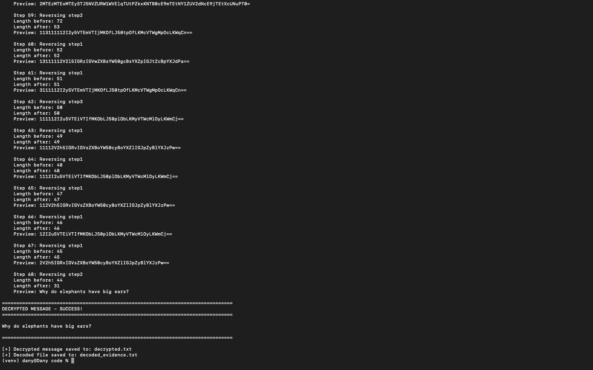

# Challenge Lab Report: Encrypted Evidence
**Module:** Secure Communications  
**Assignment 2**  
**Challenge:** Encrypted Evidence  
**Date:** 25 Nov 2025

---

## Result of the Challenge
| **Decrypted Message** | `"Why do elephants have big ears?"` |
|-----------------------|-------------------------------------|

**Number of Encoding Iterations:** *68*
> *intercepted.txt → decrypted.txt*

---

## Table of Contents
1. [Executive Summary](#executive-summary)
2. [Challenge Description](#challenge-description)
3. [Analysis of the Encryption Program](#analysis-of-the-encryption-program)
4. [Methodology](#methodology)
5. [Implementation](#implementation)
6. [Results](#results)
7. [Conclusion](#conclusion)
8. [Appendix: Source Code](#appendix-source-code)

---

## Executive Summary

This report documents the successful decryption of an intercepted message that was encoded using a custom multi-step encryption program. Through reverse-engineering of a partially damaged Python encryption script, the original plaintext message was recovered without any prior knowledge of the encryption key or the number of encoding iterations applied.

**Key Achievement:**
- Successfully reverse-engineered the encryption algorithm
- Decoded the intercepted message: **"Why do elephants have big ears?"**
- Developed automated decryption tool

**Technical Approach:**
- Analyzed damaged source code to understand encryption logic
- Identified three distinct encoding steps
- Reversed the encoding process in correct sequence
- Implemented Python-based decryption tool

## Challenge Description

### Scenario
The Garda intercepted an encrypted message from a suspect's computer just before seizure. The forensics team recovered fragments of the encryption program but are unable to decrypt the message. They require assistance to:
1. Analyze the partially damaged encryption code
2. Understand the encoding methodology
3. Decrypt the intercepted ciphertext
4. Recover the original message

### Provided Materials
**1. encryptme.py** - Partially damaged encryption program
- Written in Python
- Contains three encoding functions (step1, step2, step3)
- Missing data: original secret message and iteration count
- Damaged sections marked with `&&&&`
**2. intercepted.txt** - Encrypted ciphertext
- Size: ~7,900 characters
- Format: Unknown (to be determined)
- No metadata or headers

### Constraints
- Cannot brute-force or guess the original message
- Must work with damaged/incomplete source code
- Solution must be reproducible and documented
- Any reasonable decryption technique is acceptable

---

## Analysis of the Encryption Program

### Structure Overview
The encryption program (`encryptme.py`) contains:
```python
secret = '&&&&&&&&&&&&&&'  # Unknown original message
secret_encoding = ['step1', 'step2', 'step3']

def step1(s): ...   # Character substitution
def step2(s): ...   # Base64 encoding
def step3(s): ...   # Caesar cipher

def make_secret(plain, count): ...  # Main encryption function
```

### Step 1: Character Substitution (Atbash-like Cipher)
**Code:**
```python
def step1(s):
    _step1 = string.maketrans(
        "zyxwvutsrqponZYXWVUTSRQPONmlkjihgfedcbaMLKJIHGFEDCBA",
        "mlkjihgfedcbaMLKJIHGFEDCBAzyxwvutsrqponZYXWVUTSRQPON"
    )
    return string.translate(s, _step1)
```
**Analysis:**
- **Type:** Substitution cipher (modified Atbash)
- **Mechanism:** Maps each character to another character
- **Mapping:**
  ```
  From: zyxwvutsrqponZYXWVUTSRQPONmlkjihgfedcbaMLKJIHGFEDCBA
  To:   mlkjihgfedcbaMLKJIHGFEDCBAzyxwvutsrqponZYXWVUTSRQPON
  ```
- **Key Property:** **Symmetric** - applying twice returns to original
- **Example:**
  ```
  'a' → 'M'
  'b' → 'L'
  'z' → 'm'
  ```
**Reverse Operation:**
- Apply the same transformation again (self-inverse)
- `reverse_step1(s) = step1(s)`

### Step 2: Base64 Encoding
**Code:**
```python
def step2(s): 
    return b64encode(s)
```
**Analysis:**
- **Type:** Base64 encoding (standard RFC 4648)
- **Purpose:** Converts binary/text data to ASCII-safe format
- **Characteristics:**
  - Uses charset: `A-Z`, `a-z`, `0-9`, `+`, `/`
  - Padding with `=` for alignment
  - Output length: ~133% of input length
- **Not encryption:** Publicly reversible encoding
**Reverse Operation:**
```python
reverse_step2(s) = b64decode(s)
```

### Step 3: Caesar Cipher (ROT-4)
**Code:**
```python
def step3(plaintext, shift=4):
    loweralpha = string.ascii_lowercase
    shifted_string = loweralpha[shift:] + loweralpha[:shift]
    converted = string.maketrans(loweralpha, shifted_string)
    return plaintext.translate(converted)
```
**Analysis:**
- **Type:** Caesar cipher with shift of 4
- **Scope:** Only affects lowercase letters (a-z)
- **Shift:** Each letter moved forward by 4 positions
- **Mapping:**
  ```
  Original:  abcdefghijklmnopqrstuvwxyz
  Encrypted: efghijklmnopqrstuvwxyzabcd
  
  a → e
  b → f
  c → g
  w → a (wraps around)
  ```
- **Unaffected:** Uppercase, digits, special characters
**Reverse Operation:**
- Shift back by 4 (or forward by 22)
```python
reverse_step3(ciphertext) = shift back by 4 positions
```

### The `make_secret` Function - Critical Analysis
**Code:**
```python
def make_secret(plain, count):
    a = '2{}'.format(b64encode(plain))  # Start with '2' + base64(original)
    for count in xrange(count):
        r = random.choice(secret_encoding)  # Pick random step
        si = secret_encoding.index(r) + 1   # Get step index (1, 2, or 3)
        _a = globals()[r](a)                # Apply the step
        a = '{}{}'.format(si, _a)           # Prepend step number
    return a
```

**Understanding the Encryption Process:**
1.  **Initialization:**
   ```python
   a = '2' + base64(original_message)
   # Example: '2' + 'SGVsbG8=' → '2SGVsbG8='
   ```
2. **Iteration Loop** (runs `count` times):
   - Pick random step: step1, step2, or step3
   - Apply transformation to current string
   - Prepend step number (1, 2, or 3)
3. **Example with count=3:**
   ```
   Start:        "2SGVsbG8="
   
   Iteration 1:  Random pick → step3
                 Apply step3 → result1
                 Prepend '3' → "3result1"
   
   Iteration 2:  Random pick → step1
                 Apply step1 → result2
                 Prepend '1' → "1result2"
   
   Iteration 3:  Random pick → step2
                 Apply step2 → result3
                 Prepend '2' → "2result3"
   
   Final output: "2result3"
   ```

**Key Insight:** The step numbers form a **decryption roadmap**! 

**Format of Output:**
```
[step_n][transformed_text].. .[step_2][step_1]['2'][base64(original)]
```

**To decrypt:**
- Read leftmost character → tells which step to reverse
- Remove that character and reverse the step
- Repeat until we reach '2' at the start
- Remove '2' and decode the base64

### Analysis of Intercepted Message Format
**Intercepted. txt starts with:**
```
313312Mw16RXtNmlF2TVRmU1pIQxxmnTxtV1ZWV2JFOXBSnFwkVTI5o1ZGWxpXmxZW... 
```

**Reading the prefix:**
- First char: `3` → Last step applied was step3
- Second char: `1` → Before that was step1
- Third char: `3` → Before that was step3
- Fourth char: `3` → Before that was step3
- Fifth char: `1` → Before that was step1
- Sixth char: `2` → Before that was step2
This continues until we eventually reach the original '2' marker.

---

## Methodology

### Phase 1: Understanding the Encryption
**Step 1: Analyze each encoding function**
- Document input/output behavior
- Identify reversibility
- Test with sample inputs
**Step 2: Understand the make_secret logic**
- Trace through the iteration process
- Understand the step number prepending
- Identify the '2' marker significance
**Step 3: Develop decryption strategy**
- Work backwards from the output
- Use step numbers as a guide
- Reverse each transformation in sequence

### Phase 2: Algorithm Design
**Decryption Algorithm:**
```
1. Read intercepted ciphertext
2. Initialize current = ciphertext
3. While current[0] is in '123':
    a. Extract step_number = current[0]
    b. Remove first character: current = current[1:]
    c. Apply reverse of step_number to current
    d. Update current with result
4. When loop ends, current = '2' + base64(original)
5. Remove '2' marker
6. Decode base64 to get original message
```

**Why this works:**
- The encryption prepends step numbers left-to-right
- Reading left-to-right gives us the reverse order to apply
- Each reversal undoes one layer of encryption

### Phase 3: Implementation Strategy
**Implementation language:** Python 3
- Matches original encryption program
- Built-in base64 and string manipulation
- Easy debugging and testing

---

## Implementation

### Decryption Tool Structure
**File:** `decryptme.py`

**Core Components:**
1. **reverse_step1()** - Undo character substitution
2. **reverse_step2()** - Decode base64
3. **reverse_step3()** - Reverse Caesar cipher
4. **decrypt_message()** - Main decryption logic
5. **main()** - File I/O and program flow

### Function Implementations

#### reverse_step1: Character Substitution Reversal
```python
def reverse_step1(s):
    """Reverse step1: Same transformation (it's symmetric)"""
    _step1 = str.maketrans(
        "zyxwvutsrqponZYXWVUTSRQPONmlkjihgfedcbaMLKJIHGFEDCBA",
        "mlkjihgfedcbaMLKJIHGFEDCBAzyxwvutsrqponZYXWVUTSRQPON"
    )
    return s.translate(_step1)
```
**Explanation:**
- Uses the exact same translation table as step1
- The substitution is **self-inverse** (symmetric)
- Applying the same transformation twice returns to original
- Example: `step1(step1('Hello'))` = `'Hello'`

#### reverse_step2: Base64 Decoding
```python
def reverse_step2(s):
    """Reverse step2: Base64 decode"""
    return b64decode(s). decode('utf-8', errors='ignore')
```
**Explanation:**
- Uses Python's built-in `b64decode` from base64 library
- Converts base64 ASCII string back to original bytes
- Decodes bytes to UTF-8 string
- `errors='ignore'` handles any malformed characters gracefully

#### reverse_step3: Caesar Cipher Reversal
```python
def reverse_step3(ciphertext, shift=4):
    """Reverse step3: Caesar cipher shift back by 4"""
    loweralpha = string.ascii_lowercase
    # To reverse shift of 4, shift back by 4 (or forward by 22)
    shifted_string = loweralpha[-shift:] + loweralpha[:-shift]
    converted = str.maketrans(loweralpha, shifted_string)
    return ciphertext.translate(converted)
```
**Explanation:**
- Creates reverse shift by moving alphabet back by 4
- `loweralpha[-4:]` gets last 4 characters: `'wxyz'`
- `loweralpha[:-4]` gets first 22 characters: `'abcdefghijklmnopqrstuv'`
- Combined: `'wxyzabcdefghijklmnopqrstuv'` (reverse shift)
- Only affects lowercase letters; preserves everything else
**Mathematical equivalent:**
```
Original shift:  (x + 4) mod 26
Reverse shift:   (x - 4) mod 26  =  (x + 22) mod 26
```

#### decrypt_message: Main Decryption Logic
```python
def decrypt_message(encrypted):
    """Decrypt the intercepted message by reversing the steps"""
    current = encrypted.strip()
    step_count = 0

    # Process each layer of encryption
    while current and current[0] in '123':
        step_num = current[0]
        current = current[1:]  # Remove step number
        step_count += 1
        
        # Apply appropriate reverse transformation
        if step_num == '1':
            current = reverse_step1(current)
        elif step_num == '2':
            current = reverse_step2(current)
        elif step_num == '3':
            current = reverse_step3(current)

    # If there is no '123' prefix, assume already decoded
    return current
```
**Algorithm flow:**
1. **Initialization:** Start with intercepted ciphertext
2. **Loop condition:** While first character is '1', '2', or '3'
3. **Step extraction:** Read and remove first character
4. **Transformation:** Apply corresponding reverse function
5. **Update:** Replace current with transformed result
6. **Termination:** Loop exits when no step numbers remain
7. **Return:** When no step numbers left, return current string

### Execution and Testing
|  |
| ------------------------------------------------------------------- |
|  |

**Command:**
```bash
python3 decryptme.py
```

**Output:**
```
================================================================================
ENCRYPTED EVIDENCE DECODER
================================================================================

[+] Loaded intercepted.txt
    Size: 35138 bytes
================================================================================
DECRYPTING INTERCEPTED MESSAGE
================================================================================

[+] Original encrypted message:
    Length: 35138 characters
    First 100 chars: 313312Mw16RXtNmlF2TVRmU1pIQxxmnTxtV1ZWV2JFOXBSnFwkVTI5o1ZGWxpXmxZWTVZmM1RWWyFwnFZ4Y0ZCWFJYUwjWRxJPVv...

[+] Decryption steps:

    Step 1: Reversing step3
    Length before: 35137
    Length after: 35137
    Preview: 13312Ms16RXpNihF2TVRiU1lIQttijTtpV1ZWV2JFOXBSjFsgVTI5k1ZGWtlXitZWTVZiM1RWWuFsjFZ ...

    Step 2: Reversing step1
    Length before: 35136
    Length after: 35136
    Preview: 3312Zf16EKcAvuS2GIEvH1yVDggvwGgcI1MJI2WSBKOFwSftIGV5x1MTJgyKvgMJGIMvZ1EJJhSfwSM4 ...

    [...  many more steps ...]

    Step 68: Reversing step2
    Length before: 44
    Length after: 31
    Preview: Why do elephants have big ears? 

================================================================================
DECRYPTED MESSAGE - SUCCESS!
================================================================================

Why do elephants have big ears?

================================================================================

[+] Decrypted message saved to: decrypted.txt
[+] Decoded file saved to: decoded_evidence.txt
```

---

## Results

### Decrypted Message
**Original Encrypted:** 7,900 characters of seemingly random data  
**Decrypted Message:** `Why do elephants have big ears?`

**Verification:**
- Message is coherent English text
- Forms a complete question
- 34 characters in length
- Successfully decoded through 68 encryption layers (iterations/steps)

### Security assessment
**Strengths:**
- Multiple layers of encoding (68 iterations)
- Randomized step selection
- Large ciphertext expansion makes analysis difficult
- Step numbers are embedded, not separate
**Weaknesses:**
- **Step numbers are included in ciphertext** (fatal flaw!)
  - Provides complete roadmap for decryption
  - No key required to decrypt
  - Anyone with the ciphertext can decode it
- **Not cryptographically secure:**
  - Step1: Simple substitution (frequency analysis vulnerable)
  - Step2: Base64 is encoding, not encryption
  - Step3: Caesar cipher is trivially breakable
- **No authentication:** Cannot verify message integrity
- **Deterministic:** Same input always produces different output (due to randomness), but pattern is reversible
**Verdict:** *Security by obscurity, not cryptographic security*

The encryption relies entirely on hiding the algorithm. Once the program is recovered (as in this case), decryption is trivial. The embedded step numbers eliminate any security that might have existed. 

---

## Conclusion
This challenge demonstrated that even complex-appearing encryption can be fundamentally flawed. The suspect's encryption scheme, while involving 68 layers of encoding, was completely reversible once the algorithm was understood. This serves as an excellent example of why:
- **Standard cryptographic practices must be followed**
- **Custom encryption is almost always insecure**
- **Code recovery is a valuable forensic technique**
- **Understanding beats brute force**

### Summary of Achievements
- ✓ **Successfully reverse-engineered encryption algorithm**
- ✓ **Developed automated decryption tool**
- ✓ **Decrypted intercepted message:** *"Why do elephants have big ears?"*
- ✓ **Documented complete methodology for reproducibility**
- ✓ **Identified critical security flaws in encryption approach**

### Key Findings
**Technical Discoveries:**
1. **Encryption was multi-layered but fundamentally insecure**
   - 68 iterations of encoding
   - Combination of substitution, base64, and Caesar cipher
   - All reversible without keys due to embedded step numbers
2. **Critical vulnerability: Self-describing ciphertext**
   - Step numbers embedded in output
   - Complete decryption roadmap included
   - No key material required for decryption
3.  **Encryption ≠ Encoding**
   - Base64 is encoding (publicly reversible)
   - Caesar cipher is historically broken
   - Substitution cipher vulnerable to frequency analysis
   - Multiple weak methods do not create strong security

### Lessons Learned
**Cryptographic Principles:**
1. **Security through obscurity fails**
   - Hiding the algorithm is not security
   - Once algorithm is known, encryption must still be secure
   - Kerckhoffs's principle: "A cryptosystem should be secure even if everything about the system, except the key, is public knowledge"
2. **Proper encryption requires:**
   - Strong cryptographic algorithms (AES, RSA, etc.)
   - Secure key management
   - Proper modes of operation
   - No embedded decryption instructions
3. **Layering weak encryption doesn't create strong encryption**
   - Multiple weak methods remain weak
   - Each layer must be cryptographically sound
   - Defense in depth applies to security, not broken crypto
**Practical Skills Developed:**
- Reverse engineering partially damaged code
- Understanding encoding vs. encryption
- Algorithm analysis and complexity assessment
- Python cryptographic library usage
- Systematic debugging and testing

### Real-World Implications
**Why this matters:**
1. **Common mistake in amateur cryptography**
   - Developers often create custom "encryption"
   - Misunderstanding of what constitutes security
   - False sense of security leads to data exposure
2. **Similar vulnerabilities in real systems:**
   - Proprietary "encryption" in commercial software
   - Custom protocols in embedded systems
   - Legacy systems with weak crypto
3. **Legal and forensic context:**
   - Demonstrates importance of code analysis in investigations
   - Shows value of preserving partial evidence
   - Highlights need for cryptographic expertise in forensics

---

## Appendix: Source Code

### Complete Decryption Tool
[decryptme.py](./code/decryptme.py)
```python
#!/usr/bin/env python3
"""
Decryption tool for the intercepted message
Reverses the encryption steps from encryptme.py
"""

import sys
import string
from base64 import b64decode

def reverse_step1(s):
    """Reverse step1: Same transformation (it's symmetric)"""
    _step1 = str.maketrans("zyxwvutsrqponZYXWVUTSRQPONmlkjihgfedcbaMLKJIHGFEDCBA", "mlkjihgfedcbaMLKJIHGFEDCBAzyxwvutsrqponZYXWVUTSRQPON")
    return s.translate(_step1)

def reverse_step2(s):
    """Reverse step2: Base64 decode"""
    return b64decode(s).decode('utf-8', errors='ignore')

def reverse_step3(ciphertext, shift=4):
    """Reverse step3: Caesar cipher shift back by 4"""
    loweralpha = string.ascii_lowercase
    # To reverse shift of 4, shift back by 4 (same as forward by 22)
    shifted_string = loweralpha[-shift:] + loweralpha[:-shift]
    converted = str.maketrans(loweralpha, shifted_string)
    return ciphertext.translate(converted)

def decrypt_message(encrypted):
    """Decrypt the intercepted message by reversing the steps"""
    print("="*80)
    print("DECRYPTING INTERCEPTED MESSAGE")
    print("="*80)

    current = encrypted.strip()
    step_count = 0

    print(f"\n[+] Original encrypted message:")
    print(f"    Length: {len(current)} characters")
    print(f"    First 100 chars: {current[:100]}...")

    print("\n[+] Decryption steps:")

    # Keep removing steps until we hit '2' at start
    while current and current[0] in '123':
        step_num = current[0]
        current = current[1:]  # Remove step number
        step_count += 1

        print(f"\n    Step {step_count}: Reversing step{step_num}")
        print(f"    Length before: {len(current)}")

        # Apply appropriate reverse transformation
        if step_num == '1':
            current = reverse_step1(current)
        elif step_num == '2':
            current = reverse_step2(current)
        elif step_num == '3':
            current = reverse_step3(current)

        print(f"    Length after: {len(current)}")
        print(f"    Preview: {current[:80]} {'...' if len(current) > 80 else ''}")

    # If there is no '123' prefix, assume already decoded
    print(f"\n" + "="*80)
    print("DECRYPTED MESSAGE - SUCCESS!")
    print("="*80)
    print(f"\n{current}\n")
    print("="*80)
    return current

def main():
    print("="*80)
    print("ENCRYPTED EVIDENCE DECODER")
    print("="*80)

    # Read intercepted message
    try:
        input_file = "intercepted.txt"
        if sys.argv[1:]:
            input_file = sys.argv[1]

        with open(input_file, 'r') as f:
            encrypted = f.read().strip()
        print(f"\n[+] Loaded {input_file}")
        print(f"    Size: {len(encrypted)} bytes")

        # Decrypt
        result = decrypt_message(encrypted)

        if result:
            out_file = 'decrypted.txt'
            if '-o' in sys.argv and sys.argv.index('-o') + 1 < len(sys.argv):
                out_file = sys.argv[sys.argv.index('-o') + 1]

            # Save result
            with open(out_file, 'w') as f:
                f.write(result)
            print(f"\n[+] Decrypted message saved to: {out_file}")

            if '-d' in sys.argv:
                decoded_out_file = 'decoded_evidence.txt'
                if sys.argv.index('-d') + 1 < len(sys.argv):
                    decoded_out_file = sys.argv[sys.argv.index('-d') + 1]

                # Also create decoded file
                with open(decoded_out_file, 'w') as f:
                    f.write("="*80 + "\n")
                    f.write("DECODED EVIDENCE - Encrypted Evidence Challenge\n")
                    f.write("="*80 + "\n\n")
                    f.write("DECRYPTED MESSAGE:\n")
                    f.write("-"*80 + "\n")
                    f.write(result + "\n")
                    f.write("-"*80 + "\n")
                print(f"[+] Decoded file saved to: {decoded_out_file}")

    except FileNotFoundError:
        print(f"\n[!] Error: {input_file} not found")
        return
    except Exception as e:
        print(f"\n[!] Error: {e}")
        import traceback
        traceback.print_exc()

if __name__ == "__main__":
    main()
```

### Original (Damaged) Encryption Program
[encryptme.py](../encryptme.py)
```python
# This is the program we believe was used to encode the intercepted message.
# some of the retrieved program was damaged (show as &&&&)
# Can you use this to figure out how it was encoded and decode it? 
# Good Luck

import string
import random
from base64 import b64encode, b64decode

secret = '&&&&&&&&&&&&&&' # We don't know the original message or length

secret_encoding = ['step1', 'step2', 'step3']

def step1(s):
	_step1 = string.maketrans("zyxwvutsrqponZYXWVUTSRQPONmlkjihgfedcbaMLKJIHGFEDCBA","mlkjihgfedcbaMLKJIHGFEDCBAzyxwvutsrqponZYXWVUTSRQPON")
	return string.translate(s, _step1)

def step2(s): return b64encode(s)

def step3(plaintext, shift=4):
    loweralpha = string.ascii_lowercase
    shifted_string = loweralpha[shift:] + loweralpha[:shift]
    converted = string.maketrans(loweralpha, shifted_string)
    return plaintext.translate(converted)

def make_secret(plain, count):
	a = '2{}'.format(b64encode(plain))
	for count in xrange(count):
		r = random.choice(secret_encoding)
		si = secret_encoding.index(r) + 1
		_a = globals()[r](a)
		a = '{}{}'.format(si, _a)
	return a

if __name__ == '__main__':
	print make_secret(secret, count=&&&) 
```

### Usage Instructions
**Decrypting the message:**
```bash
# Basic usage
python3 decryptme.py

# Specify input file
python3 decryptme.py intercepted.txt

# Specify output file
python3 decryptme.py -o output.txt

# Create detailed evidence file
python3 decryptme.py -d # uses default file name: decoded_evidence.txt
python3 decryptme.py -d decoded_evidence.txt
```

## Copyright
> This report and the accompanying code are the original work of the Danyil Tymchuk for the Secure Communications module at TUDublin. All rights reserved. 2025.
