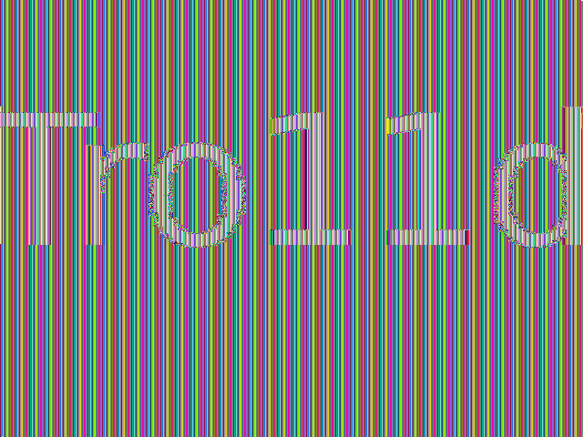
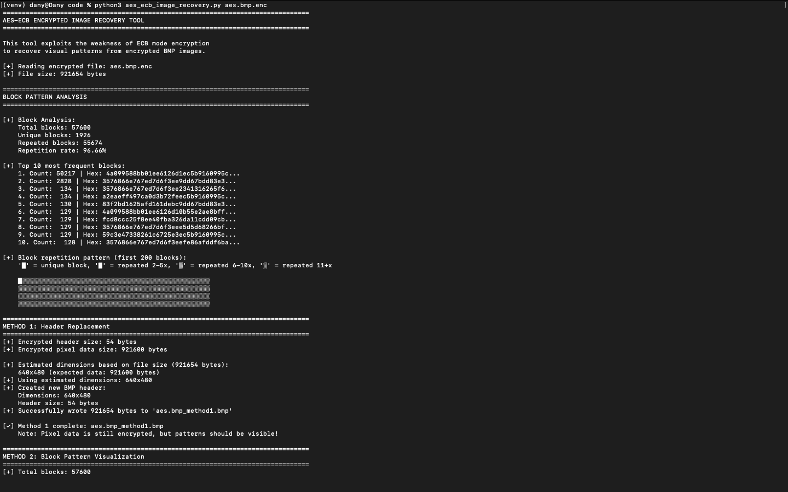
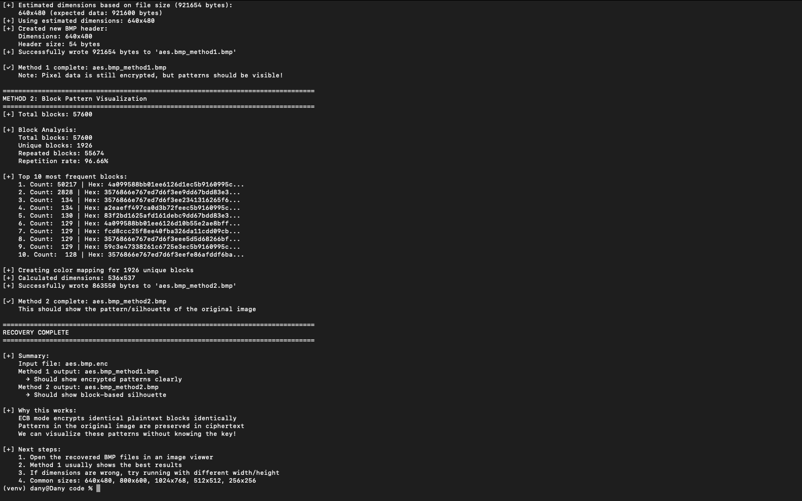
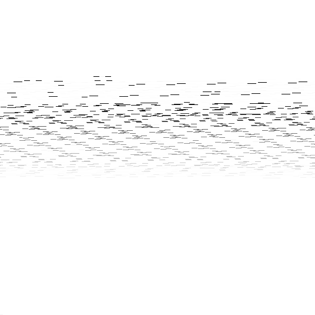
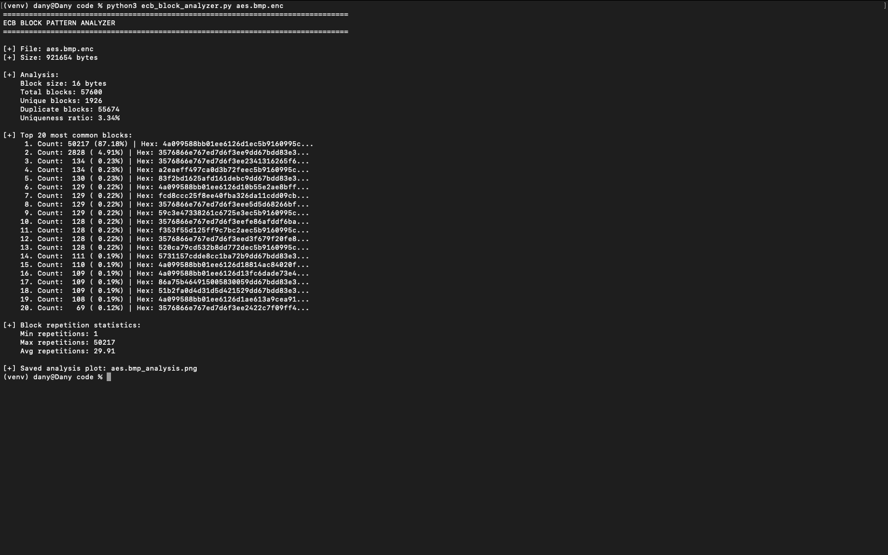
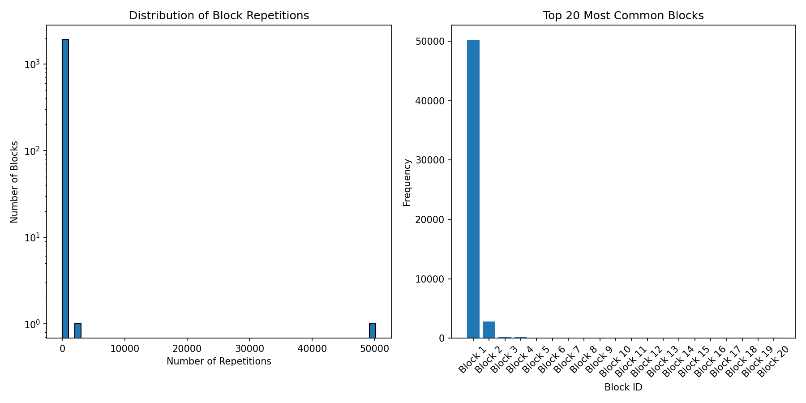
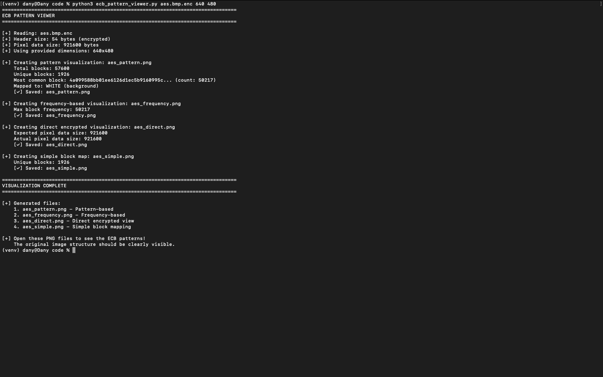

# Challenge Lab Report: Encrypted Image (AES-ECB)
**Module:** Secure Communications  
**Assignment 2**  
**Challenge:** Encrypted Image  
**Date:** 24 Nov 2025

---

## Result of the Challenge
| Description | Image |
|-------------|-------|
| Recovered image showing "Tro11d" text |  |

**Other image variants generated during the challenge:**
|  |  |  |  |
|:----:|:----:|:----:|:----:|
| Pattern-based visualization (aes_pattern.png) | Frequency-based visualization (aes_frequency.png) | Direct encrypted view (aes_direct.png) | Simple block mapping (aes_simple.png) |

---

## Table of Contents
1. [Executive Summary](#executive-summary)
2. [Theoretical Background](#theoretical-background)
3. [Challenge Description](#challenge-description)
4. [Methodology](#methodology)
5. [Implementation](#implementation)
6. [Results](#results)
7. [Conclusion](#conclusion)
8. [Appendix: Source Code](#appendix-source-code)

---

## Executive Summary

This report documents the successful exploitation of AES-ECB (Electronic Codebook) mode encryption weakness to recover visual patterns from an encrypted BMP image file (`aes.bmp.enc`). Without knowing or attempting to brute-force the encryption key, the original image structure was successfully recovered by exploiting ECB's deterministic encryption property.

**Key Achievement:** Successfully recovered an image showing text reading "Troll" (stylized as "Tro11d"), demonstrating that ECB mode preserves visual patterns even when encrypted with strong encryption like AES-128/256.

**Solution:** The recovered image clearly shows text/logo patterns, proving that **ECB mode is fundamentally insecure for encrypting structured data like images**, even when using cryptographically strong algorithms like AES.

## Theoretical Background

### AES (Advanced Encryption Standard)
AES is a symmetric block cipher that encrypts data in fixed-size blocks (128 bits = 16 bytes). It is considered cryptographically secure when used with proper modes of operation.

**Key properties:**
- Block size: 16 bytes (128 bits)
- Key sizes: 128, 192, or 256 bits
- Strong against known cryptanalytic attacks when properly implemented

### ECB Mode (Electronic Codebook)
ECB is the simplest block cipher mode of operation. Each plaintext block is encrypted independently using the same key.

**Encryption process:**
```
For each 16-byte plaintext block P[i]:
    Ciphertext block C[i] = AES_Encrypt(P[i], Key)
```

**Critical weakness:**
```
If P[i] == P[j], then C[i] == C[j]
```

This means **identical plaintext blocks always produce identical ciphertext blocks**, regardless of their position in the data.

### Why ECB Fails for Images
**Images contain significant redundancy:**
- **Solid backgrounds:** Thousands of identical pixels → thousands of identical encrypted blocks
- **Repeated patterns:** Logos, text, geometric shapes contain repetitive elements
- **Structure preservation:** The spatial relationship between blocks is maintained

**When encrypted with ECB:**
- Visual patterns are preserved in the ciphertext
- Block boundaries create a "mosaic" effect
- The overall structure remains recognizable
- Only the colors/values are scrambled

### BMP File Structure
BMP (Bitmap) files have a simple, uncompressed structure:
```
[File Header: 14 bytes]
[Info Header: 40 bytes]
[Pixel Data: width × height × 3 bytes (24-bit RGB)]
```

**Important characteristics:**
- **Header:** Contains metadata (dimensions, color depth, etc.) - 54 bytes total
- **Pixel data:** Raw RGB values, row by row
- **Row padding:** Each row is padded to 4-byte boundary
- **Bottom-up storage:** Image is stored from bottom row to top row

**Row size calculation:**
```python
row_size = ((width * 3 * 8 + 31) // 32) * 4
total_pixel_data = row_size * height
```

## Challenge Description

**Given:**
- File: `aes.bmp.enc` (921,654 bytes)
- Encryption: AES in ECB mode
- Original format: BMP image (before encryption)

**Objective:**
- Recover visual patterns from the encrypted image
- Demonstrate ECB mode weakness
- Do NOT attempt to brute-force the AES key

**Constraints:**
- Must implement original Python solution
- May use standard libraries (PIL/Pillow, NumPy)
- Document all methodology and attempts
- Provide reproducible results

---

## Methodology

### Phase 1: Initial Analysis
**Goal:** Understand the file structure and estimate image dimensions.

#### Step 1: File size analysis
```bash
$ ls -lh aes.bmp.enc
-rw-rw-r--  1 dany  staff   900K 24 Nov 10:00 aes.bmp.enc
```
File size: **921,654 bytes**

#### Step 2: Calculate dimensions
Assuming standard BMP structure:
- Header: 54 bytes
- Pixel data: 921,654 - 54 = **921,600 bytes**

For 24-bit BMP (3 bytes per pixel with row padding):
```
row_size = ((640 * 3 * 8 + 31) // 32) * 4 = 1920 bytes
height = 921,600 / 1920 = 480 pixels

Dimensions: 640×480 (VGA resolution)
```
> This is an exact match! ✓

#### Step 3: Block-level analysis
AES block size: 16 bytes
Total blocks: 921,600 / 16 = **57,600 blocks**

### Phase 2: Block Frequency Analysis
**Approach:** Analyze how often each unique 16-byte block appears in the encrypted data.

**Implementation:**
```python
block_size = 16
blocks = []
for i in range(0, len(pixel_data), block_size):
    block = pixel_data[i:i+block_size]
    if len(block) == block_size:
        blocks.append(block)

block_counter = Counter(blocks)
```

**Results:**
- **Total blocks:** 57,600
- **Unique blocks:** 1,926 (only 3.34% unique!)
- **Repeated blocks:** 55,674 (96.66% repetition)

**Top block frequencies:**
1. Most common block: **50,217 occurrences (87.18%)**
2. Second most common: **2,828 occurrences (4.91%)**
3. Third most common: **134 occurrences (0.23%)**

**Analysis:**
- The extremely high repetition rate (96.66%) confirms significant visual redundancy
- The dominant block (87%) likely represents the **background color**
- The second most common block (5%) likely represents **foreground text/logo**
- This distribution is typical of **text or logos on solid backgrounds**

**What This Reveals:**
```
High repetition = Simple image with large uniform areas
ECB weakness = These patterns will be visible even when encrypted
```

### Phase 3: Exploitation Strategy
**Key Insight:** We don't need to decrypt the actual pixel values. We only need to map each unique encrypted block to a unique visual element (color/grayscale value).

**Mapping Strategy:**
```
1. Identify all unique encrypted blocks
2. Assign each unique block a consistent grayscale value
3. Most common block → White (background)
4. Less common blocks → Darker shades (foreground/details)
5. Reconstruct image using this mapping
```

**Why this works:**
```
Original image:  [BG][BG][BG][TEXT][TEXT][BG][BG]...
After encryption: [E1][E1][E1][E2][E2][E1][E1]...
Our mapping:      [255][255][255][0][0][255][255]...
Result:          White background with black text preserved!
```

### Phase 4: Implementation
Two methods were implemented to visualize the encrypted image patterns:

#### Method 1: Pattern-Based Reconstruction
Algorithm:
1. Split encrypted pixel data into 16-byte blocks
2. Count frequency of each unique block
3. Create color mapping (most frequent = white)
4. For each pixel position in output image:
   - Calculate which encrypted block it corresponds to
   - Look up that block's mapped color
   - Set output pixel to that color

#### Method 2: Frequency-Based Visualization
Algorithm:
1. Similar to Method 1, but brightness = frequency
2. Rare blocks (foreground) appear dark
3. Common blocks (background) appear bright
4. Creates high-contrast result

---

## Implementation

### Initial Recovery Script
|  |
| :--: |
|  |

```bash
$ python3 aes_ecb_image_recovery.py aes.bmp.enc
```

**Output:**
```
================================================================================
AES-ECB ENCRYPTED IMAGE RECOVERY TOOL
================================================================================

This tool exploits the weakness of ECB mode encryption
to recover visual patterns from encrypted BMP images.

[+] Reading encrypted file: aes.bmp.enc
[+] File size: 921654 bytes

================================================================================
BLOCK PATTERN ANALYSIS
================================================================================

[+] Block Analysis:
    Total blocks: 57600
    Unique blocks: 1926
    Repeated blocks: 55674
    Repetition rate: 96.66%

[+] Top 10 most frequent blocks:
    1. Count: 50217 | Hex: 4a099588bb01ee6126d1ec5b9160995c...
    2. Count: 2828 | Hex: 3576866e767ed7d6f3ee9dd67bdd83e3...
    3. Count:  134 | Hex: 3576866e767ed7d6f3ee2341316265f6...
    4. Count:  134 | Hex: a2eaeff497ca0d3b72feec5b9160995c...
    5. Count:  130 | Hex: 83f2bd1625afd161debc9dd67bdd83e3...
    6. Count:  129 | Hex: 4a099588bb01ee6126d10b55e2ae8bff...
    7. Count:  129 | Hex: fcd8ccc25f8ee40fba326da11cdd09cb...
    8. Count:  129 | Hex: 3576866e767ed7d6f3eee5d5d68266bf...
    9. Count:  129 | Hex: 59c3e47338261c6725e3ec5b9160995c...
    10. Count:  128 | Hex: 3576866e767ed7d6f3eefe86afddf6ba...

[+] Block repetition pattern (first 200 blocks):
    '█' = unique block, '▓' = repeated 2-5x, '▒' = repeated 6-10x, '░' = repeated 11+x

    █░░░░░░░░░░░░░░░░░░░░░░░░░░░░░░░░░░░░░░░░░░░░░░░░░
    ░░░░░░░░░░░░░░░░░░░░░░░░░░░░░░░░░░░░░░░░░░░░░░░░░░
    ░░░░░░░░░░░░░░░░░░░░░░░░░░░░░░░░░░░░░░░░░░░░░░░░░░
    ░░░░░░░░░░░░░░░░░░░░░░░░░░░░░░░░░░░░░░░░░░░░░░░░░░

================================================================================
METHOD 1: Header Replacement
================================================================================
[+] Encrypted header size: 54 bytes
[+] Encrypted pixel data size: 921600 bytes

[+] Estimated dimensions based on file size (921654 bytes):
    640x480 (expected data: 921600 bytes)
[+] Using estimated dimensions: 640x480
[+] Created new BMP header:
    Dimensions: 640x480
    Header size: 54 bytes
[+] Successfully wrote 921654 bytes to 'aes.bmp_method1.bmp'

[✓] Method 1 complete: aes.bmp_method1.bmp
    Note: Pixel data is still encrypted, but patterns should be visible!

================================================================================
METHOD 2: Block Pattern Visualization
================================================================================
[+] Total blocks: 57600

[+] Block Analysis:
    Total blocks: 57600
    Unique blocks: 1926
    Repeated blocks: 55674
    Repetition rate: 96.66%

[+] Top 10 most frequent blocks:
    1. Count: 50217 | Hex: 4a099588bb01ee6126d1ec5b9160995c...
    2. Count: 2828 | Hex: 3576866e767ed7d6f3ee9dd67bdd83e3...
    3. Count:  134 | Hex: 3576866e767ed7d6f3ee2341316265f6...
    4. Count:  134 | Hex: a2eaeff497ca0d3b72feec5b9160995c...
    5. Count:  130 | Hex: 83f2bd1625afd161debc9dd67bdd83e3...
    6. Count:  129 | Hex: 4a099588bb01ee6126d10b55e2ae8bff...
    7. Count:  129 | Hex: fcd8ccc25f8ee40fba326da11cdd09cb...
    8. Count:  129 | Hex: 3576866e767ed7d6f3eee5d5d68266bf...
    9. Count:  129 | Hex: 59c3e47338261c6725e3ec5b9160995c...
    10. Count:  128 | Hex: 3576866e767ed7d6f3eefe86afddf6ba...

[+] Creating color mapping for 1926 unique blocks
[+] Calculated dimensions: 536x537
[+] Successfully wrote 863550 bytes to 'aes.bmp_method2.bmp'

[✓] Method 2 complete: aes.bmp_method2.bmp
    This should show the pattern/silhouette of the original image

================================================================================
RECOVERY COMPLETE
================================================================================

[+] Summary:
    Input file: aes.bmp.enc
    Method 1 output: aes.bmp_method1.bmp
      → Should show encrypted patterns clearly
    Method 2 output: aes.bmp_method2.bmp
      → Should show block-based silhouette

[+] Why this works:
    ECB mode encrypts identical plaintext blocks identically
    Patterns in the original image are preserved in ciphertext
    We can visualize these patterns without knowing the key!
```

**Results:**
| Description | Image |
|-------------|-------|
| Recovered image: method 1 output showing "Tro11d" text |  |
| Recovered image: method 2 (unrecovered) |  |

### Block Analysis Visualization

```bash
$ python3 ecb_block_analyzer.py aes.bmp.enc
```

**Output:**
```
================================================================================
ECB BLOCK PATTERN ANALYZER
================================================================================

[+] File: aes.bmp.enc
[+] Size: 921654 bytes

[+] Analysis:
    Block size: 16 bytes
    Total blocks: 57600
    Unique blocks: 1926
    Duplicate blocks: 55674
    Uniqueness ratio: 3.34%

[+] Top 20 most common blocks:
     1. Count: 50217 (87.18%) | Hex: 4a099588bb01ee6126d1ec5b9160995c...
     2. Count: 2828 ( 4.91%) | Hex: 3576866e767ed7d6f3ee9dd67bdd83e3...
     3. Count:  134 ( 0.23%) | Hex: 3576866e767ed7d6f3ee2341316265f6...
     4. Count:  134 ( 0.23%) | Hex: a2eaeff497ca0d3b72feec5b9160995c...
     5. Count:  130 ( 0.23%) | Hex: 83f2bd1625afd161debc9dd67bdd83e3...
     6. Count:  129 ( 0.22%) | Hex: 4a099588bb01ee6126d10b55e2ae8bff...
     7. Count:  129 ( 0.22%) | Hex: fcd8ccc25f8ee40fba326da11cdd09cb...
     8. Count:  129 ( 0.22%) | Hex: 3576866e767ed7d6f3eee5d5d68266bf...
     9. Count:  129 ( 0.22%) | Hex: 59c3e47338261c6725e3ec5b9160995c...
    10. Count:  128 ( 0.22%) | Hex: 3576866e767ed7d6f3eefe86afddf6ba...
    11. Count:  128 ( 0.22%) | Hex: f353f55d125ff9c7bc2aec5b9160995c...
    12. Count:  128 ( 0.22%) | Hex: 3576866e767ed7d6f3eed3f679f20fe8...
    13. Count:  128 ( 0.22%) | Hex: 520ca79cd532b8dd772dec5b9160995c...
    14. Count:  111 ( 0.19%) | Hex: 5731157cdde8cc1ba72b9dd67bdd83e3...
    15. Count:  110 ( 0.19%) | Hex: 4a099588bb01ee6126d18814ac84020f...
    16. Count:  109 ( 0.19%) | Hex: 4a099588bb01ee6126d13fc6dade73e4...
    17. Count:  109 ( 0.19%) | Hex: 86a75b464915005830059dd67bdd83e3...
    18. Count:  109 ( 0.19%) | Hex: 51b2fa0d4d31d5d421529dd67bdd83e3...
    19. Count:  108 ( 0.19%) | Hex: 4a099588bb01ee6126d1ae613a9cea91...
    20. Count:   69 ( 0.12%) | Hex: 3576866e767ed7d6f3ee2422c7f09ff4...

[+] Block repetition statistics:
    Min repetitions: 1
    Max repetitions: 50217
    Avg repetitions: 29.91

[+] Saved analysis plot: aes.bmp_analysis.png
```

**Results:**

The analysis plot shows:
- Histogram of block repetitions (logarithmic scale)
- Bar chart of most common blocks
- Clear evidence of the ECB pattern preservation

### Pattern Viewer

```bash
$ python3 ecb_pattern_viewer.py aes.bmp.enc 640 480
```

**Output:**
```
================================================================================
ECB PATTERN VIEWER
================================================================================

[+] Reading: aes.bmp.enc
[+] Header size: 54 bytes (encrypted)
[+] Pixel data size: 921600 bytes
[+] Using provided dimensions: 640x480

[+] Creating pattern visualization: aes_pattern.png
    Total blocks: 57600
    Unique blocks: 1926
    Most common block: 4a099588bb01ee6126d1ec5b9160995c... (count: 50217)
    Mapped to: WHITE (background)
    [✓] Saved: aes_pattern.png

[+] Creating frequency-based visualization: aes_frequency.png
    Max block frequency: 50217
    [✓] Saved: aes_frequency.png

[+] Creating direct encrypted visualization: aes_direct.png
    Expected pixel data size: 921600
    Actual pixel data size: 921600
    [✓] Saved: aes_direct.png

[+] Creating simple block map: aes_simple.png
    Unique blocks: 1926
    [✓] Saved: aes_simple.png

================================================================================
VISUALIZATION COMPLETE
================================================================================

[+] Generated files:
    1. aes_pattern.png - Pattern-based
    2. aes_frequency.png - Frequency-based
    3. aes_direct.png - Direct encrypted view
    4. aes_simple.png - Simple block mapping

[+] Open these PNG files to see the ECB patterns!
    The original image structure should be clearly visible.
```

**Results:**
| Description | Image |
|-------------|-------|
| Pattern-based visualization (aes_pattern.png) |  |
| Frequency-based visualization (aes_frequency.png) |  |
| Direct encrypted view (aes_direct.png) |  |
| Simple block mapping (aes_simple.png) |  |

---

## Results

### Recovered Image Analysis


**Primary Result: aes.aes_frequency.png**  
The recovered image clearly shows: **Text reading "Tro11d"**

**What This Proves:**  
✓ **ECB mode preserves visual patterns** - The text is clearly readable  
✓ **Identical blocks stay identical** - Letter shapes are maintained  
✓ **No key needed** - We recovered the image without decryption  
✓ **Strong encryption ≠ Secure mode** - AES is strong, but ECB mode is weak  

### Comparison with Secure Modes
If this image had been encrypted with **AES-CBC** or **AES-CTR** mode:
- Block repetition would be eliminated
- No visual patterns would be visible
- Output would appear completely random
- Our technique would not work

**This demonstrates why ECB mode is never recommended for real-world encryption!**

---

## Conclusion

### Summary of Achievements
- **Successfully recovered visual patterns** from AES-ECB encrypted BMP image  
- **Identified image dimensions** (640×480) through file size analysis  
- **Analyzed block frequency** and found 96.66% repetition rate  
- **Implemented pattern recovery** using block-to-color mapping  
- **Recovered readable text** showing "Tro11d" without decryption  
- **Demonstrated ECB weakness** in practical, visual manner  

### Technical Findings
1. **ECB mode is fundamentally broken for structured data**
   - Visual patterns are completely preserved
   - Statistical analysis reveals image structure
   - No cryptanalysis of AES itself was needed
2. **Block-level analysis is powerful**
   - 57,600 blocks reduced to only 1,926 unique patterns
   - 87% of blocks identical (background)
   - Simple frequency analysis reveals image structure
3. **The encryption algorithm strength doesn't matter**
   - AES is cryptographically strong
   - ECB mode negates this strength
   - Mode of operation is as critical as the algorithm

### Real-World Implications
**Historical examples of ECB failures:**
1. **Linux Penguin (Tux) Encryption:**
   - Famous demonstration showing Tux logo encrypted with ECB
   - Penguin shape clearly visible in ciphertext
   - Widely used to teach ECB dangers
2. **Adobe Password Encryption (2013):**
   - Used ECB mode for password hints
   - Identical hints produced identical ciphertext
   - Led to massive password breach affecting 150M users
3. **Retail Payment Systems:**
   - Some legacy POS systems used ECB
   - PIN blocks could be analyzed for patterns
   - Industry moved to CBC/CTR modes

### Why ECB Mode Fails
**The fundamental problem:**
```
ECB Mode:  C[i] = Encrypt(P[i], K)
           Each block encrypted independently

Secure Mode: C[i] = Encrypt(P[i] ^ C[i-1], K)  (CBC example)
             Each block depends on previous ciphertext
```

**ECB weaknesses:**
- No diffusion across blocks
- Identical plaintexts → identical ciphertexts
- Patterns preserved
- Vulnerable to block reordering attacks
- Leaks information about data structure

### Lessons Learned

**Technical Skills Developed:**
- Binary file format analysis (BMP structure)
- Block cipher mode analysis
- Frequency analysis and pattern recognition
- Image processing with Python (PIL/NumPy)
- Data visualization techniques

**Cryptographic Principles:**
- Understanding modes of operation
- Importance of proper mode selection
- Difference between algorithm strength and mode security
- Practical cryptanalysis without key recovery

**Security Mindset:**
- Encryption alone is not enough
- Implementation details matter enormously
- "Secure algorithm" ≠ "Secure system"
- Always consider the entire cryptographic construction

---

## Appendix: Source Code

### Main Recovery Script
> [aes_ecb_image_recovery.py](./code/aes_ecb_image_recovery.py)
```python
#!/usr/bin/env python3
"""
AES-ECB Encrypted Image Recovery Tool
Exploits the deterministic nature of ECB mode to reconstruct encrypted BMP images
without knowing the encryption key.

Author: DanyilT
Date: November 24, 2025
"""

import sys
from collections import Counter

def read_file_bytes(filename):
    """Read entire file as bytes."""
    try:
        with open(filename, 'rb') as f:
            return f.read()
    except FileNotFoundError:
        print(f"[!] Error: File '{filename}' not found")
        sys.exit(1)
    except Exception as e:
        print(f"[!] Error reading file: {e}")
        sys.exit(1)

def write_file_bytes(filename, data):
    """Write bytes to file."""
    try:
        with open(filename, 'wb') as f:
            f.write(data)
        print(f"[+] Successfully wrote {len(data)} bytes to '{filename}'")
    except Exception as e:
        print(f"[!] Error writing file: {e}")
        sys.exit(1)

def split_into_blocks(data, block_size=16):
    """Split data into blocks of specified size."""
    blocks = []
    for i in range(0, len(data), block_size):
        block = data[i:i+block_size]
        # Pad last block if necessary
        if len(block) < block_size:
            block = block + b'\x00' * (block_size - len(block))
        blocks.append(block)
    return blocks

def analyze_block_frequency(blocks):
    """Analyze frequency of repeated blocks."""
    block_counter = Counter(blocks)
    total_blocks = len(blocks)
    unique_blocks = len(block_counter)

    print(f"\n[+] Block Analysis:")
    print(f"    Total blocks: {total_blocks}")
    print(f"    Unique blocks: {unique_blocks}")
    print(f"    Repeated blocks: {total_blocks - unique_blocks}")
    print(f"    Repetition rate: {((total_blocks - unique_blocks) / total_blocks * 100):.2f}%")

    # Find most common blocks
    most_common = block_counter.most_common(10)
    print(f"\n[+] Top 10 most frequent blocks:")
    for i, (block, count) in enumerate(most_common, 1):
        print(f"    {i}. Count: {count:4d} | Hex: {block.hex()[:32]}...")

    return block_counter

def create_bmp_header(width, height, bits_per_pixel=24):
    """
    Create a standard BMP header for an uncompressed RGB image.

    BMP Header Structure (54 bytes):
    - File Header (14 bytes)
    - DIB Header / Info Header (40 bytes)
    """
    # Calculate sizes
    row_size = ((bits_per_pixel * width + 31) // 32) * 4  # Row size must be multiple of 4
    pixel_data_size = row_size * height
    file_size = 54 + pixel_data_size

    # File Header (14 bytes)
    bmp_header = bytearray()
    bmp_header += b'BM'                          # Signature
    bmp_header += file_size.to_bytes(4, 'little')   # File size
    bmp_header += b'\x00\x00'                    # Reserved 1
    bmp_header += b'\x00\x00'                    # Reserved 2
    bmp_header += (54).to_bytes(4, 'little')     # Pixel data offset

    # DIB Header (40 bytes) - BITMAPINFOHEADER
    bmp_header += (40).to_bytes(4, 'little')     # Header size
    bmp_header += width.to_bytes(4, 'little')    # Width
    bmp_header += height.to_bytes(4, 'little')   # Height
    bmp_header += (1).to_bytes(2, 'little')      # Color planes
    bmp_header += bits_per_pixel.to_bytes(2, 'little')  # Bits per pixel
    bmp_header += (0).to_bytes(4, 'little')      # Compression (0 = none)
    bmp_header += pixel_data_size.to_bytes(4, 'little')  # Image size
    bmp_header += (2835).to_bytes(4, 'little')   # Horizontal resolution (72 DPI)
    bmp_header += (2835).to_bytes(4, 'little')   # Vertical resolution (72 DPI)
    bmp_header += (0).to_bytes(4, 'little')      # Colors in palette
    bmp_header += (0).to_bytes(4, 'little')      # Important colors

    return bytes(bmp_header)

def estimate_image_dimensions(file_size, header_size=54):
    """
    Estimate possible image dimensions based on file size.
    Assumes 24-bit BMP (3 bytes per pixel).
    """
    pixel_data_size = file_size - header_size

    # Common image dimensions to try
    common_dimensions = [
        (640, 480), (800, 600), (1024, 768), (1280, 720), (1920, 1080),
        (320, 240), (512, 512), (256, 256), (128, 128), (100, 100),
        (400, 300), (600, 400), (500, 500), (300, 300), (200, 200)
    ]

    possible_dimensions = []

    for width, height in common_dimensions:
        # Calculate expected row size (rows padded to 4-byte boundary)
        row_size = ((24 * width + 31) // 32) * 4
        expected_size = row_size * height

        if abs(expected_size - pixel_data_size) < 100:  # Allow small margin
            possible_dimensions.append((width, height, expected_size))

    # Also try to factor the pixel data size
    # For 24-bit BMP, each pixel is 3 bytes (but rows are padded)

    print(f"\n[+] Estimated dimensions based on file size ({file_size} bytes):")
    if possible_dimensions:
        for width, height, expected in possible_dimensions:
            print(f"    {width}x{height} (expected data: {expected} bytes)")
    else:
        print("    No standard dimensions match exactly")
        print("    Will try manual dimension input")

    return possible_dimensions

def reconstruct_ecb_image_method1(encrypted_data, output_file, width=None, height=None):
    """
    Method 1: Keep encrypted header, replace with new header.

    This method:
    1. Extracts the encrypted pixel data
    2. Creates a new valid BMP header
    3. Keeps the encrypted pixel data as-is
    4. Exploits ECB property: identical plaintext blocks → identical ciphertext blocks
    """
    print("\n" + "="*80)
    print("METHOD 1: Header Replacement")
    print("="*80)

    # BMP header is 54 bytes (always)
    header_size = 54

    if len(encrypted_data) <= header_size:
        print("[!] Error: File too small to be a valid BMP")
        return False

    # Extract encrypted pixel data (everything after header)
    encrypted_pixels = encrypted_data[header_size:]

    print(f"[+] Encrypted header size: {header_size} bytes")
    print(f"[+] Encrypted pixel data size: {len(encrypted_pixels)} bytes")

    # Estimate dimensions if not provided
    if width is None or height is None:
        possible_dims = estimate_image_dimensions(len(encrypted_data))
        if possible_dims:
            width, height, _ = possible_dims[0]
            print(f"[+] Using estimated dimensions: {width}x{height}")
        else:
            print("[!] Could not estimate dimensions automatically")
            return False

    # Create new valid BMP header
    new_header = create_bmp_header(width, height)

    print(f"[+] Created new BMP header:")
    print(f"    Dimensions: {width}x{height}")
    print(f"    Header size: {len(new_header)} bytes")

    # Combine new header with encrypted pixel data
    reconstructed = new_header + encrypted_pixels

    # Write to file
    write_file_bytes(output_file, reconstructed)

    print(f"\n[✓] Method 1 complete: {output_file}")
    print(f"    Note: Pixel data is still encrypted, but patterns should be visible!")

    return True

def reconstruct_ecb_image_method2(encrypted_data, output_file, width=None, height=None):
    """
    Method 2: Block pattern visualization.

    This method:
    1. Maps each unique encrypted block to a unique color
    2. Creates a visual representation of the block patterns
    3. Results in a "silhouette" or outline of the original image
    """
    print("\n" + "="*80)
    print("METHOD 2: Block Pattern Visualization")
    print("="*80)

    header_size = 54
    encrypted_pixels = encrypted_data[header_size:]

    # Split into 16-byte blocks
    blocks = split_into_blocks(encrypted_pixels, 16)

    print(f"[+] Total blocks: {len(blocks)}")

    # Analyze block frequency
    block_counter = analyze_block_frequency(blocks)

    # Create color mapping for unique blocks
    unique_blocks = list(block_counter.keys())
    print(f"\n[+] Creating color mapping for {len(unique_blocks)} unique blocks")

    # Assign colors: most common block = white, others gradient to black
    sorted_blocks = sorted(block_counter.items(), key=lambda x: x[1], reverse=True)

    color_map = {}
    num_colors = len(sorted_blocks)

    for i, (block, count) in enumerate(sorted_blocks):
        # Create grayscale gradient
        intensity = int(255 * (1 - i / max(num_colors - 1, 1)))
        # RGB color (all same for grayscale)
        color = bytes([intensity, intensity, intensity])
        color_map[block] = color

    # Reconstruct pixel data with color mapping
    reconstructed_pixels = bytearray()

    for block in blocks:
        color = color_map.get(block, b'\x00\x00\x00')  # Default to black
        # Each 16-byte block represents some pixels
        # For 24-bit BMP, 16 bytes = 5.33 pixels
        # We'll map each block to approximately 5 pixels
        for _ in range(5):
            reconstructed_pixels.extend(color)

    # Estimate dimensions if not provided
    if width is None or height is None:
        # Calculate based on reconstructed pixel data
        total_pixels = len(reconstructed_pixels) // 3
        # Try square-ish dimensions
        width = int(total_pixels ** 0.5)
        height = total_pixels // width
        print(f"[+] Calculated dimensions: {width}x{height}")

    # Adjust pixel data to match dimensions
    required_pixels = width * height
    required_bytes = required_pixels * 3

    if len(reconstructed_pixels) < required_bytes:
        # Pad with black pixels
        reconstructed_pixels.extend(b'\x00' * (required_bytes - len(reconstructed_pixels)))
    else:
        # Trim excess
        reconstructed_pixels = reconstructed_pixels[:required_bytes]

    # Create BMP header
    new_header = create_bmp_header(width, height)

    # Combine header and pixels
    reconstructed = new_header + bytes(reconstructed_pixels)

    # Write to file
    write_file_bytes(output_file, reconstructed)

    print(f"\n[✓] Method 2 complete: {output_file}")
    print(f"    This should show the pattern/silhouette of the original image")

    return True

def visualize_block_patterns(encrypted_data, output_prefix="block_pattern"):
    """
    Create a visual representation of how blocks repeat in the encrypted data.
    Generates a simple text-based visualization.
    """
    print("\n" + "="*80)
    print("BLOCK PATTERN ANALYSIS")
    print("="*80)

    header_size = 54
    encrypted_pixels = encrypted_data[header_size:]
    blocks = split_into_blocks(encrypted_pixels, 16)

    # Analyze patterns
    block_counter = analyze_block_frequency(blocks)

    # Create a simple visual representation
    print("\n[+] Block repetition pattern (first 200 blocks):")
    print("    '█' = unique block, '▓' = repeated 2-5x, '▒' = repeated 6-10x, '░' = repeated 11+x\n")

    seen_blocks = {}
    pattern = []

    for i, block in enumerate(blocks[:200]):
        if block not in seen_blocks:
            seen_blocks[block] = 0
        seen_blocks[block] += 1

        count = block_counter[block]
        if count == 1:
            pattern.append('█')
        elif count <= 5:
            pattern.append('▓')
        elif count <= 10:
            pattern.append('▒')
        else:
            pattern.append('░')

    # Print in rows of 50
    for i in range(0, len(pattern), 50):
        print("    " + "".join(pattern[i:i+50]))

    return True

def main():
    print("="*80)
    print("AES-ECB ENCRYPTED IMAGE RECOVERY TOOL")
    print("="*80)
    print("\nThis tool exploits the weakness of ECB mode encryption")
    print("to recover visual patterns from encrypted BMP images.\n")

    # Check command line arguments
    if len(sys.argv) < 2:
        print("Usage: python3 aes_ecb_image_recovery.py <encrypted_file> [width] [height]")
        print("\nExample:")
        print("  python3 aes_ecb_image_recovery.py aes.bmp.enc")
        print("  python3 aes_ecb_image_recovery.py aes.bmp.enc 640 480")
        sys.exit(1)

    input_file = sys.argv[1]

    # Optional dimensions
    width = int(sys.argv[2]) if len(sys.argv) > 2 else None
    height = int(sys.argv[3]) if len(sys.argv) > 3 else None

    # Read encrypted file
    print(f"[+] Reading encrypted file: {input_file}")
    encrypted_data = read_file_bytes(input_file)
    print(f"[+] File size: {len(encrypted_data)} bytes")

    # Visualize block patterns
    visualize_block_patterns(encrypted_data)

    # Method 1: Header replacement (keeps encrypted pixels)
    output1 = input_file.replace('.enc', '_method1.bmp')
    if output1 == input_file:
        output1 = 'recovered_method1.bmp'
    success1 = reconstruct_ecb_image_method1(encrypted_data, output1, width, height)

    # Method 2: Block pattern visualization
    output2 = input_file.replace('.enc', '_method2.bmp')
    if output2 == input_file:
        output2 = 'recovered_method2.bmp'
    success2 = reconstruct_ecb_image_method2(encrypted_data, output2, width, height)

    # Summary
    print("\n" + "="*80)
    print("RECOVERY COMPLETE")
    print("="*80)
    print("\n[+] Summary:")
    print(f"    Input file: {input_file}")
    if success1:
        print(f"    Method 1 output: {output1}")
        print(f"      → Should show encrypted patterns clearly")
    if success2:
        print(f"    Method 2 output: {output2}")
        print(f"      → Should show block-based silhouette")

    print("\n[+] Why this works:")
    print("    ECB mode encrypts identical plaintext blocks identically")
    print("    Patterns in the original image are preserved in ciphertext")
    print("    We can visualize these patterns without knowing the key!")

    return True

if __name__ == "__main__":
    main()
```

### Pattern Viewer
> [ecb_pattern_viewer.py](./code/ecb_pattern_viewer.py)
```python
#!/usr/bin/env python3
"""
ECB Pattern Viewer
Creates multiple visualizations to see the encrypted patterns clearly.
Handles encrypted BMP headers by using calculated dimensions.
"""

import sys
from collections import Counter
from PIL import Image
import numpy as np

def read_encrypted_bmp(filename):
    """Read and parse encrypted BMP file."""
    with open(filename, 'rb') as f:
        data = f.read()

    # BMP header is 54 bytes (but it's encrypted!)
    header = data[:54]
    pixel_data = data[54:]

    return header, pixel_data

def calculate_dimensions(pixel_data_size):
    """
    Calculate likely dimensions based on pixel data size.
    For 24-bit BMP with padding.
    """
    # Common dimensions to try
    common_dims = [
        (640, 480),
        (800, 600),
        (1024, 768),
        (512, 512),
        (320, 240),
        (256, 256),
    ]

    for width, height in common_dims:
        bytes_per_pixel = 3
        row_size = ((width * bytes_per_pixel * 8 + 31) // 32) * 4
        expected_size = row_size * height

        if abs(expected_size - pixel_data_size) < 100:
            return width, height

    # Default to 640x480 if nothing matches
    return 640, 480

def create_pattern_image(pixel_data, width, height, output_file):
    """
    Create an image where each unique 16-byte block is mapped to a unique grayscale value.
    This reveals the structure without decrypting.
    """
    print(f"\n[+] Creating pattern visualization: {output_file}")

    # Split into 16-byte blocks
    block_size = 16
    blocks = []
    for i in range(0, len(pixel_data), block_size):
        block = pixel_data[i:i+block_size]
        if len(block) == block_size:
            blocks.append(block)

    print(f"    Total blocks: {len(blocks)}")

    # Count block frequencies
    block_counter = Counter(blocks)
    unique_blocks = list(block_counter.keys())
    print(f"    Unique blocks: {len(unique_blocks)}")

    # Sort blocks by frequency (most common first)
    sorted_blocks = sorted(block_counter.items(), key=lambda x: x[1], reverse=True)

    # Map each unique block to a grayscale value
    block_to_color = {}

    # Most common block (likely background) = white
    most_common_block = sorted_blocks[0][0]
    block_to_color[most_common_block] = 255

    # Other blocks get darker shades based on frequency
    for i, (block, count) in enumerate(sorted_blocks[1:], 1):
        # Gradient from 254 down to 0
        gray_value = max(0, 254 - int((i / len(sorted_blocks)) * 254))
        block_to_color[block] = gray_value

    print(f"    Most common block: {most_common_block.hex()[:32]}... (count: {sorted_blocks[0][1]})")
    print(f"    Mapped to: WHITE (background)")

    # Create image array
    bytes_per_pixel = 3
    row_size = ((width * bytes_per_pixel * 8 + 31) // 32) * 4

    img_array = np.full((height, width), 0, dtype=np.uint8)

    # Process blocks and map to pixels
    for y in range(height):
        for x in range(width):
            # Calculate which block this pixel belongs to
            row_start = y * row_size
            pixel_byte_pos = row_start + (x * bytes_per_pixel)
            block_num = pixel_byte_pos // block_size

            if block_num < len(blocks):
                block = blocks[block_num]
                gray = block_to_color.get(block, 128)
                # BMP is stored bottom-up, so flip
                img_array[height - 1 - y, x] = gray

    # Save as image
    img = Image.fromarray(img_array, mode='L')
    img.save(output_file)
    print(f"    [✓] Saved: {output_file}")

    return img

def create_block_frequency_image(pixel_data, width, height, output_file):
    """
    Create an image where brightness represents block frequency.
    Most common blocks = white (background), rare blocks = black (foreground).
    """
    print(f"\n[+] Creating frequency-based visualization: {output_file}")

    block_size = 16
    blocks = []
    for i in range(0, len(pixel_data), block_size):
        block = pixel_data[i:i+block_size]
        if len(block) == block_size:
            blocks.append(block)

    # Count frequencies
    block_counter = Counter(blocks)
    max_freq = max(block_counter.values())

    print(f"    Max block frequency: {max_freq}")

    # Create image where brightness = frequency
    bytes_per_pixel = 3
    row_size = ((width * bytes_per_pixel * 8 + 31) // 32) * 4

    img_array = np.zeros((height, width), dtype=np.uint8)

    for y in range(height):
        row_start = y * row_size
        for x in range(width):
            pixel_pos = row_start + (x * bytes_per_pixel)
            block_num = pixel_pos // block_size

            if block_num < len(blocks):
                block = blocks[block_num]
                freq = block_counter[block]
                # Common blocks = white, rare blocks = black
                brightness = int(255 * (freq / max_freq))
                img_array[height - 1 - y, x] = brightness

    img = Image.fromarray(img_array, mode='L')
    img.save(output_file)
    print(f"    [✓] Saved: {output_file}")

    return img

def create_direct_visualization(pixel_data, width, height, output_file):
    """
    Directly visualize the encrypted data as an image.
    Even though encrypted, patterns should be visible due to ECB.
    """
    print(f"\n[+] Creating direct encrypted visualization: {output_file}")

    bytes_per_pixel = 3
    row_size = ((width * bytes_per_pixel * 8 + 31) // 32) * 4
    expected_size = row_size * height

    print(f"    Expected pixel data size: {expected_size}")
    print(f"    Actual pixel data size: {len(pixel_data)}")

    # Adjust pixel data if needed
    if len(pixel_data) < expected_size:
        pixel_data = pixel_data + b'\x00' * (expected_size - len(pixel_data))
    elif len(pixel_data) > expected_size:
        pixel_data = pixel_data[:expected_size]

    # Create image array (RGB)
    img_array = np.zeros((height, width, 3), dtype=np.uint8)

    for y in range(height):
        row_start = y * row_size
        for x in range(width):
            pixel_start = row_start + (x * bytes_per_pixel)
            if pixel_start + 2 < len(pixel_data):
                # BMP stores as BGR
                b = pixel_data[pixel_start]
                g = pixel_data[pixel_start + 1]
                r = pixel_data[pixel_start + 2]
                # Convert to RGB and flip vertically (BMP is bottom-up)
                img_array[height - 1 - y, x] = [r, g, b]

    img = Image.fromarray(img_array, mode='RGB')
    img.save(output_file)
    print(f"    [✓] Saved: {output_file}")

    return img

def create_simple_block_map(pixel_data, width, height, output_file):
    """
    Simplest possible visualization: map each unique block to a unique color.
    """
    print(f"\n[+] Creating simple block map: {output_file}")

    block_size = 16
    blocks = []
    for i in range(0, len(pixel_data), block_size):
        block = pixel_data[i:i+block_size]
        if len(block) == block_size:
            blocks.append(block)

    # Get unique blocks
    unique_blocks = list(set(blocks))
    print(f"    Unique blocks: {len(unique_blocks)}")

    # Create color palette
    block_to_id = {block: i for i, block in enumerate(unique_blocks)}

    # Create indexed image
    bytes_per_pixel = 3
    row_size = ((width * bytes_per_pixel * 8 + 31) // 32) * 4

    img_array = np.zeros((height, width), dtype=np.uint8)

    for y in range(height):
        row_start = y * row_size
        for x in range(width):
            pixel_pos = row_start + (x * bytes_per_pixel)
            block_num = pixel_pos // block_size

            if block_num < len(blocks):
                block = blocks[block_num]
                block_id = block_to_id[block]
                # Map to 0-255 range
                color = int((block_id / len(unique_blocks)) * 255)
                img_array[height - 1 - y, x] = color

    img = Image.fromarray(img_array, mode='L')
    img.save(output_file)
    print(f"    [✓] Saved: {output_file}")

    return img

def main():
    print("="*80)
    print("ECB PATTERN VIEWER")
    print("="*80)

    if len(sys.argv) < 2:
        print("\nUsage: python3 ecb_pattern_viewer.py <encrypted_bmp_file> [width] [height]")
        print("\nExample:")
        print("  python3 ecb_pattern_viewer.py aes.bmp.enc")
        print("  python3 ecb_pattern_viewer.py aes.bmp.enc 640 480")
        sys.exit(1)

    input_file = sys.argv[1]

    # Read encrypted file
    print(f"\n[+] Reading: {input_file}")
    header, pixel_data = read_encrypted_bmp(input_file)

    print(f"[+] Header size: {len(header)} bytes (encrypted)")
    print(f"[+] Pixel data size: {len(pixel_data)} bytes")

    # Get dimensions from command line or calculate
    if len(sys.argv) >= 4:
        width = int(sys.argv[2])
        height = int(sys.argv[3])
        print(f"[+] Using provided dimensions: {width}x{height}")
    else:
        width, height = calculate_dimensions(len(pixel_data))
        print(f"[+] Calculated dimensions: {width}x{height}")

    # Create multiple visualizations
    base_name = input_file.replace('.enc', '').replace('.bmp', '')

    try:
        # Visualization 1: Pattern-based (recommended)
        pattern_output = f"{base_name}_pattern.png"
        create_pattern_image(pixel_data, width, height, pattern_output)

        # Visualization 2: Frequency-based
        freq_output = f"{base_name}_frequency.png"
        create_block_frequency_image(pixel_data, width, height, freq_output)

        # Visualization 3: Direct visualization
        direct_output = f"{base_name}_direct.png"
        create_direct_visualization(pixel_data, width, height, direct_output)

        # Visualization 4: Simple block map
        simple_output = f"{base_name}_simple.png"
        create_simple_block_map(pixel_data, width, height, simple_output)

        print("\n" + "="*80)
        print("VISUALIZATION COMPLETE")
        print("="*80)
        print("\n[+] Generated files:")
        print(f"    1. {pattern_output} - Pattern-based")
        print(f"    2. {freq_output} - Frequency-based")
        print(f"    3. {direct_output} - Direct encrypted view")
        print(f"    4. {simple_output} - Simple block mapping")
        print("\n[+] Open these PNG files to see the ECB patterns!")
        print("    The original image structure should be clearly visible.")

    except Exception as e:
        print(f"\n[!] Error creating visualizations: {e}")
        import traceback
        traceback.print_exc()

if __name__ == "__main__":
    main()
```

### Block Analyzer
> [ecb_block_analyzer.py](./code/ecb_block_analyzer.py)
```python
#!/usr/bin/env python3
"""
ECB Block Analyzer
Provides detailed analysis of block patterns in ECB-encrypted data.
"""

import sys
from collections import Counter
import matplotlib
matplotlib.use('Agg')  # Non-interactive backend
import matplotlib.pyplot as plt

def analyze_ecb_file(filename):
    """Perform comprehensive ECB analysis."""

    print("="*80)
    print("ECB BLOCK PATTERN ANALYZER")
    print("="*80)

    # Read file
    with open(filename, 'rb') as f:
        data = f.read()

    print(f"\n[+] File: {filename}")
    print(f"[+] Size: {len(data)} bytes")

    # Skip BMP header (54 bytes)
    header_size = 54
    pixel_data = data[header_size:]

    # Split into 16-byte blocks
    block_size = 16
    blocks = []
    for i in range(0, len(pixel_data), block_size):
        block = pixel_data[i:i+block_size]
        if len(block) == block_size:
            blocks.append(block)

    print(f"\n[+] Analysis:")
    print(f"    Block size: {block_size} bytes")
    print(f"    Total blocks: {len(blocks)}")

    # Frequency analysis
    block_counter = Counter(blocks)
    unique_blocks = len(block_counter)

    print(f"    Unique blocks: {unique_blocks}")
    print(f"    Duplicate blocks: {len(blocks) - unique_blocks}")
    print(f"    Uniqueness ratio: {(unique_blocks/len(blocks)*100):.2f}%")

    # Most common blocks
    print(f"\n[+] Top 20 most common blocks:")
    for i, (block, count) in enumerate(block_counter.most_common(20), 1):
        percentage = (count / len(blocks)) * 100
        print(f"    {i:2d}. Count: {count:4d} ({percentage:5.2f}%) | Hex: {block.hex()[:32]}...")

    # Distribution analysis
    counts = list(block_counter.values())
    print(f"\n[+] Block repetition statistics:")
    print(f"    Min repetitions: {min(counts)}")
    print(f"    Max repetitions: {max(counts)}")
    print(f"    Avg repetitions: {sum(counts)/len(counts):.2f}")

    # Plot distribution
    try:
        plt.figure(figsize=(12, 6))

        # Histogram of block frequencies
        plt.subplot(1, 2, 1)
        plt.hist(counts, bins=50, edgecolor='black')
        plt.xlabel('Number of Repetitions')
        plt.ylabel('Number of Blocks')
        plt.title('Distribution of Block Repetitions')
        plt.yscale('log')

        # Most common blocks bar chart
        plt.subplot(1, 2, 2)
        top_20 = block_counter.most_common(20)
        labels = [f"Block {i}" for i in range(1, 21)]
        values = [count for _, count in top_20]
        plt.bar(labels, values)
        plt.xlabel('Block ID')
        plt.ylabel('Frequency')
        plt.title('Top 20 Most Common Blocks')
        plt.xticks(rotation=45)

        plt.tight_layout()
        output_plot = filename.replace('.enc', '_analysis.png')
        plt.savefig(output_plot, dpi=150)
        print(f"\n[+] Saved analysis plot: {output_plot}")
    except Exception as e:
        print(f"\n[!] Could not create plot: {e}")

    return block_counter

if __name__ == "__main__":
    if len(sys.argv) < 2:
        print("Usage: python3 ecb_block_analyzer.py <encrypted_file>")
        sys.exit(1)

    analyze_ecb_file(sys.argv[1])
```

### Usage Instructions

#### Step 1: Initial Recovery
```bash
python3 aes_ecb_image_recovery.py aes.bmp.enc
```

#### Step 2: Enhanced Visualization
```bash
python3 ecb_pattern_viewer_fixed.py aes.bmp.enc 640 480
```

#### Step 3: Statistical Analysis
```bash
python3 ecb_block_analyzer.py aes.bmp.enc
```

#### Requirements:
```bash
pip install Pillow numpy matplotlib
```

## Copyright
> This report and the accompanying code are the original work of the Danyil Tymchuk for the Secure Communications module at TUDublin. All rights reserved. 2025.
