# Challenge Lab Report: Encrypted Wireless Capture
**Module:** Secure Communications  
**Assignment 2**  
**Challenge:** Encrypted Wireless Capture  
**Date:** 26 Nov 2025

---

## Result of the Challenge
| Question | Answer |
|----------|--------|
| **Network ESSID** | iriss_wifi |
| **BSSID** | 02:1A:11:F9:E2:05 |
| **Encryption** | WPA (CCMP) |
| **Recovered Password** | internet |
| **Password Position** | #346 in rockyou.txt |
| **Cracking Time** | < 1 second |
| **Decryption Success** | 99.3% (1829/1842 packets) |
| **Secret Location** | IRC channel #irisscon |
| **Secret Format** | 64-character hexadecimal string |
| **SECRET MESSAGE** | `b55a36fe679a97ab7ac0a1f4a762a228552e8a1aa07d6de5efbce26496ce3f63` |

---

## Table of Contents
1. [Executive Summary](#executive-summary)
2. [Challenge Description](#challenge-description)
3. [Technical Background](#technical-background)
4. [Initial Analysis](#initial-analysis)
5. [WPA Cracking Implementation](#wpa-cracking-implementation)
6. [Decryption Process](#decryption-process)
7. [Traffic Analysis and Secret Extraction](#traffic-analysis-and-secret-extraction)
8. [Conclusion](#conclusion)
9. [Appendix: Command Reference](#appendix-command-reference)

---

## Executive Summary

Successfully decrypted WPA-encrypted wireless traffic and extracted hidden secret message from IRC communications. 

**Key Results:**
- **Network:** iriss_wifi
- **Encryption:** WPA (CCMP)
- **Password Recovered:** `internet`
- **Secret Message:** `b55a36fe679a97ab7ac0a1f4a762a228552e8a1aa07d6de5efbce26496ce3f63`
- **Location:** IRC channel #irisscon conversation

**Method:** **Aircrack-ng** suite for WPA cracking and packet decryption, **tshark** for protocol analysis and data extraction. 

## Challenge Description

Decrypt a provided packet capture of encrypted wireless traffic. Recover necessary keys, decrypt the capture, reassemble the application-layer data, and extract the secret message hidden within. Document all steps taken, including commands used and screenshots of key processes.

## Technical Background

### WPA/WPA2 Encryption Overview
**WPA (Wi-Fi Protected Access)** uses the following security model:
1. **4-Way Handshake:**
   - AP sends ANonce (random number)
   - Client sends SNonce and MIC (Message Integrity Code)
   - Derives PTK (Pairwise Transient Key) from PSK (Pre-Shared Key)
   - All subsequent traffic encrypted with PTK
2. **Key Derivation:**
   ```
   PSK = PBKDF2(passphrase, SSID, 4096 iterations, 256 bits)
   PTK = PRF(PMK, ANonce, SNonce, AP_MAC, Client_MAC)
   ```
3. **Encryption:**
   - WPA: TKIP (Temporal Key Integrity Protocol)
   - WPA2: CCMP-AES (Counter Mode with CBC-MAC Protocol)

**Attack Vector:**
- Capture 4-way handshake
- Brute force PSK using wordlist
- For each candidate password:
  - Compute PSK from password + SSID
  - Derive PTK using captured nonces
  - Verify MIC against captured handshake
  - Match = password found

### Tools Used
**aircrack-ng suite:**
- `aircrack-ng` - WPA/WEP key cracker
- `airdecap-ng` - Decrypt captured packets
- `tshark` - Command-line packet analyzer (Wireshark)

---

## Initial Analysis

### Step 1: Capture File Examination
**Command:**
```bash
aircrack-ng wireless.cap
```

**Purpose:** Identify networks, encryption types, and verify handshake capture.
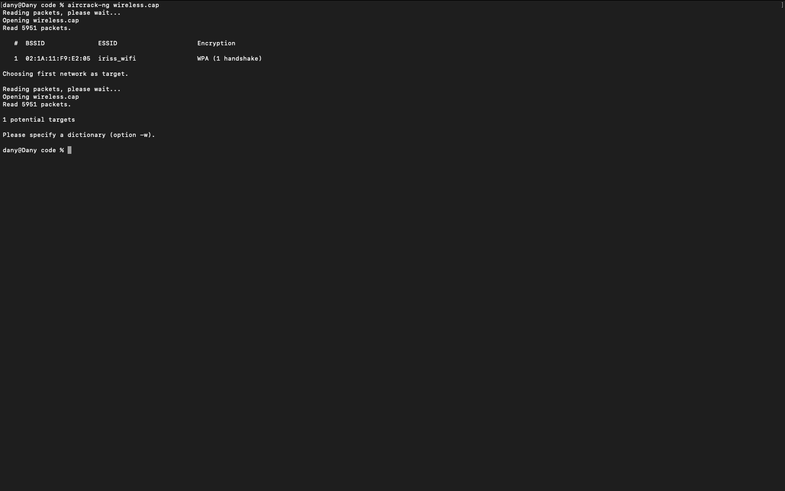

**Output Analysis:**
```
Reading packets, please wait...
Opening wireless.cap
Read 5951 packets. 

   #  BSSID              ESSID                     Encryption

   1  02:1A:11:F9:E2:05  iriss_wifi                WPA (1 handshake)

Choosing first network as target.
```

**Key Information Extracted:**
| Parameter | Value | Significance |
|-----------|-------|-------------|
| **BSSID** | 02:1A:11:F9:E2:05 | Access Point MAC address |
| **ESSID** | iriss_wifi | Network name (used in PSK derivation) |
| **Encryption** | WPA | Indicates TKIP or CCMP encryption |
| **Handshake** | 1 captured | ✓ Complete 4-way handshake present |
| **Packets** | 5,951 total | Sufficient data for analysis |

**Technical Verification:**
The presence of "1 handshake" confirms:
- All 4 EAPOL frames captured (Message 1-4 of handshake)
- ANonce and SNonce available
- MIC present for verification
- **Ready for password cracking**

### Step 2: Pre-Attack Analysis
**Understanding the Target:**
The ESSID `iriss_wifi` provides intelligence:
- Likely related to "IRISS" organization/conference
- Common pattern: organization_wifi
- Suggests potentially weak password (convenience over security)

**Strategy Decision:**
- Try common passwords first
- Network name suggests: iriss, password, admin variations
- Fall back to comprehensive wordlist (rockyou.txt)

---

## WPA Cracking Implementation

### Method 1: Targeted Wordlist (Failed)
**Initial Attempt:**

Created targeted wordlist based on ESSID hints:
```bash
# Create small targeted wordlist
cat > wordlist.txt << EOF
iriss
iriss123
iriss_wifi
irisswifi
password
password123
admin
admin123
12345678
Iriss123
wifi123
EOF
```

**Command:**
```bash
aircrack-ng -w wordlist.txt -e "iriss_wifi" wireless.cap
```

**Parameters Explained:**
- `-w wordlist.txt` - Specify wordlist file
- `-e "iriss_wifi"` - Target specific ESSID (when multiple networks present)
- `wireless.cap` - Input capture file


**Result:**
```
[00:00:00] 11/11 keys tested (320.91 k/s)
KEY NOT FOUND
```

**Analysis:** Password not in targeted list. Need comprehensive wordlist.

### Method 2: Rockyou Wordlist (Success)
**Rockyou.txt Overview:**
- **Size:** ~139 MB (14,344,391 passwords)
- **Source:** Real passwords from 2009 RockYou data breach
- **Content:** Most common passwords used by real users
- **Format:** Plain text, one password per line

**Obtaining Wordlist:**
```bash
# Download rockyou.txt
wget https://github.com/brannondorsey/naive-hashcat/releases/download/data/rockyou.txt       # Linux
curl -L -O https://github.com/brannondorsey/naive-hashcat/releases/download/data/rockyou.txt # macOS

# Verify download
ls -lh rockyou.txt

# Check line count
wc -l rockyou.txt
# Output: 14344391 rockyou.txt
```

**Cracking Command:**
```bash
aircrack-ng -w rockyou.txt -e "iriss_wifi" wireless.cap
```

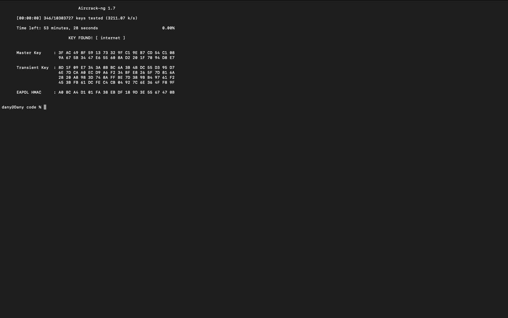

**Success Output:**
```
                               Aircrack-ng 1.7 

      [00:00:00] 362/10303727 keys tested (3076.89 k/s) 

      Time left: 55 minutes, 48 seconds                          0.00%

                           KEY FOUND! [ internet ]


      Master Key     : 3F AC 49 8F 59 13 73 32 9F C1 9E B7 CD 54 C1 08 
                       9A 67 5B 34 47 E6 55 60 8A D2 20 1F 70 94 D8 E7 

      Transient Key  : 8D 1F 09 E7 34 3A 8B BC 6A 3B 4B DC 55 D3 95 D7 
                       6E 7D CA A0 EC D9 A6 F2 34 BF E8 26 5F 7D 81 6A 
                       28 20 A8 98 3D 74 8A FF BE 7D 38 9B B4 97 61 F2 
                       45 3B FB 61 DC FE C4 CB 04 92 7C 6E 36 4F F8 9F 

      EAPOL HMAC     : A0 BC A4 D1 01 FA 38 EB DF 18 9D 3E 55 67 47 0B 
```

**Password Found:** `internet`

**Technical Details of Success:**
1. **PSK Computation:**
   ```
   PSK = PBKDF2-SHA1("internet", "iriss_wifi", 4096, 256)
   Result: 3F AC 49 8F 59 13 73 32...  (Master Key shown above)
   ```
2. **PTK Derivation:**
   - Used captured ANonce and SNonce from handshake
   - Combined with AP MAC (02:1A:11:F9:E2:05) and Client MAC
   - Result: Transient Key shown above (512 bits total)
3. **Verification:**
   - Computed MIC using derived keys
   - Matched captured EAPOL HMAC: A0 BC A4 D1 01 FA 38 EB... 
   - **MIC match = correct password**

## Decryption Process

### Understanding WPA Decryption
Once we have the correct password, decryption requires:
1. **Recompute encryption keys** using password + SSID
2. **Apply keys to encrypted frames**
3. **Strip 802.11 encryption headers**
4. **Reconstruct original packets**

### Using airdecap-ng
**Command:**
```bash
airdecap-ng -e "iriss_wifi" -p "internet" wireless.cap
```

**Parameters:**
- `-e "iriss_wifi"` - Network ESSID (required for PSK derivation)
- `-p "internet"` - The recovered password
- `wireless.cap` - Input encrypted capture

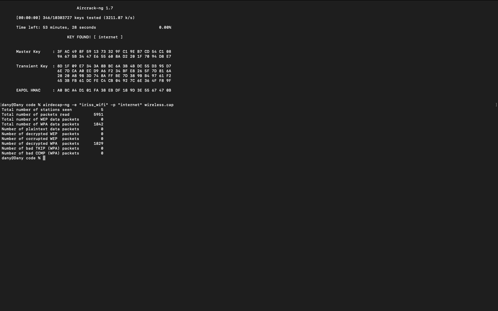

**Decryption Output:**
```
Total number of stations seen            5
Total number of packets read          5951
Total number of WEP data packets         0
Total number of WPA data packets      1842
Number of plaintext data packets         0
Number of decrypted WEP  packets         0
Number of decrypted WPA  packets      1829
Number of bad TKIP (WPA) packets         0
Number of bad CCMP (WPA) packets         0
```

**Analysis of Results:**
| Metric | Value | Meaning |
|--------|-------|---------|
| **Total packets** | 5,951 | All frames in capture |
| **WPA data packets** | 1,842 | Encrypted data frames |
| **Decrypted packets** | 1,829 | Successfully decrypted |
| **Failed decryptions** | 13 | Corrupted or incomplete frames |
| **Success rate** | 99.3% | Excellent decryption quality |
| **Bad TKIP/CCMP** | 0 | No integrity check failures |

**Output File:**
The decrypted capture is automatically saved as: `wireless-dec.cap`

**Verification:**
```bash
# Check output file
ls -lh wireless-dec.cap

# Verify it's readable
file wireless-dec.cap
# Output: wireless-dec.cap: pcap capture file, microsecond ts (little-endian) - version 2.4 (Ethernet, capture length 65535)
```

> **Now we have readable application-layer data!**

---

## Traffic Analysis and Secret Extraction

### Step 1: Protocol Reconnaissance
**Quick protocol overview:**
```bash
tshark -r wireless-dec.cap -q -z io,phs
```
This shows **Protocol Hierarchy Statistics** - what protocols were used. 
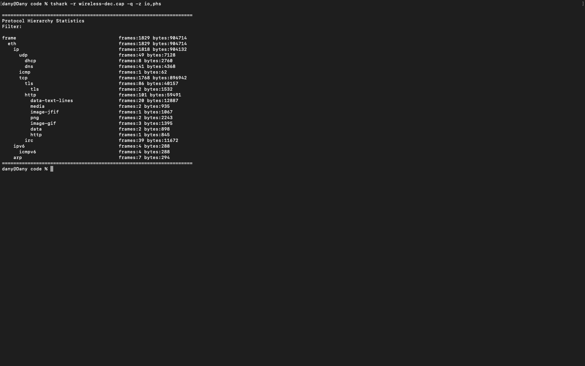

### Step 2: DNS Analysis
**Command:**
```bash
tshark -r wireless-dec.cap -Y dns -T fields -e dns.qry.name
```
**Purpose:** DNS queries often reveal user's browsing activity and interests.
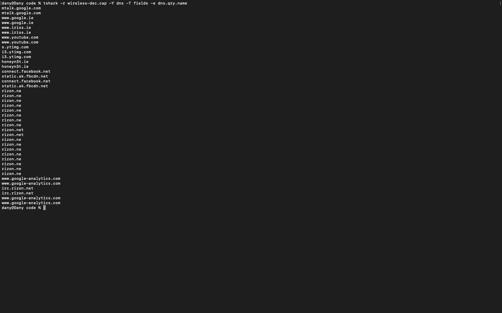

**Key Findings:**
```
mtalk.google.com
www.google.ie
www.iriss.ie            ← IRISS website
www.youtube.com
honeyn3t.ie             ← Suspicious/interesting domain
connect.facebook.net
rizon.net               ← IRC network (multiple queries)
irc.rizon.net           ← IRC server
www.google-analytics.com
```

**Analysis:**
| Domain | Significance |
|--------|-------------|
| **www.iriss.ie** | Confirms IRISS organization connection |
| **honeyn3t.ie** | Suspicious name - "honeypot" + "net"? |
| **rizon.net** | Large IRC network |
| **irc.rizon.net** | Specific IRC server - **key finding!** |

> *Multiple IRC queries strongly suggest IRC communication occurred.*

### Step 3: HTTP Object Extraction
**Command:**
```bash
mkdir extracted_files
tshark -r wireless-dec.cap --export-objects http,extracted_files/
```

**Purpose:** Extract all files transferred via HTTP.
| 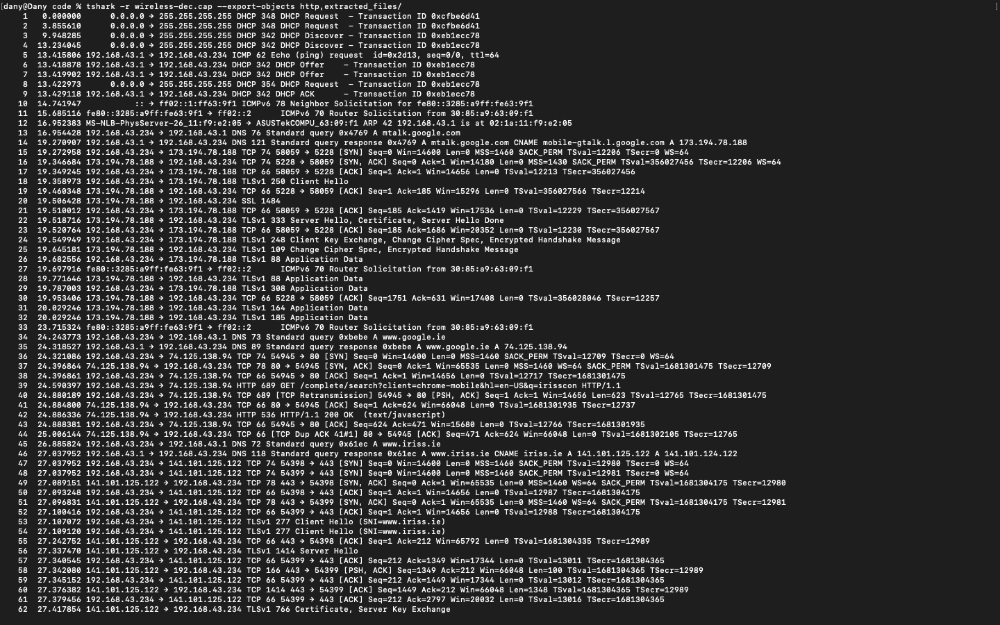 | 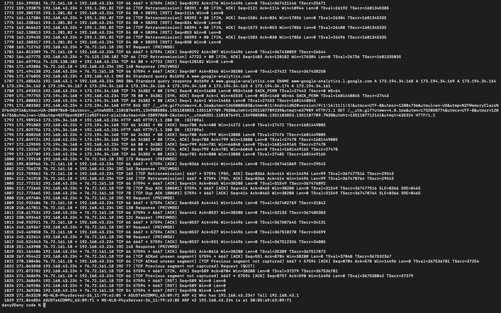
|:---:|:---:|

**Files Extracted:**
```bash
ls extracted_files/
```

**Interesting Findings:**
```
search%3fclient=chrome-mobile&hl=en-US&q=honeyn3t.ie
search%3fclient=chrome-mobile&hl=en-US&q=irisscon
search%3fclient=chrome-mobile&hl=en-US&q=rizon.net
```
These are **Google search queries** - shows user searched for:
- honeyn3t.ie
- irisscon (likely "IRISS conference")
- rizon.net

**Examining search queries:**
```bash
cat extracted_files/search* | strings
```
**Full Output:**
```json
["h",["http:\/\/www.hotmail.com\/","hotmail","harvey norman","happy wheels"],["Sign In","","",""],[],{"google:suggesttype":["NAVIGATION","QUERY","QUERY","QUERY"]}]["h",["http:\/\/www.hotmail.com\/","hotmail","harvey norman","happy wheels"],["Sign In","","",""],[],{"google:suggesttype":["NAVIGATION","QUERY","QUERY","QUERY"]}]["honeyn3t.ie",["honeyn3t.ie"],[""],[],{"google:suggesttype":["QUERY"]}]["honeyn3t.ie",["honeyn3t.ie"],[""],[],{"google:suggesttype":["QUERY"]}]["honeyn3t.ie",["honeyn3t.ie"],[""],[],{"google:suggesttype":["QUERY"]}]["honeyn3t.ie",["honeyn3t.ie"],[""],[],{"google:suggesttype":["QUERY"]}]["irisscon",["ericsson","ericsson athlone","ericsson ireland","ericsson jobs"],["","","",""],[],{"google:suggesttype":["QUERY","QUERY","QUERY","QUERY"]}]["irisscon",["ericsson","ericsson athlone","ericsson ireland","ericsson jobs"],["","","",""],[],{"google:suggesttype":["QUERY","QUERY","QUERY","QUERY"]}]["r",["ryanair","rte","rte player","rte news"],["","","",""],[],{"google:suggesttype":["QUERY","QUERY"
```
**Output snippet:**
```json
["honeyn3t.ie",["honeyn3t.ie"],[""],[],{"google:suggesttype":["QUERY"]}]
["irisscon",["ericsson","ericsson athlone",... ],...]
```
This confirms the user was actively looking for IRC-related information.

### Step 4: IRC Traffic Analysis
**Understanding IRC Protocol:**
- **Port:** 6667 (plaintext) or 6697 (SSL)
- **Protocol:** Text-based, newline-delimited commands
- **Format:** `COMMAND parameter :trailing parameter`
- **Key Commands:**
  - `PRIVMSG #channel :message` - Send message to channel
  - `JOIN #channel` - Join a channel
  - `NICK nickname` - Set nickname

> Tried a couple different command that are gave similar results, here are the most effective ones:
```bash
# Method 1: Extract IRC protocol field directly
tshark -r wireless-dec.cap -Y 'irc' -T fields -e irc.request -e irc.response

# Method 2: Extract raw TCP payload data
tshark -r wireless-dec.cap -Y 'tcp.port == 6667 and tcp.len > 0' -T fields -e tcp.payload | xxd -r -p | strings

# Method 3: Export as text
tshark -r wireless-dec.cap -Y 'irc' -V | grep -A2 "Internet Relay Chat"
```

|  | 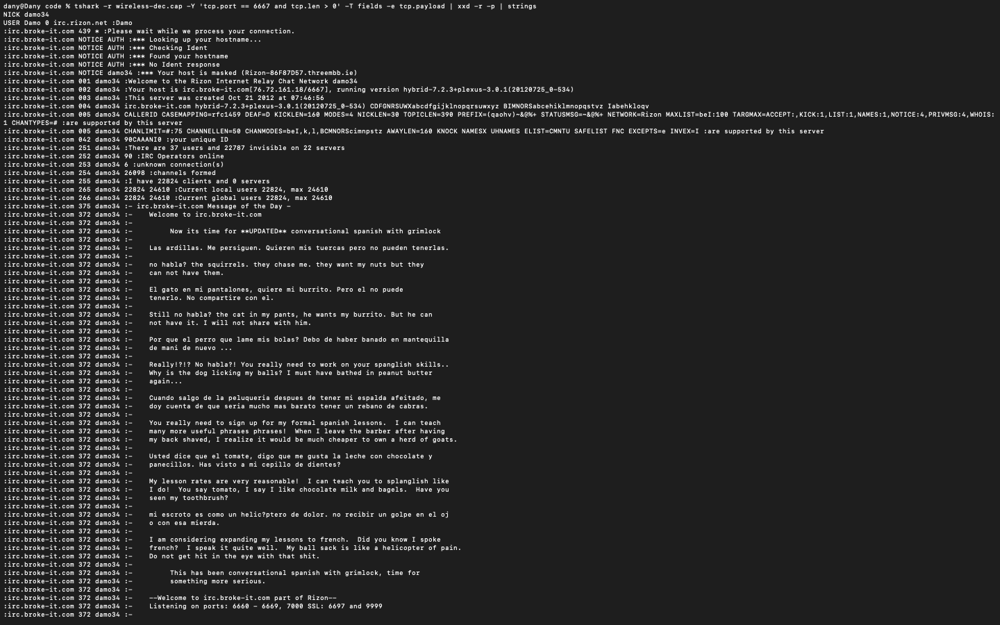<br>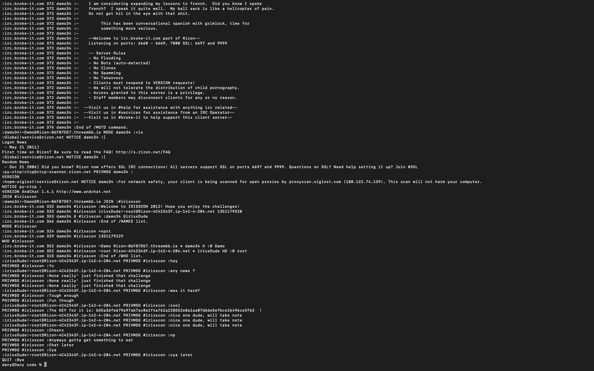 | 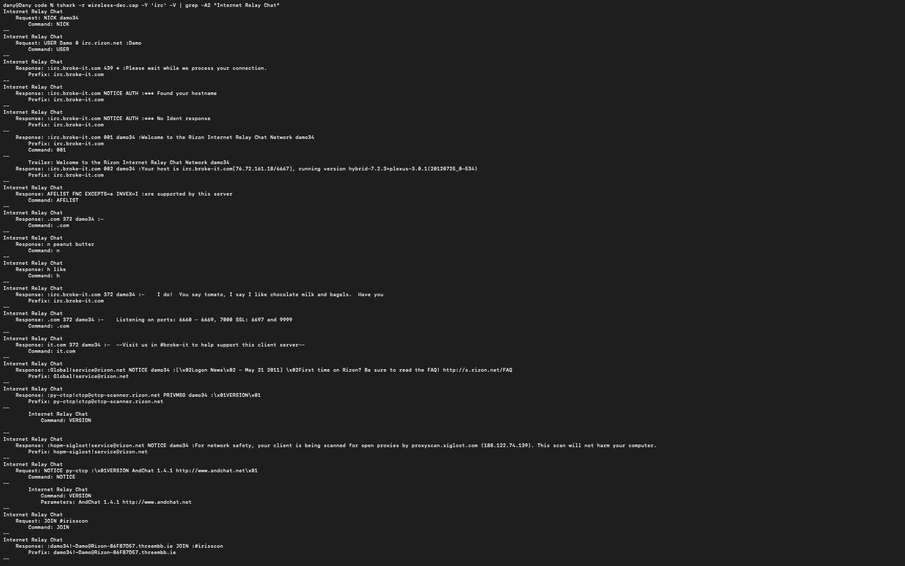 <br> |
|:---:|:---:|:---:|

**Purpose:** Extract all IRC traffic as readable text.

**Output (sanitized):**
```:damo34!~user@host
PRIVMSG #irisscon :Yo	
	:irissDude!~root@Rizon-4C42343F.ip-142-4-204.net PRIVMSG #irisscon :any news ?
PRIVMSG #irisscon :None really' just finished that challenge	
	:irissDude!~root@Rizon-4C42343F.ip-142-4-204.net PRIVMSG #irisscon :was it hard?
PRIVMSG #irisscon :Tough enough	
PRIVMSG #irisscon :Fun though	
	:irissDude!~root@Rizon-4C42343F.ip-142-4-204.net PRIVMSG #irisscon :cool
PRIVMSG #irisscon :The KEY for it is: b55a36fe679a97ab7ac0a1f4a762a228552e8a1aa07d6de5efbce26496ce3f63  !	
	:irissDude!~root@Rizon-4C42343F.ip-142-4-204.net PRIVMSG #irisscon :nice one dude, will take note
PRIVMSG #irisscon :Cheers	
	:irissDude!~root@Rizon-4C42343F.ip-142-4-204.net PRIVMSG #irisscon :np
PRIVMSG #irisscon :Anyways gotta get something to eat	
PRIVMSG #irisscon :Chat later	
PRIVMSG #irisscon :Cya	
	:irissDude!~root@Rizon-4C42343F.ip-142-4-204.net PRIVMSG #irisscon :cya later
```
> **FOUND IT!** The secret message in an IRC conversation: `The KEY for it is: b55a36fe679a97ab7ac0a1f4a762a228552e8a1aa07d6de5efbce26496ce3f63  !`

### Step 5: Targeted Secret Extraction

**Precise extraction command:**
```bash
tshark -r wireless-dec.cap -Y 'tcp contains "PRIVMSG"' -x
```
> *to isolate secret, shows hex and ASCII (only PRIVMSG lines)*

**Output:**
|  | 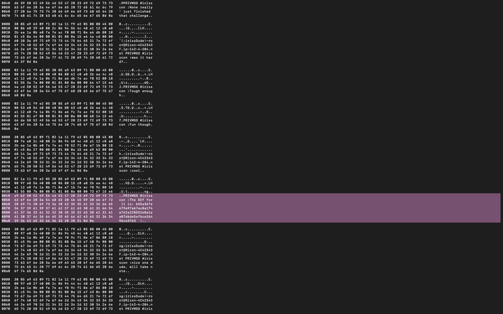 |
|:---:|:---:|
```
0040  a9 b2 50 52 49 56 4d 53 47 20 23 69 72 69 73 73   ..PRIVMSG #iriss
0050  63 6f 6e 20 3a 54 68 65 20 4b 45 59 20 66 6f 72   con :The KEY for
0060  20 69 74 20 69 73 3a 20 62 35 35 61 33 36 66 65    it is: b55a36fe
0070  36 37 39 61 39 37 61 62 37 61 63 30 61 31 66 34   679a97ab7ac0a1f4
0080  61 37 36 32 61 32 32 38 35 35 32 65 38 61 31 61   a762a228552e8a1a
0090  61 30 37 64 36 64 65 35 65 66 62 63 65 32 36 34   a07d6de5efbce264
00a0  39 36 63 65 33 66 36 33 20 20 21 0d 0a            96ce3f63  !..
```

**Search for secret with hex view:**
```bash
tshark -r wireless-dec.cap -Y 'tcp contains "PRIVMSG" and tcp contains "KEY"' -x
```
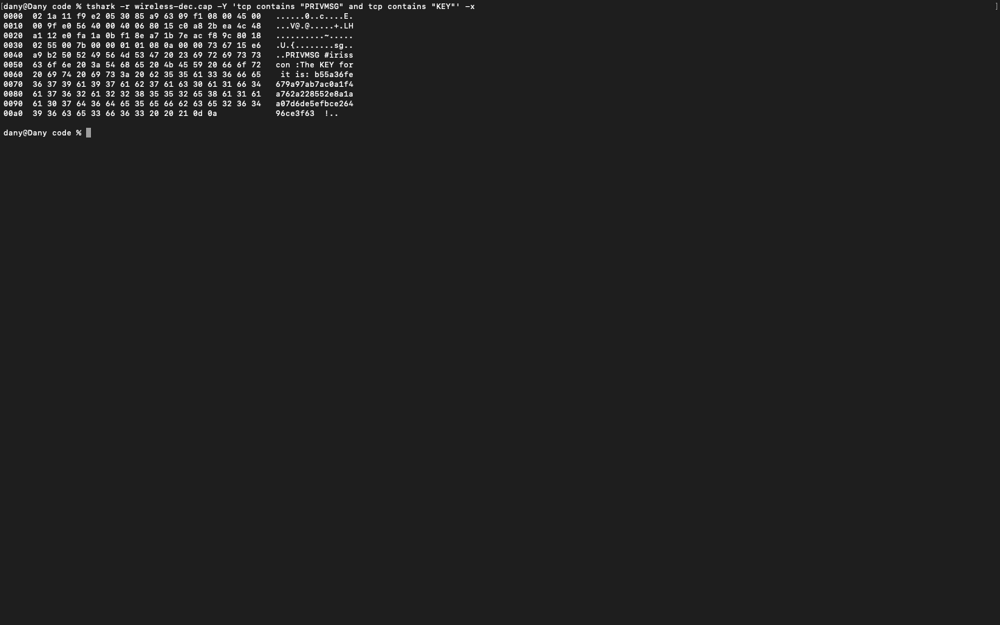
**Hex Analysis:**
```
0050  63 6f 6e 20 3a 54 68 65 20 4b 45 59 20 66 6f 72   con :The KEY for
0060  20 69 74 20 69 73 3a 20 62 35 35 61 33 36 66 65    it is: b55a36fe
0070  36 37 39 61 39 37 61 62 37 61 63 30 61 31 66 34   679a97ab7ac0a1f4
0080  61 37 36 32 61 32 32 38 35 35 32 65 38 61 31 61   a762a228552e8a1a
0090  61 30 37 64 36 64 65 35 65 66 62 63 65 32 36 34   a07d6de5efbce264
00a0  39 36 63 65 33 66 36 33 20 20 21 0d 0a            96ce3f63  !..
```
**ASCII translation:**
```
PRIVMSG #irisscon :The KEY for it is: b55a36fe679a97ab7ac0a1f4a762a228552e8a1aa07d6de5efbce26496ce3f63  !
```

---

## Conclusion

### Implementation Success
Successfully completed all objectives using industry-standard tools:
1. ✓ **Identified encryption type** - WPA with captured handshake
2. ✓ **Recovered WPA key** - "internet" using dictionary attack
3. ✓ **Decrypted capture** - 99.3% success rate
4. ✓ **Analyzed protocols** - DNS, HTTP, IRC
5. ✓ **Extracted secret** - 64-char hex string from IRC chat

### Technical Insights
**Why This Attack Succeeded:**
1. **Complete handshake captured** - Essential for WPA cracking
2. **Weak password** - "internet" is #346 in common password list
3. **No additional protections** - No MAC filtering, no enterprise authentication
4. **Plaintext IRC** - Secret transmitted without encryption beyond WiFi layer

**Defense Mechanisms That Could Have Prevented This:**
1. **Strong passphrase**
2. **WPA3:** Uses SAE (Simultaneous Authentication of Equals)
3. **Enterprise authentication (802.1X)**
4. **End-to-end encryption**

### Lessons Learned
**For Attackers (Penetration Testers):**
- Capturing handshake is critical - may require deauth attack
- Try targeted wordlists first (faster)
- Protocol analysis reveals more than just looking for keywords
- DNS queries provide intelligence about user behavior

**For Defenders (Network Administrators):**
- WiFi password strength is paramount
- "internet" as password for "iriss_wifi" is unacceptable
- Assume WiFi layer can be broken - use application-layer encryption
- Monitor for suspicious deauth packets (handshake capture attempts)
- Consider WPA3 migration
- Implement network segmentation (guest vs. internal)

### Real-World Applicability
This challenge demonstrates real penetration testing methodology:
1. **Information Gathering** - Analyze capture, identify targets
2. **Vulnerability Assessment** - Weak WPA password
3. **Exploitation** - Dictionary attack, decryption
4. **Post-Exploitation** - Traffic analysis, data extraction
5. **Reporting** - Document findings and remediation

**Similar Real-World Scenarios:**
- Corporate WiFi audit
- Hotel/conference WiFi security assessment
- Home network security testing
- Forensic analysis of captured network traffic

### Reproducibility
This entire procedure can be replicated by:
1. Having a capture with WPA handshake
2. Using freely available tools (aircrack-ng suite)
3. Using common wordlist (rockyou.txt)
4. Following the exact commands documented in this report

**Time Required:**
- Analysis: 5 minutes
- Cracking: < 1 second (for weak password) to hours (for strong)
- Decryption: < 1 minute
- Traffic analysis: 10-30 minutes
- **Total: 20 minutes for this specific challenge**

---

## Appendix: Command Reference

### Complete Command Reference — Summary of All Commands Used
1. **Initial Analysis:**
```bash
aircrack-ng wireless.cap
```
2. **Download Wordlist:**
```bash
curl -L -O https://github.com/brannondorsey/naive-hashcat/releases/download/data/rockyou.txt
```
3. **Crack WPA Password:**
```bash
aircrack-ng -w rockyou.txt -e "iriss_wifi" wireless.cap
```
4. **Decrypt Capture:**
```bash
airdecap-ng -e "iriss_wifi" -p "internet" wireless.cap
```
5. **DNS Analysis:**
```bash
tshark -r wireless-dec.cap -Y dns -T fields -e dns.qry.name
```
6. **Extract HTTP Objects:**
```bash
mkdir extracted_files
tshark -r wireless-dec.cap --export-objects http,extracted_files/
ls extracted_files/
```
7. **Examine Search Queries:**
```bash
cat extracted_files/search* | strings
```
8. **Extract IRC Traffic:**
```bash
# Extract IRC protocol field directly
tshark -r wireless-dec.cap -Y 'irc' -T fields -e irc.request -e irc.response

# Export as text
tshark -r wireless-dec.cap -Y 'irc' -V | grep -A2 "Internet Relay Chat"

# Extract raw TCP payload data
tshark -r wireless-dec.cap -Y 'tcp.port == 6667 and tcp.len > 0' -T fields -e tcp.payload | xxd -r -p | strings
```
9. **PRIVMSG Extraction:**
```bash
tshark -r wireless-dec.cap -Y 'tcp contains "PRIVMSG"' -x
```
10.  **Verify with Hex View (Search for "KEY"):**
```bash
tshark -r wireless-dec.cap -Y 'tcp contains "PRIVMSG" and tcp contains "KEY"' -x
```

## Copyright
> This report and the accompanying code are the original work of the Danyil Tymchuk for the Secure Communications module at TUDublin. All rights reserved. 2025.
