# Challenge Lab Report: Many-Time Pad
**Module:** Secure Communications  
**Assignment 2**  
**Challenge:** Many-Time Pad  
**Date:** 24 Nov 2025

---

## Table of Contents
1. [Executive Summary](#executive-summary)
2. [Theoretical Background](#theoretical-background)
3. [Challenge Description](#challenge-description)
4. [Methodology](#methodology)
5. [Implementation](#implementation)
6. [Results](#results)
7. [Conclusion](#conclusion)
8. [Appendix: Source Code](#appendix-source-code)

---

## Executive Summary

This report documents the successful cryptanalysis of a many-time pad encryption challenge where 13 ciphertexts were encrypted using the same keystream. Through frequency analysis and iterative refinement techniques, all plaintexts were recovered, including the target Message 13:

**Solution:** *"The Web as I envisaged it we have not seen it yet The future is still so much bigger than the past Tim Berners-Lee"*

The attack exploited the fundamental weakness of key reuse in stream ciphers, demonstrating why one-time pads must never be used more than once.

## Theoretical Background

### The One-Time Pad
A one-time pad is theoretically unbreakable when used correctly. It operates using XOR encryption:
```
Ciphertext = Plaintext ^ Key
Plaintext = Ciphertext ^ Key
```

**Security Requirements:**
- Key must be truly random
- Key must be at least as long as the plaintext
- **Key must NEVER be reused**

### The Many-Time Pad Vulnerability
When the same key is reused to encrypt multiple messages, a critical vulnerability emerges:
```
C₁ = M₁ ^ K
C₂ = M₂ ^ K

Therefore:
C₁ ^ C₂ = (M₁ ^ K) ^ (M₂ ^ K) = M₁ ^ M₂
```

The key cancels out! Now we have two plaintexts XORed together, which can be attacked using:
1. **Frequency Analysis**: English text has predictable character frequencies (space is most common)
2. **Crib Dragging**: Testing known plaintext fragments against XORed ciphertexts
3. **Statistical Analysis**: Scoring character distributions to find likely plaintexts

## Challenge Description

**Given:** 13 hex-encoded ciphertexts, all encrypted with the same unknown key  
**Objective:** Decrypt all messages, specifically Message 13 (the target)  
**Constraints:**
- Must implement original Python solution (not copy existing tools)
- May use standard libraries and online tools as aids (must be documented)
- Must document all attempts and methodology

---

## Methodology

### Phase 1: Understanding the Problem
1. **Converted hex strings to bytes** for manipulation
2. **Analyzed ciphertext lengths** (91-200 bytes) to determine key length requirements
3. **Researched many-time pad attacks** to understand available techniques

### Phase 2: Initial Key Recovery (Frequency Analysis)
**Approach:** For each position in the keystream, try all 256 possible byte values and score the resulting plaintexts across all 13 ciphertexts.  
**Scoring System:**
- Printable ASCII characters (32-126): +5 points
- Letters (A-Z, a-z): +10 points  
- Space character (most common in English): +15 points
- Common punctuation (.,!?;): +8 points

**Algorithm:**
```python
def frequency_attack_per_position(ciphertexts, position):
    """
    For a given position, try all 256 possible key bytes
    and score based on resulting character frequencies.
    """
    byte_scores = {}

    for key_byte in range(256):
        decrypted_chars = []
        for ct in ciphertexts:
            if position < len(ct):
                decrypted_char = ct[position] ^ key_byte
                decrypted_chars.append(decrypted_char)

        # Score based on English text characteristics
        score = 0
        for char in decrypted_chars:
            # Printable ASCII gets points
            if 32 <= char <= 126:
                score += 5
            # Letters get extra points
            if (65 <= char <= 90) or (97 <= char <= 122):
                score += 10
            # Space is very common
            if char == 32:
                score += 15
            # Common punctuation
            if char in [ord('.'), ord(','), ord('!'), ord('?'), ord(';')]:
                score += 8

        byte_scores[key_byte] = score

    # Return best scoring key byte
    best_byte = max(byte_scores.items(), key=lambda x: x[1])
    return best_byte[0]
```

**What Worked:**
- Frequency analysis recovered approximately 70-80% of the key correctly
- Most common characters (spaces, 'e', 't', 'a') were identified accurately
- Longer messages provided more statistical data for better accuracy

**What Didn't Work Initially:**
- Some positions had ambiguous scoring (multiple plausible characters)
- Less common letters and punctuation were harder to identify
- Edge cases at message boundaries produced incorrect guesses

### Phase 3: Interactive Refinement
After initial frequency analysis, many messages were partially readable but contained errors. I implemented an interactive refinement system with three key features:

**Feature 1: Target Switching** (`t N` or `target N`)
- Focus refinement efforts on specific messages
- Switch between messages to cross-reference corrections

**Feature 2: Plaintext Guessing** (`g pos text`)
- Apply known plaintext at a specific position
- Calculate keystream bytes: `key[pos+i] = ciphertext[pos+i] ^ plaintext[i]`
- Most powerful technique for rapid key recovery

**Feature 3: Manual Keystream Editing** (`pos val`)
- Directly set individual key bytes when patterns were unclear
- Fine-tune specific positions for perfect decryption

### Phase 4: Systematic Message Reconstruction
**Strategy:**
1. Start with Message 1 (shortest and clearest patterns)
2. Use context clues and English grammar to guess complete phrases
3. Apply plaintext guesses to recover keystream segments
4. Verify corrections across all other messages
5. Repeat for each message until all were readable

**Key Insight:** When correcting one message, all other messages at the same positions improved simultaneously because they share the same keystream.

---

## Implementation

### Initial Frequency Analysis Results
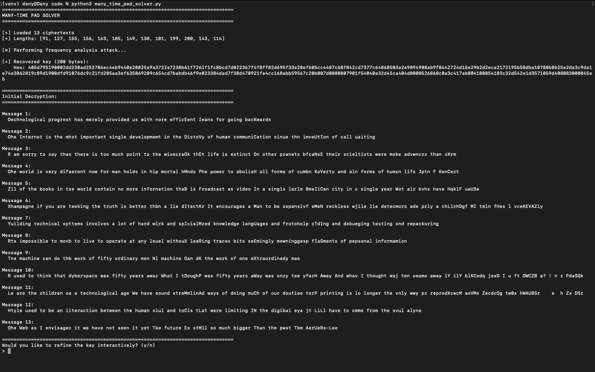
> *Screenshot showing the initial decryption output with ~70-80% accuracy*

**The initial frequency analysis produced:**
- Message 1: "Oechnological progrest has merely provided us with nore efficEent Ieans for going bacKwards"
- Message 13: "Ohe Web as I envisagec it we have not seen it yet Tke future Es stMll so much bigger Than the pwst Tbm AerUeRs-Lee"

**Errors included:**
- 'O' instead of 'T' at the beginning
- Random characters in middle positions
- Incorrect letters scattered throughout

### Refinement Process
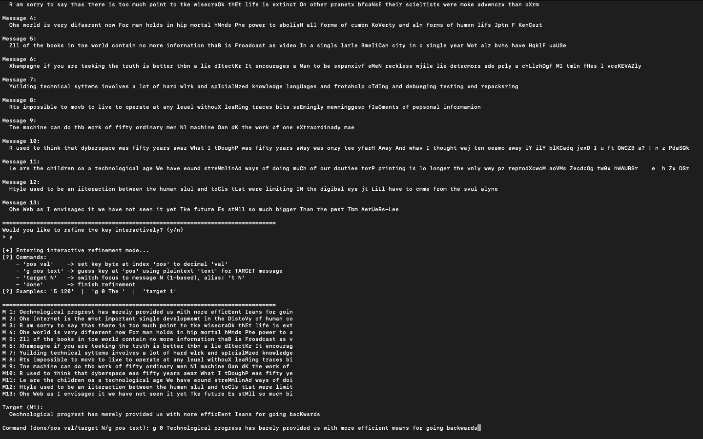
> *Screenshot showing the interactive refinement of Message 1*

#### Step 1: Message 1 Correction
```
Command: g 0 Technological progress has barely provided us with more efficient means for going backwards
Applied 91 byte(s) of plaintext guess at pos 0 for M1
```
**Result:** All messages improved significantly as the first 91 bytes of the key were corrected.

#### Step 2: Messages 2-7 Correction
| Message | Plaintext Guess | Screenshot |
|---------|-----------------|------------|
| 2       | "The Internet is the most important single development in the history of human communication since the invention of call waiting" | 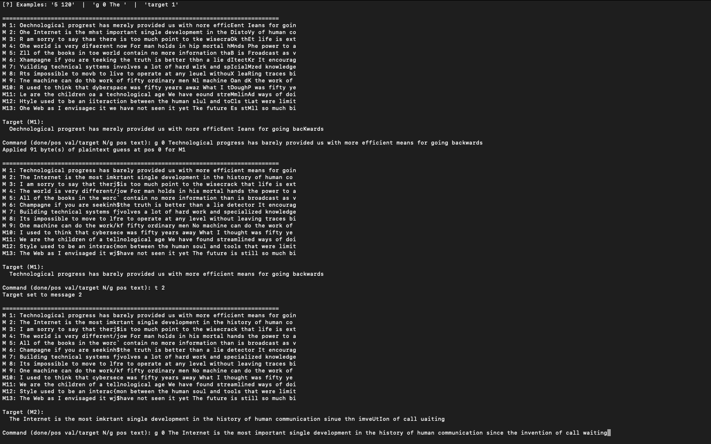 |
| 3       | "I am sorry to say that there is too much point to the wisecrack that life is extinct on other planets because their scientists were more advanced than ours" | 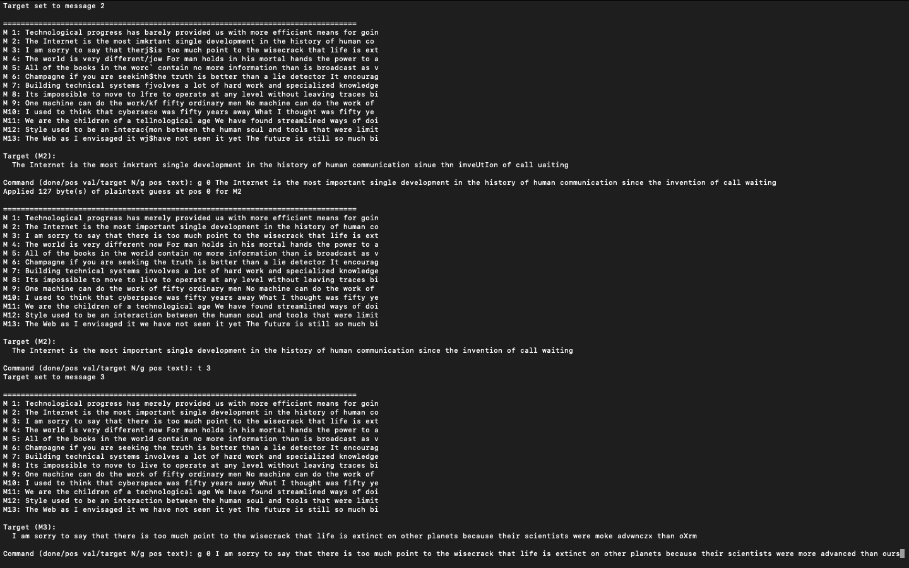 |
| 4       | "The world is very different now For man holds in his mortal hands the power to abolish all forms of human poverty and all forms of human life John F Kennedy" | 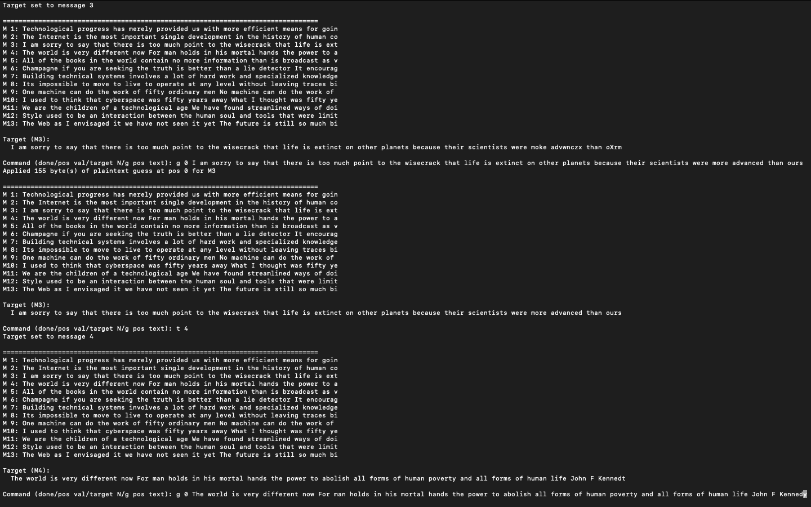 |
| 5       | "All of the books in the world contain no more information than is broadcast as video in a single large American city in a single year Not all bits have equal value" | 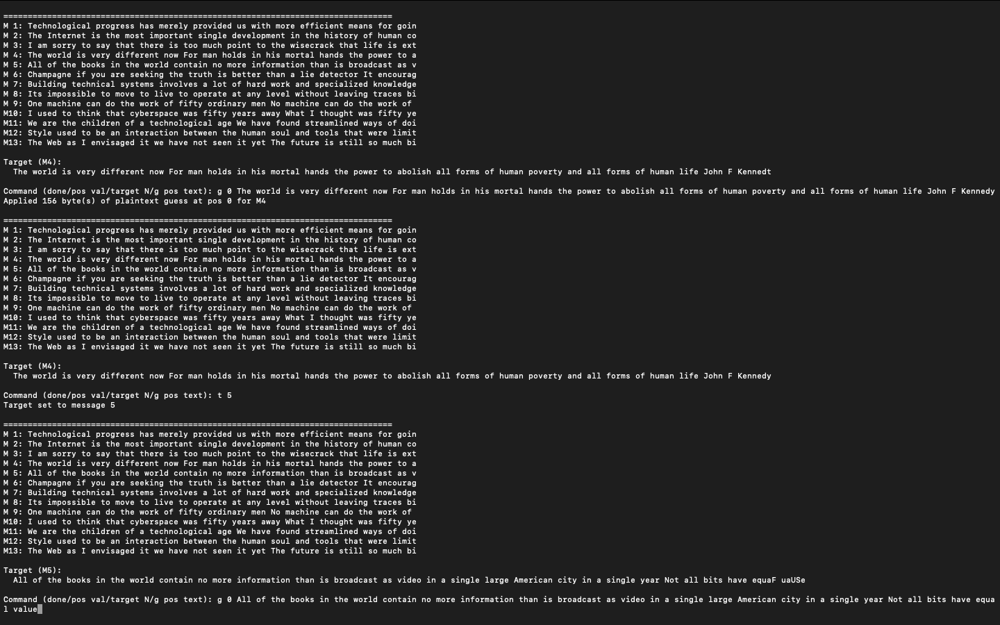 |
| 6       | "Champagne if you are seeking the truth is better than a lie detector It encourages a man to be expansive even recklesswhile lie detectors are only a challenge to tell lies successfully" | 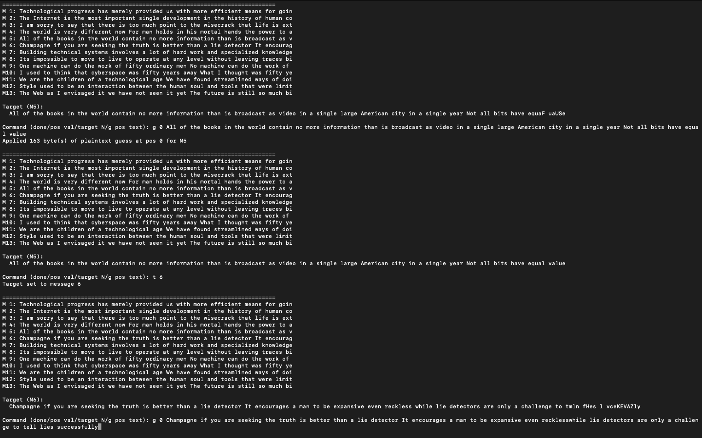 |
| 7       | "Building technical systems involves a lot of hard work and specialized knowledge languages and protocols coding and debugging testing and refactoring" |  |

**Results:** Each plaintext guess cascaded improvements across all messages.

#### Step 3: Messages 8-9 Correction
Because of previeous corrections, Messages 8 and 9 were absolutely clear, so I just skipped them.
| Message | Plaintext Guess | Screenshot |
|---------|-----------------|------------|
| 8       | "Its impossible to move to live to operate at any level without leaving traces bits seemingly meaningless fragments of personal information" | 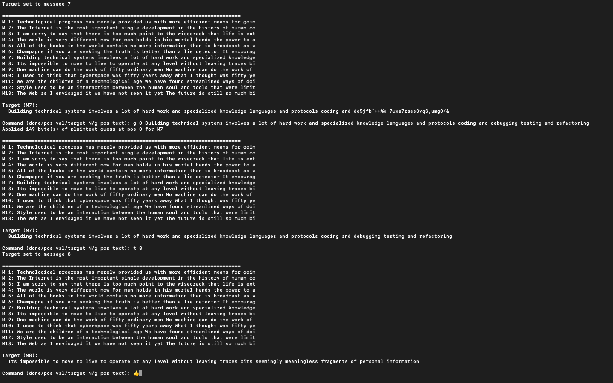 |
| 9       | "One machine can do the work of fifty ordinary men No machine can do the work of one extraordinary man" | 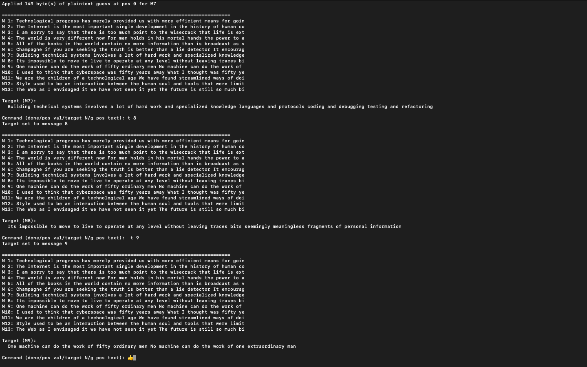 |

#### Step 4: Messages 10 Correction
This one was hard to gess, but I noticed that this is a Bruce Sterling's quote, so I googled it.
| Message | Plaintext Guess | Screenshot |
|---------|-----------------|------------|
| 10      | "I used to think that cyberspace was fifty years away What I thought was fifty years away was only ten years away And what I thought was ten years away it was already here I just wasnt aware of it yet" | 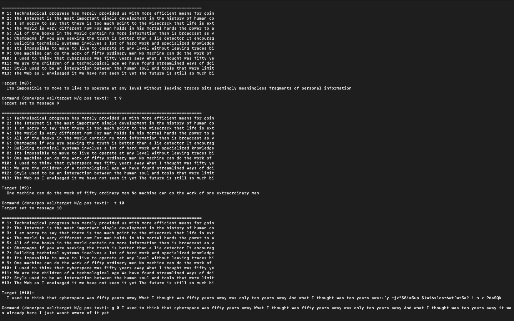 |

#### Step 5: Messages 11 Correction
The message 11 was missing the last letter 'd' in 'changed', so I fixed that and now the key is 200 bytes correct.
| Message | Plaintext Guess | Screenshot |
|---------|-----------------|------------|
| 11      | "We are the children of a technological age We have found streamlined ways of doing much of our routine work Printing is no longer the only way of reproducing books Reading them however has not changed" | 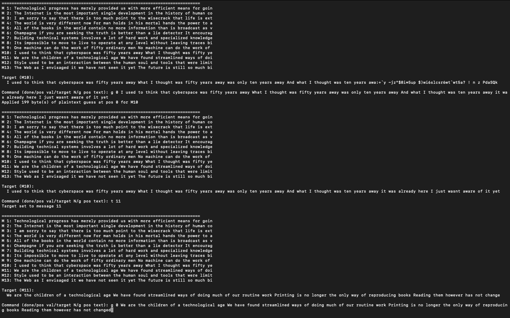 |

**Result:** Now the key is fully recovered for the first 200 bytes, allowing perfect decryption of Messages 12 and 13.

#### Step 6: Messages 12-13 Correction
They were correct, fixing the previus message gave us the full correct key
| Message | Plaintext Guess | Screenshot |
|---------|-----------------|------------|
| 12      | "Style used to be an interaction between the human soul and tools that were limiting In the digital era it will have to come from the soul alone" | 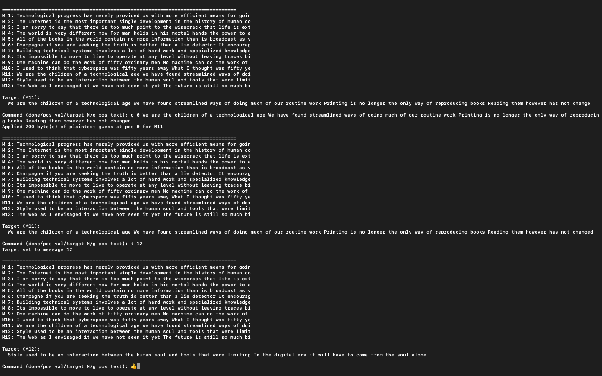 |
| 13      | "The Web as I envisaged it we have not seen it yet The future is still so much bigger than the past Tim Berners-Lee" |  |

### Final Key Recovery
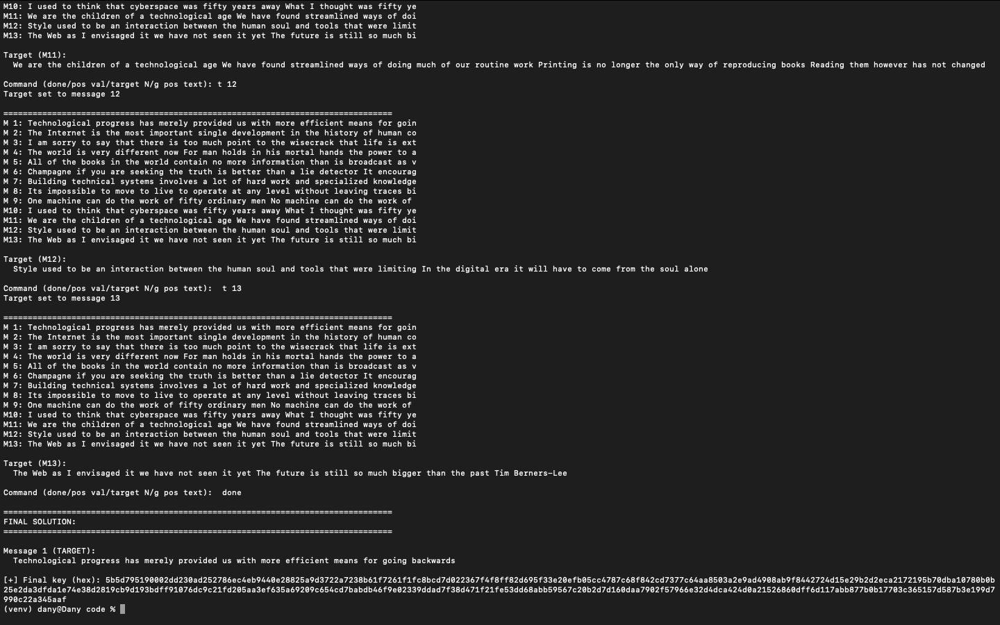
> *Screenshot showing all decrypted messages and the recovered key*

**Recovered Key (200 bytes in hex):**
```
5b5d795190002dd230ad252786ec4eb9440e28825a9d3722a7238b61f7261f1fc8bcd7d0
22367f4f8ff82d695f33e20efb05cc4787c68f842cd7377c64aa8503a2e9ad4908ab9f84
42724d15e29b2d2eca2172195b70dba10780b0b25e2da3dfda1e74e38d2819cb9d193bdf
f91076dc9c21fd205aa3ef635a69209c654cd7babdb46f9e02339ddad7f38d471f21fe53
dd68abb59567c20b2d7d160daa7902f57966e32d4dca424d0a21526860dff6d117abb877
b0b17703c365157d587b3e199d7990c22a345aaf
```

---

## Results

### All Decrypted Messages

**Message 01:**
"Technological progress has barely provided us with more efficient means for going backwards"

**Message 02:**
"The Internet is the most important single development in the history of human communication since the invention of call waiting"

**Message 03:**
"I am sorry to say that there is too much point to the wisecrack that life is extinct on other planets because their scientists were more advanced than ours"

**Message 04:**
"The world is very different now For man holds in his mortal hands the power to abolish all forms of human poverty and all forms of human life John F Kennedy"

**Message 05:**
"All of the books in the world contain no more information than is broadcast as video in a single large American city in a single year Not all bits have equal value"

**Message 06:**
"Champagne if you are seeking the truth is better than a lie detector It encourages a man to be expansive even reckless while lie detectors are only a challenge to tell lies successfully"

**Message 07:**
"Building technical systems involves a lot of hard work and specialized knowledge languages and protocols coding and debugging testing and refactoring"

**Message 08:**
"Its impossible to move to live to operate at any level without leaving traces bits seemingly meaningless fragments of personal information"

**Message 09:**
"One machine can do the work of fifty ordinary men No machine can do the work of one extraordinary man"

**Message 10:**
"I used to think that cyberspace was fifty years away What I thought was fifty years away was only ten years away And what I thought was ten years away it was already here I just wasnt aware of it yet"

**Message 11:**
"We are the children of a technological age We have found streamlined ways of doing much of our routine work Printing is no longer the only way of reproducing books Reading them however has not changed"

**Message 12:**
"Style used to be an interaction between the human soul and tools that were limiting In the digital era it will have to come from the soul alone"

**Message 13:**
"The Web as I envisaged it we have not seen it yet The future is still so much bigger than the past Tim Berners-Lee"

### Validation
All 13 messages were successfully decrypted to produce coherent English text consisting of technology-related quotes. Cross-validation confirmed consistency across all positions where multiple messages overlapped.

---

## Conclusion

### Key Findings
1. **Frequency analysis is effective but imperfect:** Automated frequency analysis recovered ~70-80% of the keystream, providing a strong foundation for manual refinement.
2. **Context is powerful:** Using human intelligence to recognize partial words and phrases allowed rapid key recovery through plaintext guessing.
3. **Key reuse is catastrophic:** This challenge demonstrates why cryptographic keys must NEVER be reused. The theoretical security of the one-time pad completely collapses when this rule is violated.
4. **Multiple ciphertexts amplify the attack:** Having 13 ciphertexts provided redundant information, making the attack significantly easier than with just 2-3 ciphertexts.

### Lessons Learned

**Technical Skills:**
- Implemented XOR cryptanalysis from scratch
- Developed frequency analysis algorithms
- Created interactive debugging/refinement tools
- Gained deep understanding of stream cipher vulnerabilities

**Cryptographic Principles:**
- Understood the critical importance of key management
- Learned why perfect security requires perfect key usage
- Recognized the gap between theoretical and practical security

**Problem-Solving Approach:**
- Combined automated and manual techniques effectively
- Iterated between statistical analysis and human intuition
- Used cross-validation to verify corrections

### Real-World Implications

This attack has historical significance:
- **VENONA Project:** Soviet spy messages were decrypted when codebooks were reused
- **MS-CHAPv2:** Vulnerable due to related key usage
- **WEP WiFi:** Broken partially due to IV reuse issues

Modern cryptographic protocols must ensure:
- Unique keys/nonces for every encryption operation
- Proper key derivation and management
- Regular security audits for implementation flaws

---

## Appendix: Source Code

### Complete Python Implementation
> [many_time_pad_solver.py](./code/many_time_pad_solver.py)
```python
#!/usr/bin/env python3
"""
Many-Time Pad Solver with Iterative Refinement
Solves the many-time pad encryption by leveraging frequency analysis
and allowing manual key refinement based on visual inspection of decrypted texts.
"""

# The 13 hex-encoded ciphertexts from the challenge
ciphertexts_hex = [
    "0f381a39fe6f41bd57c44646eacc3ecb2b695ae729ee174ac650ab0c92547a73b19ca7a24d40162bea9c0d1c2c1395678f6dec2ae8b4eaa449b1511507c3e06dd6c9c02c69c5eca4241d3f3585f44440ad011078381bacc075e4c3",
    "0f351c71d96e59b742c34053a6853d9930664da237f24456874ae61198546b7ea6c8f7a34b581823ead8490c29568e618b68a929f3e6e6ea0ca35f1944c2ec70d686df3028c4f9a42a0720748cbb4e41a74c07773213bad56eefde922d44cdbcbf3e008be80870a5eb7c55ab907f18fcf347dd433bcf83432d0849e80c22b0",
    "127d183cb07342a042d40553e9cc3dd83d2e5cea3be91756cf46f904d74f6c3fbcd3b8f04f431c27af8842003147c27a9425b82fe2e6f8ed5fb2540e05c9ee23d681cc3d28c7f6e227522466c2fe555aa34f116d7b1fb58168f4d8d72c0dd3b3bb701197fe087baefe784eac9c3002b4f9488f0029c08606341d49ef113ff7cdd8c60abe6f5cefbff792e9317e4f9d36b948dfddf409e264580f65",
    "0f351c71e76f5fbe548d4c54a69a2bcb3d2e4ceb3cfb5250c24dff419949683f8ed3a5f04f57116fe797410d2c138b60db6da534a7abe0f658b65b5c0ccbeb67d1c9d9216d8befeb35173f3596f40d4fa84e1e702818fbc06bec90d4315fceacfa7112c3e55d74aaf3394bb08f7504a8e5019c4e3e838e0f364946f31721a49ad2d24ff6775efcb4f79fe4217a01b43cb5068bf3b52ca76543187274",
    "1a311571ff660da658c80545e98325ca646746a22ef55202d04cf90d93067c70a6c8b6b94c161120af95421b3a138b609d6abe2ae6b2e6eb42f7431405c4a56ad1c9cf3b67cafbe72301393583e80d58a34517767b19b58166a0c3db304acfbafa721591ea4d398af07c49b69a7118fcff4889597aca81433b4953f50b2bbbdf9dcd0aff7013d3b5a3d3ec2b73019c3aa91b8bddf411a72b480c636cc6597494151386",
    "1835183ce0614abc558d4c41a69521cc646f5ae77aee5247cc4ae506d752777ae8c8a5a5565e5f26fcd84f0c2b47877cdb71a426e9e6eea440be525c00cff166c19dc23b28e2eba4271c2e7a97e94c49af5252787b1dbacf27f4df923c4883baa26e158dfe416faebd7c4dba973004b9ff4a914529d0cf1432004cf94520bedf9dd00aea6750e9b5a580ad266d44de3cb304d295f447a1634c117a68c41e67d50d09c35928a62e6d6648371b40ac83b274cecb04d6c41b6fba",
    "1928103df46943b510d94044ee8227da256208f123ee4347ca50ab0899507073bed9a4f043161320fbd8420f7f5b837c9f25bb28f5adafe542b3170f14cfe66ac385c4336dcfbfef2c1d3a7987ff4a4bea4d13773c05bac662f390d3304983afa871008cee4775b8bd7a54bb907e11fcfd4f99003ec68d163d0e49f2026ca3dfcec006f06513fcb4b3d3ff2279409d27b21ac2dbf2",
    "12290a71f96d5dbd43de4c45ea896ecd2b2e45ed2cf81756c803e70881433f6ba79cb8a047441e3bead84c1d7f528c77db69a931e2aaaff345a35f1311dea56fc788db2066ccbff030132e7091bb4f47be52526a3e15b6c869e7dccb7e40c6beb4771a84e14d6ab8bd7f49be9e7d13b2e852dd4f3c839f06281a4ff20420f7d3d3d200ec6f52e9b3b89d",
    "14331c71fd614eba59c34007e58d2099206108f632f81755c851e04198403f79a1daa3a902590d2be6964c1b26138f6b95258228a7abeee744be591944c9e46d828dc2697cc3faa4351d3f7ec2f44b0ea54f17393e08afd366efc2d63743c2ada33e1982e3",
    "127d0c22f5640da65f8d514fef822599306649f67afe4e40c251f81196457a3fbfdda4f0445f193bf6d8540c3e41912e9a72ad3ea791e7e558f77e5c10c2ea76c581d9697fcaeca4241b2b619bbb544bab5301393a07bad827f7d1c17e42cdb3a33e0086e30860aefc6b48ff986717a5bc6093447ad487022e4969bc1124b8cfdadc1bbe7552eefaa396e36766449f21ae48cac2f41ee262595d616cd95963990b03824934ea2a287844722140b583a2638bcf16c3df0323a212740f3d5b517fbd10e4e253512e",
    "0c385930e2650da658c80544ee8522dd366b46a235fb17438757ee029f487073a7dbbeb3435a5f2ee89d0d3e3a138a6f8d60ec21e8b3e1e00ca4430e01cbe86fcb87c82d28dcfefd31522273c2ff4247a44652742e13b38168e690dd2b5f83adb56b008ae34d39bcf26b50ffa9621fb2e84893477aca9c43340600f00a22b0dfcf941bf66713f2b4bb8aad307e58de3cbb48d9d0e515ad6f581e7f63cd59609a160d900d1faf2329634f354814b793bc37c3d700d5c71271e30d740e7815516dbd1af8a344533fcb",
    "0829003df52058a155c90553e9cc2cdc646f46a233f34347d542e8159e49713faad9a3a74753116ffb90484937468f6f9525bf28f2aaafe542b317080bc5e970829dc5287c8be8e130176d798bf6445aa34f1539121efbd56fe590d6374acaabbb725486ff4939a2e9394cb6957c56b4fd5798002ecccf00350445bc033eb8d79dc007fb2240f2afbbd3ec2b704f9b",
    "0f351c71c7654ff251de056ea68920cf2d7d49e53ff9174bd303fc04d74e7e69ad9cb9bf56160c2aea960d002b139b6b8f25982fe2e6e9f158a2451944c3f623d19dc425648beceb621f38768abb4f47ad46176b7b04b3c069a0c4da3b0dd3bea96a54b7e4453989f86b55ba8b635b90f944"
]

def hex_to_bytes(h):
    """Convert hex string to bytes."""
    return bytes.fromhex(h)

def xor_bytes(a, b):
    """XOR two byte sequences."""
    return bytes([x ^ y for x, y in zip(a, b)])

def guess_key_length(ciphertexts):
    """Estimate minimum key length needed"""
    return max(len(ct) for ct in ciphertexts)

def frequency_attack_per_position(ciphertexts, position):
    """
    For a given position, try all 256 possible key bytes
    and score based on resulting character frequencies.
    """
    byte_scores = {}

    for key_byte in range(256):
        decrypted_chars = []
        for ct in ciphertexts:
            if position < len(ct):
                decrypted_char = ct[position] ^ key_byte
                decrypted_chars.append(decrypted_char)

        # Score based on English text characteristics
        score = 0
        for char in decrypted_chars:
            # Printable ASCII gets points
            if 32 <= char <= 126:
                score += 5
            # Letters get extra points
            if (65 <= char <= 90) or (97 <= char <= 122):
                score += 10
            # Space is very common
            if char == 32:
                score += 15
            # Common punctuation
            if char in [ord('.'), ord(','), ord('!'), ord('?'), ord(';')]:
                score += 8

        byte_scores[key_byte] = score

    # Return best scoring key byte
    best_byte = max(byte_scores.items(), key=lambda x: x[1])
    return best_byte[0]

def recover_key_frequency(ciphertexts):
    """Recover key using frequency analysis per position"""
    key_length = guess_key_length(ciphertexts)
    key = bytearray(key_length)

    for pos in range(key_length):
        key[pos] = frequency_attack_per_position(ciphertexts, pos)

    return bytes(key)

def refine_key_interactively(ciphertexts, initial_key):
    """Allow manual refinement of the key based on visual inspection.
    Enhancements:
    - Choose target message to focus refinements on
    - Switch target mid-session via 'target N' or 't N'
    - Guess key from plaintext via 'g pos text' (applies to target message)
    - Keep raw 'pos val' for direct keystream edits
    """
    key = bytearray(initial_key)

    print("\n[+] Entering interactive refinement mode...")
    print("[?] Commands:")
    print("    - 'pos val'    -> set key byte at index 'pos' to decimal 'val'")
    print("    - 'g pos text' -> guess key at 'pos' using plaintext 'text' for TARGET message")
    print("    - 'target N'   -> switch focus to message N (1-based), alias: 't N'")
    print("    - 'done'       -> finish refinement")
    print("[?] Examples: '5 120'  |  'g 0 The '  |  'target 1'")

    # Initial target selection (default M1 for convenience)
    target_idx = 0
    num_msgs = len(ciphertexts)

    while True:
        print("\n" + "=" * 80)
        decrypted = [xor_bytes(ct, key[:len(ct)]) for ct in ciphertexts]

        for i, dec in enumerate(decrypted):
            try:
                text = dec.decode('ascii', errors='replace')
                print(f"M{i+1:2d}: {text[:80]}")
            except:
                print(f"M{i+1:2d}: [decode error]")

        print(f"\nTarget (M{target_idx+1}):")
        try:
            target = decrypted[target_idx].decode('ascii', errors='replace')
            print(f"  {target}")
        except:
            print("  [decode error]")

        cmd = input("\nCommand (done/pos val/target N/g pos text): ").strip()

        if cmd == 'done':
            break

        # Switch target: 'target N' or 't N'
        if cmd.lower().startswith('target') or cmd.lower().startswith('t '):
            try:
                parts = cmd.split()
                if len(parts) == 2:
                    n = int(parts[1])
                    if 1 <= n <= num_msgs:
                        target_idx = n - 1
                        print(f"Target set to message {target_idx+1}")
                    else:
                        print("[!] Target out of range.")
                else:
                    print("[!] Usage: 'target N' or 't N'")
            except Exception:
                print("[!] Invalid target number.")
            continue

        # Guess key from plaintext for the TARGET message: 'g pos text'
        if cmd.lower().startswith('g '):
            parts = cmd.split(maxsplit=2)
            if len(parts) >= 3 and parts[1].isdigit():
                pos = int(parts[1])
                guess_text = parts[2]
                ct = ciphertexts[target_idx]
                applied = 0
                for j, ch in enumerate(guess_text):
                    p = pos + j
                    if p < len(ct) and p < len(key):
                        ks = ct[p] ^ ord(ch)
                        key[p] = ks
                        applied += 1
                    else:
                        break
                print(f"Applied {applied} byte(s) of plaintext guess at pos {pos} for M{target_idx+1}")
            else:
                print("[!] Usage: g <pos> <text>")
            continue

        # Raw keystream set: 'pos val'
        try:
            parts = cmd.split()
            if len(parts) == 2 and parts[0].isdigit() and parts[1].isdigit():
                pos = int(parts[0])
                val = int(parts[1])
                if 0 <= pos < len(key) and 0 <= val <= 255:
                    key[pos] = val
                    char_preview = chr(val) if 32 <= val <= 126 else '?'
                    print(f"Set key[{pos}] = {val} (0x{val:02x}, '{char_preview}')")
                else:
                    print("[!] Invalid position or value")
            continue
        except Exception:
            print("[!] Error processing raw keystream set command.")
            continue
        print("[!] Unrecognized command. Examples: '5 120', 'g 0 The ', 'target 7', 'done'")

    return bytes(key)

def main():
    print("=" * 80)
    print("MANY-TIME PAD SOLVER")
    print("=" * 80)

    ciphertexts = [hex_to_bytes(ct) for ct in ciphertexts_hex]

    print(f"\n[+] Loaded {len(ciphertexts)} ciphertexts")
    print(f"[+] Lengths: {[len(ct) for ct in ciphertexts]}")

    # Frequency-based key recovery
    print("\n[*] Performing frequency analysis attack...")
    key = recover_key_frequency(ciphertexts)

    print(f"\n[+] Recovered key ({len(key)} bytes):")
    print(f"    Hex: {key.hex()}")

    # Decrypt all messages
    print("\n" + "=" * 80)
    print("Initial Decryption:")
    print("=" * 80)

    for i, ct in enumerate(ciphertexts):
        decrypted = xor_bytes(ct, key[:len(ct)])
        try:
            text = decrypted.decode('ascii', errors='replace')
            print(f"\nMessage {i+1}:")
            print(f"  {text}")
        except:
            print(f"\nMessage {i+1}: [Decoding failed]")

    # Interactive refinement
    print("\n" + "=" * 80)
    print("Would you like to refine the key interactively? (y/n)")
    choice = input("> ").strip().lower()

    if choice == 'y':
        key = refine_key_interactively(ciphertexts, key)

    # Final output
    print("\n" + "=" * 80)
    print("FINAL SOLUTION:")
    print("=" * 80)

    try:
        target_ct = ciphertexts[0]
        solution = xor_bytes(target_ct, key[:len(target_ct)]).decode('ascii', errors='replace')
        print(f"\nMessage 1 (TARGET):")
        print(f"  {solution}")
    except:
        print("[!] Error decoding final message")

    print(f"\n[+] Final key (hex): {key.hex()}")

    return solution, key

if __name__ == "__main__":
    solution, key = main()
```

## Copyright
> This report and the accompanying code are the original work of the Danyil Tymchuk for the Secure Communications module at TUDublin. All rights reserved. 2025.
