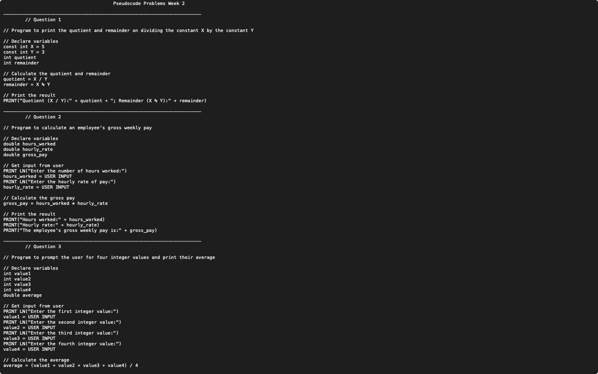
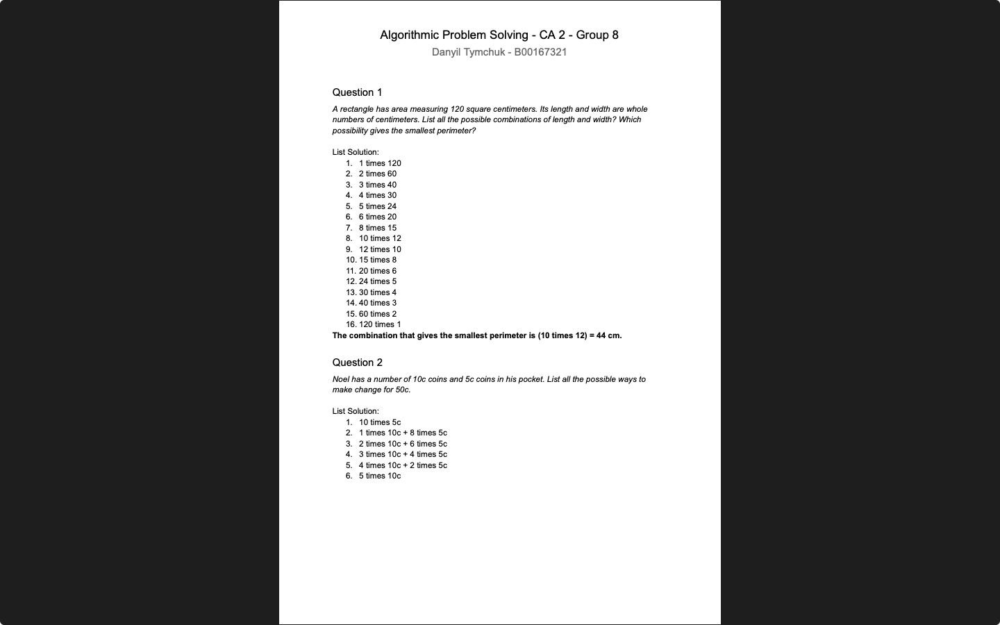

# Algorithmic Problem Solving
**Module:** Algorithmic Problem Solving `COMP H1034`  
**Lectorer:** Noel Carey  
**Duration:** Semester 1 (Year 1)  
**Date:** September - December 2023

> This Module provides an introduction to the principles of algorithmic problem solving. The module covers the development of algorithms using pseudocode, diagrams and lists. The module also covers the use of conditional statements and logical expressions in algorithm development. The module also covers the use of systematic lists and the elimination of possibilities in problem-solving. The module also covers the use of logic in problem-solving. The module also covers the use of classic problems in problem-solving.

## Grades Breakdown
| **Assessment Type** | **Weighting** |
|---------------------|---------------|
| Weekly Participation & Engagement (weekly labs) | 20% |
| CA 1 (In lab test) | 20% |
| CA 2 (In lab test) | 40% |

## Table of Contents
- [Weeks](#weeks)
    - [Week 1](#week-1-pseudocode-problems-week-1): Pseudocode Problems Week 1
    - [Week 2](#week-2-pseudocode-problems-week-2): Pseudocode Problems Week 2
    - [Week 3](#week-3-pseudocode-problems-week-3): Pseudocode Problems Week 3
    - [Week 4](#week-4-pseudocode-problems-week-4): Pseudocode Problems Week 4
    - [Week 5](#week-5-pseudocode-problems-week-5): Pseudocode Problems Week 5
    - [Week 6](#week-6-ca-1-in-lab-test-pseudocode-problems): CA 1 (In lab test): Pseudocode Problems
    - [Week 8](#week-8-diagrams-and-lists): Diagrams and Lists
    - [Week 9](#week-9-eliminating-possibilities): Eliminating Possibilities
    - [Week 10](#week-10-ca-2-in-lab-test-lists-and-diagrams): CA 2 (In lab test): Lists and Diagrams
- [Continuous Assessment (CA)](#continuous-assessment-ca)
    - [CA 1](#ca-1-pseudocode-problems): Pseudocode Problems
    - [CA 2](#ca-2-diagrams-and-lists): Diagrams and Lists

## Weeks

### [Week 1](./week01): Pseudocode Problems Week 1
[Task](./week01/lab/algorithmic_problem_solving_week01_lab.pdf) | [Solution](./week01/lab/solution/algorithmic_problem_solving_week01_lab_solution.txt)

This week lab focuses on solving problems using pseudocode. The exercises are designed to help understand the logic and structure of algorithms without getting bogged down by syntax.


#### Questions
1. Write a Pseudocode program that produces the output shown below.
    ```
    Java Programming
    Rocks
    ```
2. Write a Pseudocode program that prints the answers to the following arithmetic expressions on **separate** lines.
    ```
    1. 4 × 4 = result
    2. 3 × 7 + (−2 × −8) = result
    3. (2 × 5)−6 / (4 × 8)−(2 ×3) = result
    ```
3. Write a Pseudocode program that uses two variables **number1** and **number2** to store the values **71** and **3.14**. Your program should print the values stored in **number1** and **number2** to the screen on separate lines as shown below.
    ```
    number1 = 71
    number2 = 3.14
    ```
4. An employee receives an hourly rate of €9.80 and works 42 hours a week. Write a Pseudocode program that calculates the employee's gross weekly wage and prints it to the screen.
    ```
    Hourly rate is 9.8
    Hours worked is 42
    Gross weekly is 411.6
    ```
5. Given the following function \( f(x) = x² + 3x - 5 \), write a Pseudocode program to evaluate **\( f(x) \) where \( x = 4 \) and \( f(x) \) where \( x = 6 \)**. Your program should print the resulting arithmetic expressions and the final results.
    ```
    x² can be written as (x * x)
    ```

### [Week 2](./week02/): Pseudocode Problems Week 2
[Task](./week02/lab/algorithmic_problem_solving_week02_lab.pdf) | [Solution](./week02/lab/solution/algorithmic_problem_solving_week02_lab_solution.txt)

This lab continues the exploration of pseudocode problems, focusing on more complex scenarios and mathematical operations.



#### Questions
1. Write a Pseudocode program that prints the **quotient** and **remainder** on dividing the constant **X** by the constant **Y**. X should be initialized to **5** and Y should be initialized to **3**. Your program should use two variables called **quotient** and **remainder** to store results and you should use a single PRINT() statement to print the result in the format.
    ```
    X / Y = 1 and X % Y = 2
    ```
2. Write a Pseudocode program to calculate an employee’s gross weekly pay. The **input** to the program should be the **number of hours worked** and the **hourly rate of pay**. Your program output should look as follows and you should test your program using the values shown below.
    ```
    Please input hourly rate: 9.6
    Please input hours worked: 45
    Hours worked = 45.0 hourly rate = 9.6 gross wweekly = 432.0
    ```
3. Write a Pseudocode program that **prompts** the user for **four integer values** and prints their **average**. Your program output should look as follows and you should use the test values shown.
    ```
    Enter number 1: 1
    Enter number 2: 2
    Enter number 3: 3
    Enter number 4: 4
    Answer = 2.5
    ```
4. Write a Pseudocode program that calculates the volume of a cylinder. Your program should **prompt** the user to enter the **radius** and **height** of the cylinder and should use a combination of **constants** and **variables** to calculate the volume. The following formula should be used to calculate the volume, where V=volume, r=radius and h=height:
    ```
    V = π * r² * h
    ```
    ```
    Enter the radius: 2.5
    Enter the height: 11.5
    Volume = 225.6875
    ```

### [Week 3](./week03/): Pseudocode Problems Week 3
[Task](./week03/lab/algorithmic_problem_solving_week03_lab.pdf) | [Solution](./week03/lab/solution/algorithmic_problem_solving_week03_lab_solution.txt)

This lab introduces more advanced pseudocode problems, focusing on conditional statements and logical expressions.


#### Questions
1. Write a single Java program that evaluates the **truth** or **falsity** of the following expressions using **PRINT()** statements as shown in the program output below.
    ```
    I. 5 – 1 != 3
    II. 100 % 50 == 0
    III. (21 + 7) / 4 >= 100
    ```
    ```
    5 - 1 != 3 is true
    100 % 50 == 0 is true
    (21 + 7) / 4 >= 100 is false
    ```
2. Write a single Java program that declares two integer variables called x and y. Assign x = 4, y = 10 and write Boolean expressions that represent the statements below. Your program should output the results as shown below.
    ```
    a) X is an even number;
    b) X multiplied by 5 is less than 7 squared;
    c) Y minus X is positive;
    d) Y cubed is less than 100. (noted cubed is Y*Y*Y)
    ```
    ```
    X is an even number is true
    X multiplied by 5 is less than 7 squared is true
    Y minus X is positive is true
    Y cubed is less than 100 is false
    ```
3. Write a program to read a student’s grade out of 100 from the keyboard. The program should print one of **PASS** or **FAIL**. A pass is any grade of 40% or higher.
    ```
    Enter grade: 21
    FAILED
    ```
4. Write a Pseudocode program to read a month number and print its month name. For example, an input of 10 would result in an output of October.

    ```
    Enter month number: 10
    October
    ```

### [Week 4](./week04/): Pseudocode Problems Week 4
[Task](./week04/lab/algorithmic_problem_solving_week04_lab.pdf) | [Solution](./week04/lab/solution/algorithmic_problem_solving_week04_lab_solution.txt)

This lab focuses on solving problems using pseudocode, emphasizing conditional statements and logical expressions.


#### Questions
1. Write a Java program that evaluates and prints the **truth** or **falsity** of the following expressions; **you should assign the outcome of each expression to a Boolean variable**.
    ```
    2 * 3 == 6 && 4 < 5
    3 > 1 || 5 < 3
    1 < 10 && 2 < 10 && 3 < 10
    !(3 > 10) && 5 != 4
    (10 >= 10) && (11 >= 10)
    ```
2. Write a Pseudocode program to read an integer value from the user and print one of 3 options that the number can be. The three options are shown below.
    ```
    1. positive
    2. negative
    3. zero
    ```
3. Write a Pseudocode program that reads in a student’s grade (0 – 100) from the user and prints the associated alphabetic grade. Use the table below in your answer.
    ```
    | GRADE | PERCENTAGE BAND |
    |-------|-----------------|
    | A     | 80-100          |
    | B+    | 70-79           |
    | B     | 60-69           |
    | B-    | 55-59           |
    | C+    | 50-54           |
    | C     | 40-49           |
    | D     | 35-39           |
    | F     | 0-34            |
    ```
    ```
    Please enter your grade (0-100): 81
    A
    ```
4. Write a program to read the lengths of three sides of a triangle (**A**, **B**, and **C**) and print one of **TRIANGLE** or **NOT A TRIANGLE**.
    ```
    Triangle Inequality Theorem: The sum of the two sides must be greater than the longest side.
    C is the longest side so (6 + 5 > 10) == true
    C is the longest side but (5 + 5 > 10) == false
    ```

### [Week 5](./week05/): Pseudocode Problems Week 5
[Task](./week05/lab/algorithmic_problem_solving_week05_lab.pdf) | [Solution](./week05/lab/solution/algorithmic_problem_solving_week05_lab_solution.txt)

This lab continues the exploration of pseudocode problems, focusing on more complex scenarios and mathematical operations.


#### Questions
1. Write a Pseudocode program to read an integer value in the range 1..100 and output its value in words. For example, if the input is **45** then the output is **“forty five”**. If the number entered is not within the valid range the program should print “Invalid number!”.

    ```
    Please enter a number between 1 - 100: 1
    One
    ```
2. Write a program that reads the length of any three lines a, b, c and prints one of.
    ```
    A) Triangle; followed by either scalene, isosceles or equilateral; followed by either right-angled or not right-angled,
    B) Not a triangle.
    ```
    ```
    Enter length of line A: 3
    Enter length of line B: 2
    Enter length of line C: 5
    Not a triangle
    ```

### Week 6: [CA 1  (In lab test)](#ca-1-pseudocode-problems): Pseudocode Problems
> There was the CA 1 test during this week. See [CA 1](./assessment/01/) for details.  
> Look at the [Continuous Assessment (CA)](#continuous-assessment-ca) section below for more information, [CA 1](#ca-1-pseudocode-problems).

### [Week 7](./week07/): Review Week
> No lab this week. Use this week to review previous weeks' labs and prepare for upcoming assessments.

### [Week 8](./week08/): Diagrams and Lists
[Task](./week08/lab/algorithmic_problem_solving_week08_lab.pdf) | [Solution](./week08/lab/solution/algorithmic_problem_solving_week08_lab_solution.pdf)

This lab introduces the use of diagrams and lists as problem-solving tools. The exercises are designed to help understand the logic and structure of algorithms without getting bogged down by syntax.


#### Questions
- Diagrams
    1. FOLLOW THE BOUNCING BALL
        - A ball rebounds one-half the height from which it is dropped. The ball is dropped from a height of 160m and keeps bouncing. What is the total vertical distance the ball will travel from the moment it is dropped to the moment it hits the floor for the fifth time.
    2. WORM JOURNEY
        - A worm is at the bottom of a 12m wall. Every day the worm crawls up 3m, but at night it slips down 2m. How many days does it take the worm to get to the top of the wall.
    3. RACE
        - Becky, Ruby, Isabel, Lana, Alma, and Sabrina ran an 800m race. Alma beat Isabel by 7 meters. Sabrina beat Becky by 12 meters. Alma finished 5 meters ahead of Lana but 3 meters behind Sabrina. Ruby finished halfway (distance-wise) between the first and the last women. In what order did the women finish? What were the distances between them?
    4. A WHOLE LOT OF SHAKING GOIN’ ON
        - If six people met at a party and all shook hands with one another, how many handshakes would be exchanged?
    5. ROCK CLIMBING
        - Amy is just learning how to rock climb. Her instructor takes her to a 13m climbing wall for her first time. She climbs 2.5m in 2 minutes but then slips back 1m in 10 seconds. This pattern repeats until she reaches the top. How long will it take her to reach the very top of the wall?
- Systematic Lists
    1. CARDS AND COMICS
        - Paul’s daughter has €6.00 she wants to spend on comic books and superhero cards. Comic books cost 60c each, and deluxe packages of superhero cards cost €1.20 each. List all the ways she can spend all of her money on comic books, superhero cards, or both.
    2. TENNIS TOURNAMENT
        - Justin, Julie, Jamie, Matt, Ryan, and Roland are the six players in a round-robin tennis tournament. Each player will play a set against each of the other players. List all the sets that need to be played.
    3. FEE CONCERT TICKETS
        - Alex, Blake, Chuck, and Darren all called into a radio show to get free tickets to a concert. List all the possible orders in which their calls could have been received.
    4. TWENTY-FOUR
        - How many ways are there to add four positive even numbers to get a sum of 24?
    5. FINISHED PRODUCT
        - The product (2 numbers multiplied) of two whole numbers is 360, and their sums (2 numbers added) is less than 100, what are the possibilities for the two numbers?
- Classic Problems
    1. THE WEIGHT OF A BRICK
        - If a brick balances with three-quarters of a brick and three-quarters of a kg, then how much does the brick weigh?
    2. THE HUNGRY BOOKWORM
        - The four volumes of the ‘world of mathematics’ are sitting side by side on a bookshelf, in order, with volume 1 on the left. A bookworm tunnels through the front cover of volume 1 all the way through the back cover of volume 4. Each book has a front cover and a back cover that each measure 4mm. The pages of each book measure 26mm. How far does the bookworm tunnel? CLUE: The answer is NOT 136mm.
    3. ARCHERY PUZZLE
        - A target shows the numbers 16, 17, 23, 24, 39, and 40. How many arrows does it take to score exactly 100 on this target?

### [Week 9](week09): Eliminating Possibilities
[Task](./week09/lab/algorithmic_problem_solving_week09_lab.pdf) | [Solution](./week09/lab/solution/algorithmic_problem_solving_week09_lab_solution.pdf)

This lab focuses on solving problems using the eliminating possibilities method. The exercises are designed to help understand the logic and structure of algorithms without getting bogged down by syntax.


#### Questions
- Eliminating Possibilities
    1. SQUARE ROOTS
        - The square root of 4356 is an integer. Without a calculator, determine what that integer is by eliminating possibilities. Do the same for 8464.
    2. HOW MANY LINES?
        - Stu counted the lines of a page in his book. Counting by three gave a remainder of 2, counting by fives also gave a remainder of 2, and counting by sevens gave a remainder of 5. How many lines were on the page?
    3. THE THREE SQUARES
        - Three cousins, Bob, Chris, and Phil, were sitting around watching football on TV. The game was so boring that they started talking about how old they were. Bob (The oldest) noticed that they were all between the ages of 11 and 30. Phil noticed that the sum of their ages was 70. Chris (The youngest) pointed out, “if you write the square of each of our ages, all the digits from 1 to 9 will appear exactly once in the digits of the three squares”. How old was each person?
- Logic
    1. THE FISHING TRIP
        - Several friends take a fishing trip every year. Each year they have a contest to see who catches the heaviest fish. The loser has to pay for all of the junk food they eat on the trip. Determine each friend’s standings in this year’s contest by using the following clues. By the way, in the tradition of fishing trips, every statement quoted here is a falsehood.
            - Marta: Mickey was first
            - Woody: I beat Sally
            - Sally: Marta beat Woody
            - Mickey: Woody was second
    2. VOLLEYBALL TEAM
        - Three friends – Elaine, Kelly, and Shannon – all start for their college volleyball team. Each plays a different position: setter, middle blocker, and outside hitter. Of the three, one is a first year, one a 2nd year, and the other is a 4th year. From the clues below, determine each woman’s position and year in college.
            1. Elaine is not the setter.
            2. Kelly has been in school longer than the middle blocker.
            3. The middle blocker has been in school longer than the outside hitter.
            4. Either Kelly is the setter or Elaine is the middle blocker.
    3. ATHLETES
        - Russ, Don, Pamela, and Yvonne are the first names of four friends who all received sports scholarships. Krieger actually has a full scholarship because he is a star in two different sports. Use the clues to determine each person’s full name.
            1. Hicks and Russ play on the same men’s volleyball team.
            2. Drake and Braun have both set women’s records in swimming.
            3. Yvonne and Drake both went to the same high school.
    4. EXPERTS
        - Abbie, Bridget, Clare, and Demi are women whose professions are water quality engineer, soil contamination scientist, air pollution consultant, and biological diversity advocate. Match each woman to her expertise using the following four clues.
            1. Bridget’s expertise is not biological diversity.
            2. Abbie loves to garden, but her expertise has nothing to do with soil or air pollution.
            3. The air pollution expert, the water quality engineer, and Demi all met one another at a global warming conference.
            4. Bridget has never met the person who works on air pollution.
- Classic Problems
    1. TURKEYS
        - Among Grandfather’s papers, a bill was found: 72 Turkeys = *€67.9*
        - The first and last digits of the number that obviously represented the total price of those fowls are replaced here by blanks, for they have faded and are now illegible. What are the two faded digits and what was the price of one turkey?

### Week 10: [CA 2 (In lab test)](#ca-2-diagrams-and-lists): Diagrams and Lists
> There was the CA 2 test during this week. See [CA 2](./assessment/02/) for details.  
> Look at the [Continuous Assessment (CA)](#continuous-assessment-ca) section below for more information, [CA 2](#ca-2-diagrams-and-lists).

## [Continuous Assessment](./assessment/) (CA)
> In-class test assessments conducted during lab sessions.

### [CA 1](./assessment/01/): Pseudocode Problems
> [!NOTE]  
> The in-lab test solution can be found on [`test/year01/module-algorithmic_problem_solving/in-lab-practical-test`](https://github.com/DanyilT/projects-in-university/tree/test/year01/module-algorithmic_problem_solving/in-lab-practical-test) branch.  
> There is a links to the solution and code below.

[Solution](https://github.com/DanyilT/projects-in-university/tree/test/year01/module-algorithmic_problem_solving/in-lab-practical-test/01/solution/) | [pseudocode.txt](https://github.com/DanyilT/projects-in-university/tree/test/year01/module-algorithmic_problem_solving/in-lab-practical-test/01/solution/pseudocode.txt) | [code.java](https://github.com/DanyilT/projects-in-university/tree/test/year01/module-algorithmic_problem_solving/in-lab-practical-test/01/solution/code.java)

> [!WARNING]  
> I didn't manage to get the assessment paper, but based on my notes and screenshots, here is what I could gather.

This CA focuses on solving problems using pseudocode and implementing it in Java.

**Note:** There was only one question with two parts: pseudocode and Java code.


#### Questions
- Question 1
    
    - Write a Pseudocode program that outputs the day name of the week based on the number entered by the user. The program should prompt the user to enter a number between 1 and 7 and output the corresponding day name. If the user enters a number outside the range, the program should output "Invalid number".
- Question 2
    
    - Write Java code based on the Pseudocode program in question 1. The program should output the day name of the week based on the number entered by the user. The program should prompt the user to enter a number between 1 and 7 and output the corresponding day name. If the user enters a number outside the range, the program should output "Invalid number".

### [CA 2](./assessment/02/): Diagrams and Lists
> [!NOTE]  
> The in-lab test solution can be found on [`test/year01/module-algorithmic_problem_solving/in-lab-practical-test`](https://github.com/DanyilT/projects-in-university/tree/test/year01/module-algorithmic_problem_solving/in-lab-practical-test) branch.  
> There is a links to the solution and code below.

[Solution](https://github.com/DanyilT/projects-in-university/tree/test/year01/module-algorithmic_problem_solving/in-lab-practical-test/02/solution/) | [solution.pdf](https://github.com/DanyilT/projects-in-university/tree/test/year01/module-algorithmic_problem_solving/in-lab-practical-test/02/solution/solution.pdf)

> [!WARNING]  
> I didn't manage to get the assessment paper, but based on my notes and screenshots, here is what I could gather.

This CA focuses on solving problems using lists and diagrams.

**Note:** There were two questions related to lists and diagrams.



#### Questions
- Question 1
    - A rectangle has an area measuring 120 square centimeters. Its length and width are whole numbers of centimeters. List all the possible combinations of length and width? Which possibility gives the smallest perimeter?
- Question 2
    - Noel has a number of 10c coins and 5c coins in his pocket. List all the possible ways to make change for 50c.
