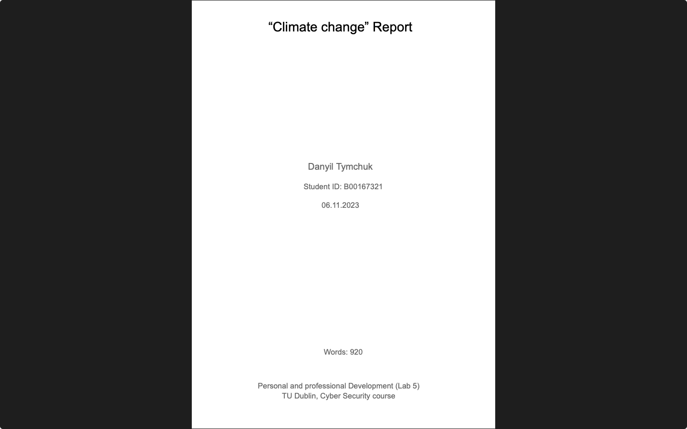
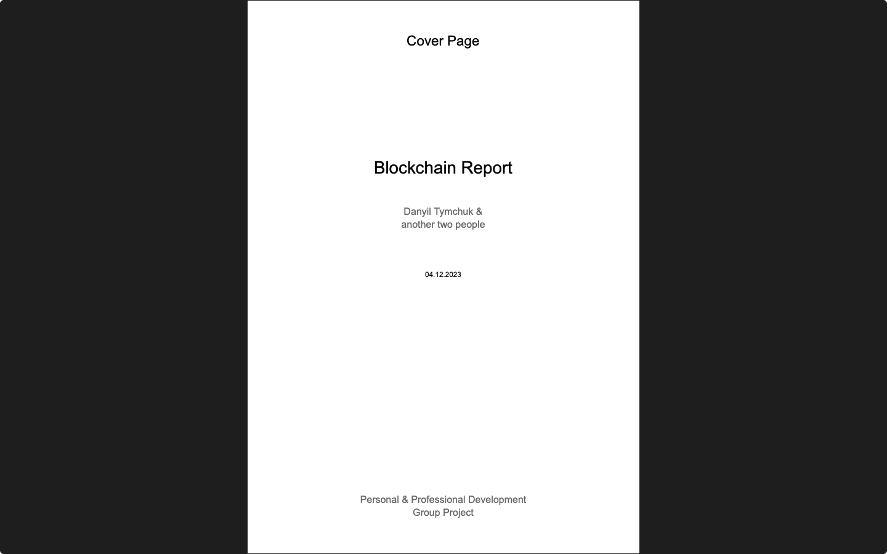

# Personal and Professional Development
**Module:** Personal and Professional Development `COMP H1033`  
**Lectorer:** Maria Brennan  
**Duration:** Semester 1 (Year 1)  
**Date:** September - December 2023  
**Credits:** 5 ECTS

> This module covers personal and professional development topics, including presentations, communication skills, and teamwork. The module aims to develop students' soft skills and enhance their employability. Main project was to create and deliver a presentation on a topic of choice. Btw, this module is absolute trash. 🗿

> [!CAUTION]  
> I didn't manage to save much materials for this module.

## Grades Breakdown
| **Assessment Type** | **Weighting** |
|---------------------|---------------|
| idk | idk |

> [!WARNING]  
> There was an extended induction initiative as part of this module 🤮  
> Here are the instructions and activities for Week 1 (email copy):
> ```
> by Maria Brennan - Monday, 18 September 2023, 12:02 PM
> 
> Morning all, as discussed in the lecture this morning I mentioned about the extended induction initiative and its contribution to your PPD module. Ciaran O'Leary will be sending instructions and asks every Monday for the next 5 weeks.
> 
> These are the instructions for this week:
>
> Week 1: Your Student Voice
> Your preparation tasks for week 1 are as follows:
> Preparation Task 1, Student Success Portal [5 minutes]: Enrol in the "Student Success Portal 2023-24" module on Brightspace (you can find it using the Discover tool) or Moodle (you may already be enrolled - though it may still be named 2022-23, check when you log in). This portal is packed full of really useful information that you should browse through and refer to throughout the year.
> Link to the portal on Moodle:  Course: Student Success (tudublin.ie)
> Preparation Task 2, Class Representative [15 minutes]: Go to the page about Being a Class Representative and learn about the very important part Class Representatives play in TU Dublin life. Watch the video at the top of the page and read through the page (you don't need to do the Learning Activities at the bottom of that webpage).
> Preparation Task 3, Nomination [3 minutes]: Read about the reasons to become a Class Representative and the Class Representative nomination and election process on the "Class Rep Hub" on the Students' Union website.
> Preparation Task 4, Equality, Diversity and Inclusion [15 minutes]: Go to the page about Equality, Diversity and Inclusion where advice is provided to Class Representatives and others on how to create an inclusive environment for everyone in their class. Watch the video at the top of the page and read through the page (you don't need to do the Learning Activities at the bottom of that webpage)
> The activities you need to do to complete this week of Extended Induction are:
> Activity A, Quiz Time [7 minutes]: Answer the 10 questions in this quiz. You can take the quiz as often as you want, but you need to have answered all questions correctly by midnight on Friday, 22 September. All the answers to the quiz questions can be found in this email or the preparation tasks.
> Activity B, Photo Time [10 minutes]: Take a photo of the front of one of the Students' Union offices on your campus (if you don't have access to a camera, just write a few sentences about what you find at the Students' Union office). Put this into a Word document and save it somewhere you can access it for the next five weeks. You'll add something to that Word document every week before submitting it to us in Week 5 to apply for your certificate/digital badge.
> 
> Regards,
> 
> Marie 
> ```

## Table of Contents

- [Weeks](#weeks)
    - [Week 8 (Lab 5)](#week-8-lab-5-climate-change-report): Climate Change Report
    - [Week 11](#week-11-mcq-test): MCQ Test
- [Continuous Assessment (CA)](#continuous-assessment-ca)
    - [Blockchain](#blockchain)
        - [Report](#report)
        - [Presentation](#presentation)

## Weeks

### [Week 8 (Lab 5)](./week08/lab/): Climate Change Report
**Date:** November 6, 2023  
[Report](./week08/lab/solution/personal_and_professional_development_climate_change_report.pdf)



### Week 11: MCQ Test
> Was MCQ test, idk about what exactly... Probably some bullshit...

## [Continuous Assessment](./assessment/) (CA)

### [Blockchain](./assessment/01/)
> [!NOTE]  
> The submitted files (report + presentation) are located in the `presentation/year01/module-personal_and_professional_development/blockchain-report-and-presentation` branch.

Presentation about blockchain and how to hack a blockchain. Includes a .pdf for easier reading and a .pptx with annotations.  
**Note:** _'How to Hack a Blockchain'_ — was my part of the report/presentation.

#### [Report](./assessment/01/submission/report_link.txt)
**Date:** December 7, 2023  


- [blockchain_report.md](https://github.com/DanyilT/projects-in-university/tree/presentation/year01/module-personal_and_professional_development/blockchain-report-and-presentation/report/blockchain_report.md): The markdown file for the report. Markdown version of [pdf file](https://github.com/DanyilT/projects-in-university/tree/presentation/year01/module-personal_and_professional_development/blockchain-report-and-presentation/report/blockchain_report.pdf).
- [blockchain_report.pdf](https://github.com/DanyilT/projects-in-university/tree/presentation/year01/module-personal_and_professional_development/blockchain-report-and-presentation/report/blockchain_report.pdf): A report on blockchain technology, its applications, and how to hack a blockchain.
- [blockchain_report_full.pdf](https://github.com/DanyilT/projects-in-university/tree/presentation/year01/module-personal_and_professional_development/blockchain-report-and-presentation/report/blockchain_report_full.pdf): A full version of the report including two other group members' contributions.

#### [Presentation](./assessment/01/submission/presentation_link.txt)
**Date:** December 11, 2023  


- [blockchain_presentation.pdf](https://github.com/DanyilT/projects-in-university/tree/presentation/year01/module-personal_and_professional_development/blockchain-report-and-presentation/presentation/blockchain_presentation.pdf): A presentation on blockchain technology, its applications, and how to hack a blockchain.
- [blockchain_presentation.pptx](https://github.com/DanyilT/projects-in-university/tree/presentation/year01/module-personal_and_professional_development/blockchain-report-and-presentation/presentation/blockchain_presentation.pptx): A PowerPoint presentation with annotations.
- [blockchain_presentation_full.pdf](https://github.com/DanyilT/projects-in-university/tree/presentation/year01/module-personal_and_professional_development/blockchain-report-and-presentation/presentation/blockchain_presentation_full.pdf): A full version of the presentation including two other group members' contributions.
- [blockchain_presentation_full.pptx](https://github.com/DanyilT/projects-in-university/tree/presentation/year01/module-personal_and_professional_development/blockchain-report-and-presentation/presentation/blockchain_presentation_full.pptx): A full PowerPoint presentation including two other group members' contributions.
