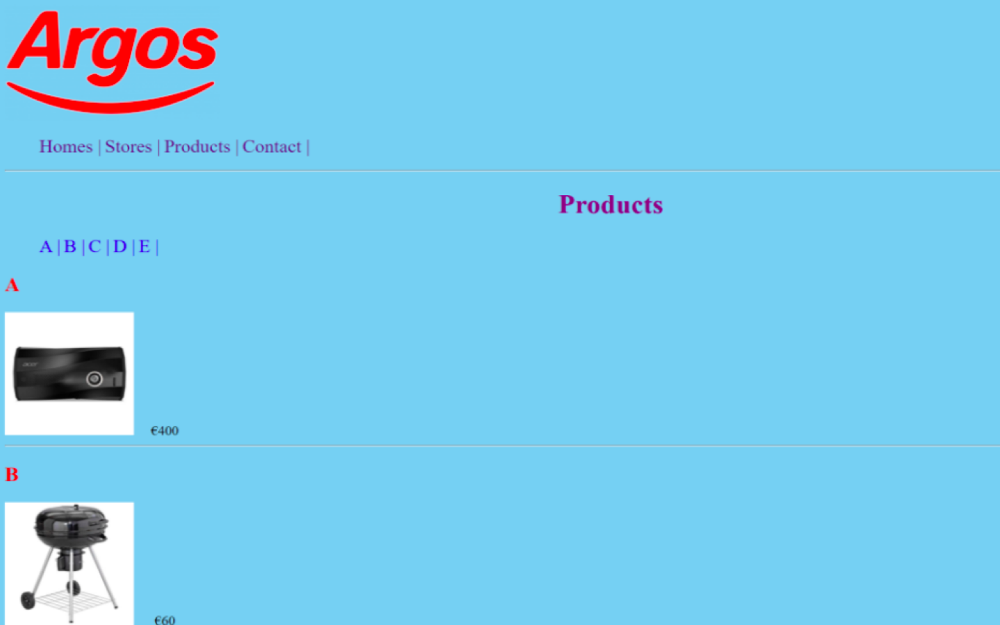

# Web Development Fundamentals
**Module:** Web Development Fundamentals `COMP H1026`  
**Lectorer:** Orla McMahon  
**Duration:** Semester 1 (Year 1)  
**Date:** September - December 2023  
**Credits:** 5 ECTS

> This module covers the basics of web development, including HTML, CSS, and introductory JavaScript. Projects in this category aim to build a strong foundation in creating and styling web pages, as well as adding interactivity through JavaScript. The module also covers responsive design and accessibility. The primary goal is to develop an understanding of web development and its applications in real-world scenarios. The course also includes practical exercises to reinforce the theoretical concepts.

## Grades Breakdown
| **Assessment Type** | **Weighting** |
|---------------------|---------------|
| Weekly Labs | 30% |
| Assignment 1 (MCQ Test) | 20% |
| Assignment 2 (Project) | 50% |

## Table of Contents
- [Weeks](#weeks)
    - [Week 1](#week-1-introduction-week): Introduction Week
    - [Week 2 (Lab 1)](#week-2-lab-1-1st-html-page): 1st HTML Page
    - [Week 3 (Lab 2)](#week-3-lab-2-headings-images-lists): Headings, Images, Lists
    - [Week 4 (Lab 3)](#week-4-lab-3-tables-links): Tables, Links
    - [Week 5 (Lab 4)](#week-5-lab-4-colors-text-links): Colors, Text, Links
    - [Week 6 (Lab 5)](#week-6-lab-5-id-class-div-span-page-structure): ID, Class, Div, Span, Page Structure
    - [Week 7](#week-7-review-week): Review Week
    - [Week 8 (Lab 6)](#week-8-lab-6-horizontal-and-responsive-navigation-bar): Horizontal and Responsive Navigation Bar
    - [Week 10 (CA 1)](#week-10-ca-1-mcq-test): MCQ Test
- [Project](#project)
    - [Personal Portfolio](#personal-portfolio)

## Weeks

### Week 1: Introduction Week
> Introduction to the module, overview of web development technologies, and setting up the development environment.

### [Week 2 (Lab 1)](./week02/lab/): 1st HTML Page
[Brief](./week02/lab/web_development_fundamentals_week02_lab.pdf) | [Solution (.html & .css)](./week02/lab/solution/)

This laboratory exercise introduces students to the basic HTML tags and how to create a simple web page.
1. Create a HTML page called [`lab01.html`](./week02/lab/solution/lab01.html)
    
    - Download HtmlTemplate from Nowhere
    - Open this file in ~~Brackets~~ and save as `lab01.html`
    - The title should be “my 1st web page”
    - Create a H1 heading and add your name
    - Create a H2 heading and add “Hobbies”
    - Underneath the H2 heading use the `
` tag to describe some hobbies
    - Create a folder called images in the lab01 folder
    - Download the image called student.jpg to the images folder from Nowhere
    - Add an image “student.jpg” to your file

### [Week 3 (Lab 2)](./week03/lab/): Headings, Images, Lists
[Brief](./week03/lab/web_development_fundamentals_week03_lab.pdf) | [Solution (.html)](./week03/lab/solution/)

This laboratory exercise introduces students to the basic HTML tags and how to create a simple web page.
1. Create a College Web page [`lab02ex1.html`](./week03/lab/solution/lab02ex1.html)
    
    - Download HtmlTemplate from Nowhere
    - Open this file in ~~Brackets~~ and save as `lab02ex1.html`
    - Create a folder called images in the lab02 folder
    - Download the image called “TUDublin” from Nowhere to the images folder
    - Add an image “tudublin.png?raw=true” to your file
    - Create a H1 heading and add “TU Dublin Blanchardstown Campus”
    - Create a H2 heading and add “Computing Course”
    - Use the paragraph tags to provide a description about the course.
    - Insert a line under the description
    - Create a H3 heading and add “1st Year Modules”
    - Add an unordered list of 1st year modules on the Computing Course under the H3 heading
2. Nested Lists [`lab02ex2.html`](./week03/lab/solution/lab02ex2.html)
    
    - Download HtmlTemplate from Nowhere
    - Open this file in ~~Brackets~~ and save as `lab02ex2.html`
    - The title should be “Lists”
    - Create an ordered list of two of your favourite bands
    - Underneath this create a nested list that shows the band names and 2 albums as per solution below.
3. Definition Lists [`lab02ex3.html`](./week03/lab/solution/lab02ex3.html)
    
    - Download HtmlTemplate from Nowhere
    - Open this file in ~~Brackets~~ and save as `lab02ex3.html`
    - The title should be “Definition Lists”
    - Create a definition list of the courses in a restaurant
    - For example a dinner menu may consist of starter, main course and dessert.
    - The starter could have options such as soup and garlic bread.
    - The main course options are pasta, chicken curry and pizza.
    - The dessert options are brownie, apple pie and tiramisu

### [Week 4 (Lab 3)](./week04/lab/): Tables, Links
[Brief](./week04/lab/web_development_fundamentals_week04_lab.pdf) | [Solution (.html & .css)](./week04/lab/solution/)

This laboratory exercise introduces students to the basic HTML tags and how to create a simple web page.

| Lab 3 (ex1) Sample Submission | Lab 3 (ex1) My Submission | 
|---------------------|-----------------|
|  |  |

1. Links [`index.html`](./week04/lab/solution/ex1/index.html)
    
    - Create a (skeleton) web page and save it as `index.html`.
    - Put an appropriate `<title>` on the page
    - Create a heading level 1. – HOME PAGE
    - Select a company image from the Internet
    - On your HOME page, create 4 internal links to connect each of the 4 web pages – index.html, stores.html, products.html, and contact.html.
    - Put a horizontal rule under the links.
    - Put in another horizontal rule.
    - Put in text – copyright – and copyright symbol at the bottom of each page.
    - Save index.html as stores.html and products.html and contact.html. You have now made copies of the page, which contains, the links, the image, horizontal rule and copyright.
    - Check that you can click from one page to the next.
    - On the HOME page – add an image of your selected company and create an external link to the company that you have selected, eg www.amazon.com.
    - On the STORES pages – list the location of 3 stores. Use line breaks.
    - On the PRODUCTS page – show images and prices for 5 items. Show them in alpha order. Use the euro signs. Use non-breaking spaces to put the price a slight distance away from the image. Look at the image of the PRODUCTS page.
    - On the PRODUCTS page – create an “ A – E” list that the user can click on to view each object.
    - On the CONTACT page – create an email link and provide your email address so that when clicked the ‘email to’ page is displayed.
    - Add the same style sheet - index.css to each webpage.
2. Tables [`lab03ex2.html`](./week04/lab/solution/ex2/lab03ex2.html) & [`table.css`](./week04/lab/solution/ex2/table.css)
    
    - Download Html Template from Nowhere
    - Open this file in ~~Brackets~~ and save as `lab03ex2.html`
    - The title should be “Tables Example”
    - In the head, link the `lab03ex2.html` document to the `table.css` stylesheet
    - Using the `<table>`, `<tr>`, `<th>` and `<td>` tags, create a table
    - Remember that you must set your borders in your CSS file for them to display.
    - Copy and paste the contents of your document into the HTML validator at `https://html5.validator.nu` and ensure there are no errors in your code.

### [Week 5 (Lab 4)](./week05/lab/): Colors, Text, Links
[Brief](./week05/lab/web_development_fundamentals_week05_lab.pdf) | [Solution (.html & .css)](./week05/lab/solution/)

This laboratory exercise introduces students to the basic HTML tags and how to create a simple web page.
1. Sport Spider [`index.html`](./week05/lab/solution/index.html)
    
    - **Home Page:** [`index.html`](./week05/lab/solution/index.html)
        - Download HtmlTemplate from Nowhere
        - Open this file in ~~Brackets~~ and save as `index.html`
        - The title should be “Sport Spider”
        - Create a folder called images in the lab04 folder
        - Save all your images to this folder
        - Create a css folder in the lab04 folder
        - Save the css file to this folder
        - Create a web page with the following:
            - Background colour – beige
            - Font family for ‘Sport Spider’ is serif
            - Font family for body: sans-serif
            - Headings for ‘The Company’, ‘Products’, ‘Location and Hours’ should be red,
            - Create a link called ‘Contact Us’ that will link to the Contact page.
            - Links are styled as follows
                - Initial colour purple, no underline
                - Visited: colour yellow, no underline
                - Hover: colour red, underline
                - Active: colour green, no underline
            - The text ‘Republic of Ireland’ and ‘Northern Ireland’ should be in italics
            - 
    
    - **Contact Page:** [`contact.html`](./week05/lab/solution/contact.html)
        - Headings should be in red
        - Link to the email address ‘sportspider@hotmail.com’
        - ‘Back to home page’ should bring the user back to the home page

### [Week 6 (Lab 5)](./week06/lab/): ID, Class, Div, Span, Page Structure
[Brief](./week06/lab/web_development_fundamentals_week06_lab.pdf) | [Solution (.html & .css)](./week06/lab/solution/)

This laboratory exercise introduces students to the basic HTML tags and how to create a simple web page.
1. Sport Spider [`index.html`](./week06/lab/solution/index.html)
    
    - **Home Page:** [`index.html`](./week06/lab/solution/index.html)
        - Modify the page above and add in structure tags as follows:
        - The header tag should contain the Sports image and the logo “Sports Spider: Set the background to an appropriate colour.
        - The main tag should contain information about the company, products, location and hours and contact us and an image of the shop(any shop image from the web will suffice) that is displayed on the left with appropriate spacing. Set the background to an appropriate colour.
        - The footer tag should contain contact details. Set the background to an appropriate colour. Text in cyan; text aligned to centre
        - Mark the text up in footer so that it appears in small lettering.
        - Image
        - Provide space around the image
        - Create a nav tag that lists the following options horizontally:
            - Home
            - Products
            - Order Online
            - Contact Us
        - Demonstrate the use of the following CSS properties:
            - ID Selector
                - Use an id selector to set the heading ‘Sports Spider’ to the colour green
            - Class Selector
                - Use a class selector to style 2 headings – ‘Company’ and ‘Products’ as follows:
                    - Font size of 2em; hotpink background with black text; centre aligned; oblique text; in small capital letters and underlined
            - Use the Div tag to style paragraphs as follows:
                - Text in cyan; use the following font (specify the order of preference) – Times New Roman, Georgia, Serif
                - Indent the text by 50px
            - Span
                - Set ‘largest sports retailer’ to bold using the span tag

### Week 7: Review Week
> No lectures and labs this week.

### [Week 8, Lab 6](./week08/lab/): Horizontal and Responsive Navigation Bar
[Brief](./week08/lab/web_development_fundamentals_week08_lab.pdf) | [Solution (.html & .css & .js)](./week08/lab/solution/)

This laboratory exercise introduces students to the basic HTML tags and how to create a simple web page.
1. Create a Horizontal menu [`index.html`](./week08/lab/solution/index.html)
    
    - **Styling the Navigation Bar:**
        - When the link is displayed and unvisited:
            - Change the font colour of the links to pink
            - Change the background colour to purple
            - Change the colour of the border to cyan
            - Change the size of the border to 2px
        - When you hover over a link or when it is just being clicked:
            - Change the background colour to pink
            - Change the font colour to purple
2. Create a Responsive Navigation Bar [`index.html`](./week08/lab/solution/index.html)
    
    - [How To Create a Responsive Top Navigation Menu (w3schools.com)](https://www.w3schools.com/howto/howto_js_topnav_responsive.asp)

### Week 10 (CA 1): MCQ Test
> Multiple Choice Questions (MCQ) Test covering all topics from this module.
> 
> **Volume** — 60 questions  
> **Time** — 90 minutes  
> **Worth** — 20%

## Project
This is have to be the final project for the module.

### [Personal Portfolio](./assessment/01/)
**Deadline:** Sunday, December 10, 2023

> [!IMPORTANT]  
> The project is located on [`project/year01/module-web_development_fundamentals/personal-portfolio`](https://github.com/DanyilT/projects-in-university/tree/project/year01/module-web_development_fundamentals/personal-portfolio) branch.  
> Please switch to this branch to see the project files.  
> The branch contains the implementation files, project assets, and the README for this standalone project.

[Brief](./assessment/01/web_development_fundamentals_assessment.pdf) | [Submission](./assessment/01/submission/project_link.txt)

This is my Personal Portfolio website. I created this website to showcase my skills and projects, as well as to provide information about myself. The website is built using HTML, CSS, and JavaScript. It includes a home page, an about page, a projects page, and a contact page. The website is fully responsive and works on all devices.

> [!TIP]  
> You can visit this website project at the following links:  
> **Cloudflare Pages:** [web-development-fundamentals--personal-portfolio.pages.dev](https://web-development-fundamentals--personal-portfolio.pages.dev)

---

**More:**
> [!TIP]  
> Also you can find more my WebDev projects in my [WebDev repository](https://github.com/DanyilT/WebDev) on GitHub, including the [PersonalPortfolio](https://github.com/DanyilT/WebDev/tree/main/PersonalPortfolio) project.

> [!NOTE]  
> There is may be an older version of the website, because I have done this project in the past (a long time ago) and I have updated it since then. You can see the relevant project at this repository [`WebDev/PersonalPortfolio`](https://github.com/DanyilT/WebDev/tree/main/PersonalPortfolio) (not this repo), so you can check it out there.
