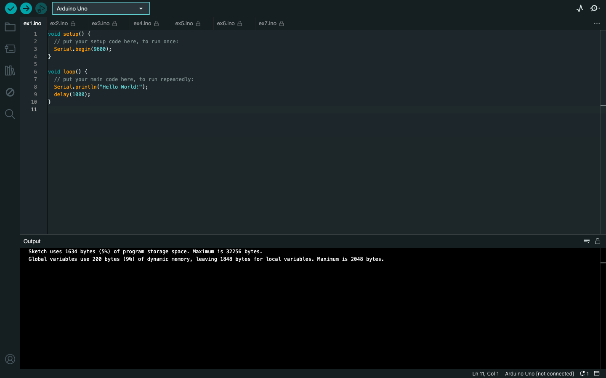
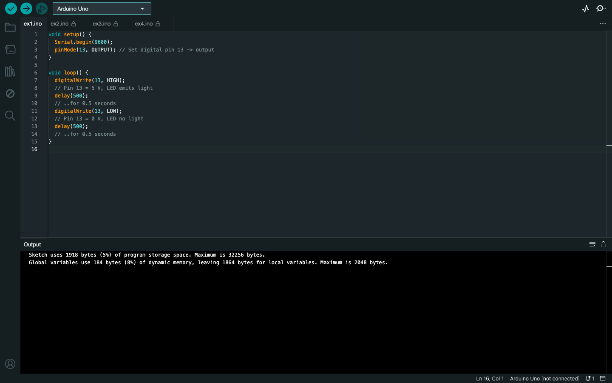
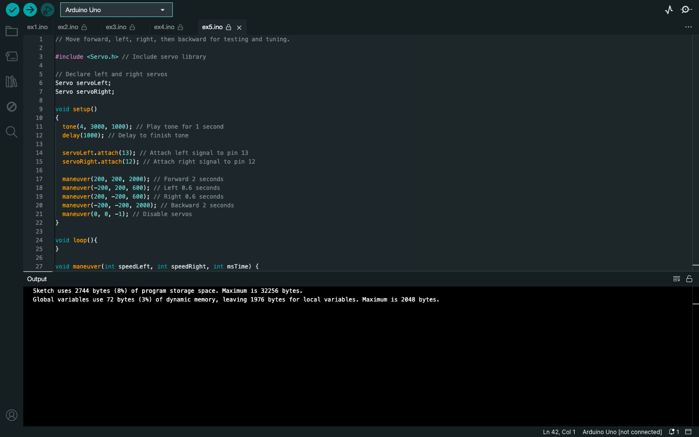
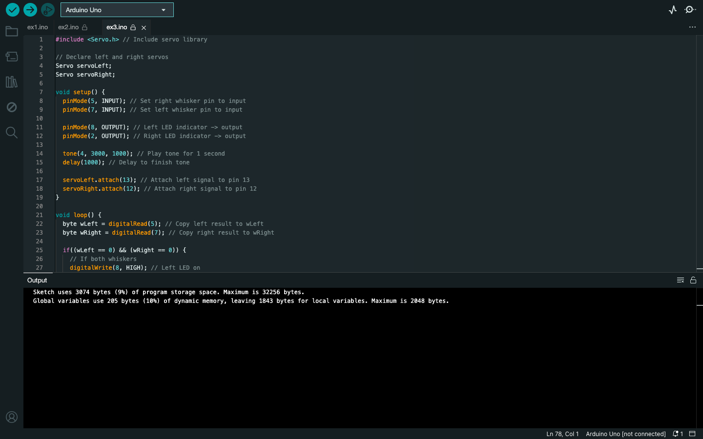

# Computer Architecture
**Module:** Computer Architecture `COMP H1027`  
**Lectorer:** Gerome Donnelly  
**Duration:** Semester 2 (Year 1)  
**Date:** January - May 2024  
**Credits:** 5 ECTS

> This module introduces the basics of computer architecture and the principles of digital logic design. The module covers the fundamental concepts of digital systems, including binary numbers, logic gates, and Boolean algebra. The module also covers the design and implementation of combinational and sequential circuits using logic gates and flip-flops. The module includes practical activities to build and test digital circuits using breadboards and logic gates. The module also covers the basics of microcontrollers and embedded systems, including the Arduino platform. The module includes practical activities to build and test circuits using the Arduino platform and program microcontrollers to perform various tasks. The primary goal is to develop an understanding of computer architecture and its applications in real-world scenarios. Also have to be the final project for the module: write a code for Arduino Uno Vechile to navigate through a maze.

## Grades Breakdown
| **Assessment Type** | **Weighting** |
|---------------------|---------------|
| Weekly Labs | idk |
| CA (MCQ Test) | idk |
| Project | 20% |

## Table of Contents
- [Weeks](#weeks)
    - [Week 1](#week-1-no-labs-week): No labs week
    - [Week 2 (Lab 1)](#week-2-lab-1-introduction): Introduction
    - [Week 4 (Lab 2)](#week-4-lab-2-shield-resistors-and-leds): Shield, Resistors and LEDs
    - [Week 5 (Lab 3)](#week-5-lab-3-led-servo-signal-monitors): LED Servo Signal Monitors
    - [Week 6 (Lab 4)](#week-6-lab-4-attach-the-boe-shield-to-the-chassis): Attach the BOE Shield to the Chassis
    - [Week 7 (Lab 5)](#week-7-lab-5-programming-strategies-for-boe-shield-bot): Programming Strategies for BOE Shield-Bot
    - [Week 8 (Lab 6)](#week-8-lab-6-tactile-navigation-with-whiskers): Tactile Navigation with Whiskers
    - [Week 11 (CA)](#week-11-ca-mcq-test): MCQ Test
- [Project](#project)
    - [Arduino Uno Vehicle Maze Navigation](#maze-runner)

## Labs

### Week 1: No labs week
> Intruduction week, no labs

### [Week 2 (Lab 1)](./week02/lab/): Introduction
[Task](./week02/lab/computer_architecture_week02_lab.pdf) | [Solution (.ino)](./week02/lab/solution/)

This lab introduces the Arduino Uno and the BOE Shield-Bot. How to set up the Arduino Development Environment, write and upload basic sketches, and understand fundamental programming concepts such as functions, variables, and loops. The lab also covers how to make the Shield-Bot perform basic maneuvers and respond to sensor inputs.
- [ex1](./week02/lab/solution/ex1/ex1.ino)
    
- [ex2](./week02/lab/solution/ex2/ex2.ino)
    
- [ex3](./week02/lab/solution/ex3/ex3.ino)
    
- [ex4](./week02/lab/solution/ex4/ex4.ino)
    
- [ex5](./week02/lab/solution/ex5/ex5.ino)
    
- [ex6](./week02/lab/solution/ex6/ex6.ino)
    
- [ex7](./week02/lab/solution/ex7/ex7.ino)
    

### [Week 4 (Lab 2)](./week04/lab/): Shield, Resistors and LEDs
[Task](./week04/lab/computer_architecture_week04_lab.pdf) | [Solution (.ino)](./week04/lab/solution/)

This lab focuses on using the BOE Shield to build and test circuits with resistors and LEDs. The basics of building circuits, understanding resistor color codes, and making the Arduino interact with these circuits. The lab includes activities for setting up the BOE Shield, building and testing LED indicator lights, and programming the Arduino to control the LEDs.
- [ex1](./week04/lab/solution/ex1/ex1.ino)
    
- [ex2](./week04/lab/solution/ex2/ex2.ino)
    
- [ex3](./week04/lab/solution/ex3/ex3.ino)
    
- [ex4](./week04/lab/solution/ex4/ex4.ino)
    

### [Week 5 (Lab 3)](./week05/lab/): LED Servo Signal Monitors
[Task](./week05/lab/computer_architecture_week05_lab.pdf) | [Solution (.ino)](./week05/lab/solution/)

This lab covers the use of LEDs to monitor servo signals. How to generate servo control signals using the Arduino, understand the importance of precise timing for servo motor control, and use the Arduino Servo library for more accurate and efficient signal generation. The lab includes activities for setting up and testing servo signals, connecting servos to the BOE Shield, and controlling servo speed and direction.
- [ex1](./week05/lab/solution/ex1/ex1.ino)
    
- [ex2](./week05/lab/solution/ex2/ex2.ino)
    

### [Week 6 (Lab 4)](./week06/lab/): Attach the BOE Shield to the Chassis
[Task](./week06/lab/computer_architecture_week06_lab.pdf) | [Solution (.ino)](./week06/lab/solution/)

This lab involves attaching the BOE Shield to the chassis and testing the servos to ensure proper electrical connections. How to build a start-reset indicator circuit, program the Arduino to control servo motors, and test servo speed and direction. The lab includes activities for assembling the BOE Shield-Bot, connecting the battery pack, and using a piezospeaker to play some sounds.
- [ex1](./week06/lab/solution/ex1/ex1.ino)
    
- [ex2](./week06/lab/solution/ex2/ex2.ino)
    
- [ex3](./week06/lab/solution/ex3/ex3.ino)
    

### [Week 7 (Lab 5)](./week07/lab/): Programming Strategies for BOE Shield-Bot
[Task](./week07/lab/computer_architecture_week07_lab.pdf) | [Solution (.ino)](./week07/lab/solution/)
> Lab + CA (MCQ Test) in this week

This lab introduces different programming strategies to make the BOE Shield-Bot move. How to control the BOE Shield-Bot's movements, including moving forward, backward, rotating, and pivoting. The lab also covers creating functions for each maneuver to simplify navigation and improve code reusability.
- [ex1](./week07/lab/solution/ex1/ex1.ino)
    
- [ex2](./week07/lab/solution/ex2/ex2.ino)
    
- [ex3](./week07/lab/solution/ex3/ex3.ino)
    
- [ex4](./week07/lab/solution/ex4/ex4.ino)
    
- [ex5](./week07/lab/solution/ex5/ex5.ino)
    

### [Week 8 (Lab 6)](./week08/lab/): Tactile Navigation with Whiskers
[Task](./week08/lab/computer_architecture_week08_lab.pdf) | [Solution (.ino)](./week08/lab/solution/)

This lab introduces tactile navigation using whisker switches. Build and test whisker circuits, program the BOE Shield-Bot to monitor whisker states, and implement autonomous navigation by touch. The lab includes activities for building whisker circuits, testing whisker inputs, and programming the BOE Shield-Bot to respond to obstacles using whisker inputs.
- [ex1](./week08/lab/solution/ex1/ex1.ino)
    
- [ex2](./week08/lab/solution/ex2/ex2.ino)
    
- [ex3](./week08/lab/solution/ex3/ex3.ino)
    

### Week 11 (CA): MCQ Test
> Multiple Choice Questions (MCQ) Test covering all topics from this module.

## Project
This is have to be the final project for the module.

### [Maze Runner](./assessment/01/)
**Deadline:** Monday, April 22, 2024 @ 09:00

> [!IMPORTANT]  
> The project is located on [`project/year01/module-computer_architecture/maze-runner`](https://github.com/DanyilT/projects-in-university/tree/project/year01/module-computer_architecture/maze-runner) branch.  
> Please switch to this branch to see the project files.  
> This branch contains my Arduino code (.ino) and README describing the project. 

[Task](./assessment/01/computer_architecture_assessment.pdf) | [Submission](./assessment/01/submission/project_link.txt)

This is a code for Arduino Uno Vechile to navigate through a maze. The vehicle is equipped with a servo motor and whisker switches to detect obstacles and navigate around them. The code uses a combination of servo control, whisker input monitoring, and decision-making logic to guide the vehicle through the maze autonomously.

_Note: this version of the bot did not successfully complete the maze, but implements the required sensor, LED, and audio logic._

