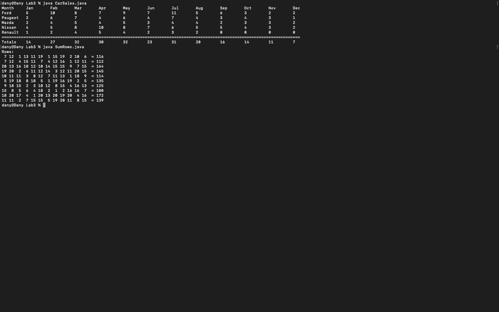
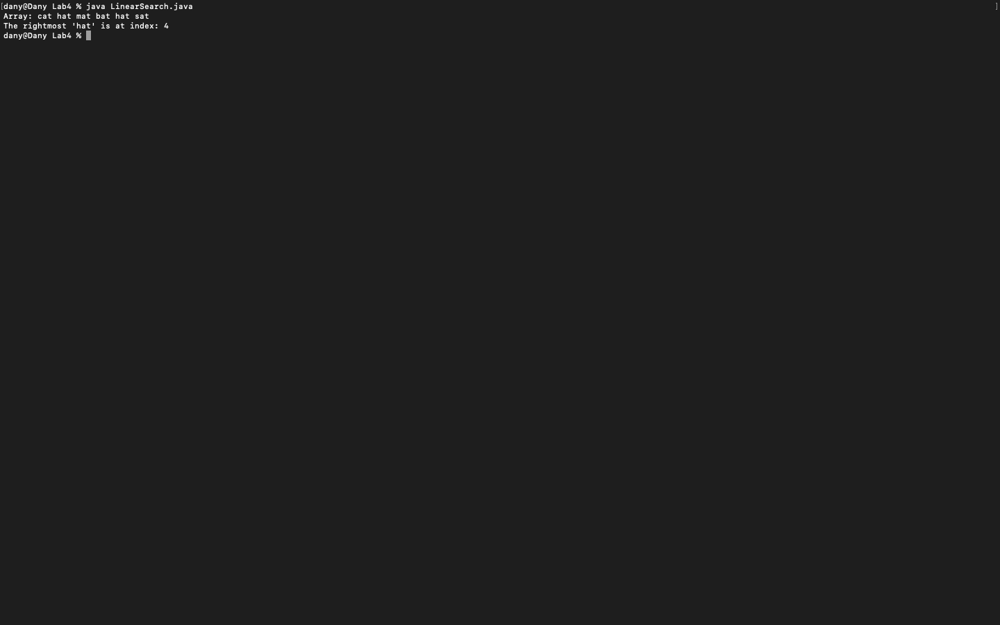
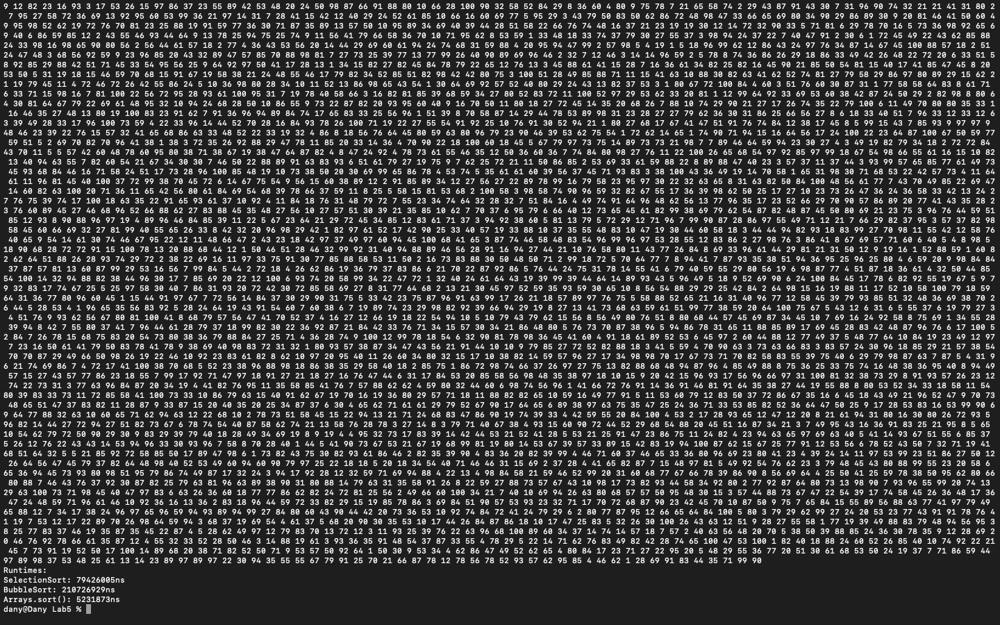
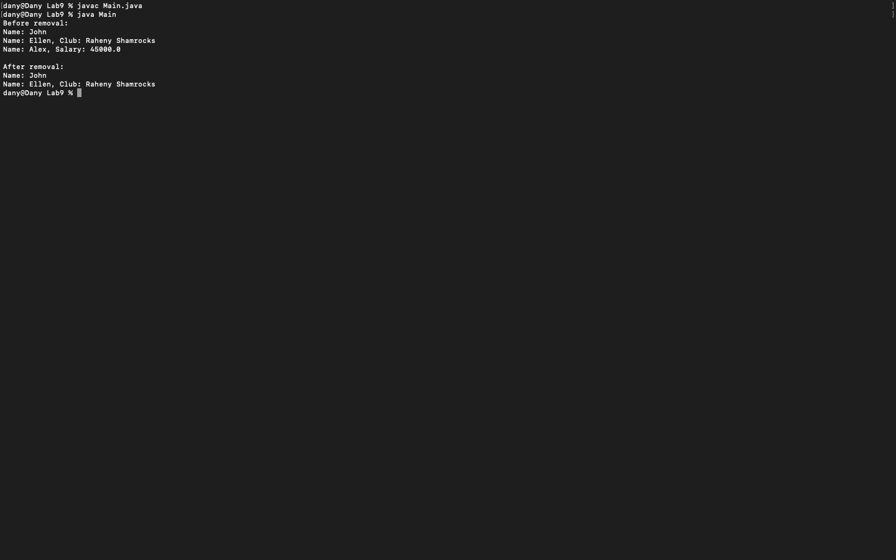

# Fundamentals of Programming 2
**Module:** Fundamentals of Programming 2 `COMP H1031`  
**Lectorer:** Stephen Sheridan  
**Duration:** Semester 2 (Year 1)  
**Date:** January - May 2024  
**Credits:** 5 ECTS

> This module builds on the concepts introduced in Fundamentals of Programming 1. The module covers more advanced programming topics, including arrays, classes, objects, and file handling. The primary goal is to develop problem-solving skills and enhance logical thinking through practical exercises and a final project. The final project for the module involves writing code for a Coffee Shop application that allows the user to view and order drinks.

## Grades Breakdown
| **Assessment Type** | **Weighting** | **Total** |
|---------------------|---------------|-----------|
| Weekly Worksheets (2-7) | 5% | 30% |
| MCQ (Week 11) | idk | idk |
| Project | 40% | 40% |

## Table of Contents
- [Weeks](#weeks)
    - [Week 1](#week-1-idk-whats-happed-to-this-lab-but-i-dont-have-it): Idk what's happed to this lab, but I don't have it
    - [Week 2](#week-2-lab-2-excersise-sheet-2): Excersise Sheet 2
    - [Week 3](#week-3-lab-3-excersise-sheet-3): Excersise Sheet 3
    - [Week 4](#week-4-lab-4-excersise-sheet-4): Excersise Sheet 4
    - [Week 5](#week-5-lab-5-excersise-sheet-5): Excersise Sheet 5
    - [Week 6](#week-6-lab-6-excersise-sheet-6): Excersise Sheet 6
    - [Week 7](#week-7-lab-7-excersise-sheet-7): Excersise Sheet 7
    - [Week 8](#week-8-lab-8-formative-worksheet-more-objects): Formative Worksheet (More Objects)
    - [Week 9](#week-9-lab-9-formative-worksheet-collections-composition--inheritance): Formative Worksheet (Collections, Composition & Inheritance)
    - [Week 10](#week-10-lab-10-formative-worksheet-sequential-binary-files): Formative Worksheet (Sequential Binary Files)
    - [Week 11](#week-11-ca-mcq-test): MCQ Test
- [Project](#project)
    - [Coffee Shop Application](#coffee-shop)

## Weeks

### Week 1: Idk what's happed to this lab, but I don't have it
`null`

### [Week 2 (Lab 2)](./week02/lab/): Excersise Sheet 2
[Task](./week02/lab/fundamentals_of_programming_2_week02_lab.pdf) | [Solution (.java)](./week02/lab/solution/)

This lab introduces the concept of arrays and how to manipulate them. The lab covers how to create arrays, populate them with random numbers, and perform various operations on the array elements. The lab also includes activities for sorting arrays, finding the maximum and minimum values, and calculating the average of the array elements.


#### Questions
1. Write a Java program called [ProcessArray.java](./week02/lab/solution/ProcessArray.java) that implements **static methods** to carry out the following:
    - A **function** called **makeRandomArray** that creates and **returns** an integer array of a given size with values between a lower and upper bound.
    - A **procedure** called **printArray** that prints any given array to screen. Each array value should be separated by a space “ “.
    - A **function** called **sumArray** that **returns** the sum of any given integer array.
    - A **function** called **averageArray** that calculates and **returns** the average value of any given integer array.
    - A **function** called **frequency** that calculates and **returns** the count of a given integer value for any given integer array.
    - A **procedure** called **zeroArray** that sets the values of any given integer array to zero.
        ```java
        // Method to create an integer array
        public static int[] makeRandomArray(int size, int lower, int upper)
        // Method to print an integer array
        public static void printArray(int[] array)
        // Method to sum the values of an integer array
        public static int sumArray(int[] array)
        ```
        ```java
        // Main method
        public static void main(String[] args)
        {
            // Declare an empty array
            int[] myData;
            // Create th array
            myData = makeRandomArray(200, 100, 1);
            // Print the array
            printArray(myData);
            // Sum the array
            System.out.printf("Array sum: %d\n", sumArray(myData));
            // Average the array
            System.out.printf("Array average: %.2f\n", averageArray(myData));
            // Find the frequency of a 10
            System.out.printf("Frequency of 10: %d\n", frequency(10, myData));
            // Zero the array
            zeroArray(myData);
            // Print the array
            printArray(myData);
        }
        ```

### [Week 3 (Lab 3)](./week03/lab/): Excersise Sheet 3
[Task](./week03/lab/fundamentals_of_programming_2_week03_lab.pdf) | [Solution (.java)](./week03/lab/solution/)

This lab introduces the concept of 2D arrays and how to manipulate them. The lab covers how to create 2D arrays, populate them with random numbers, and perform various operations on the array elements. The lab also includes activities for sorting 2D arrays, finding the maximum and minimum values, and calculating the average of the array elements.



#### Questions
1. The table below shows the yearly car sales for Murphy’s used cars. The rows in the table show the manufacturer of each car sold and the columns represent the months from January through to December. Write a Java program called [CarSales.java](./week03/lab/solution/CarSales.java) that prints the table as shown along with the total sales for each month.
    ```
    Month     Jan       Feb       Mar       Apr       May       Jun       Jul       Aug       Sep       Oct       Nov       Dec
    Ford      5         10        8         7         9         7         11        5         6         3         2         2
    Peugeot   2         6         7         4         6         4         7         4         3         4         3         1
    Mazda     2         4         5         4         5         3         4         4         2         3         3         2
    Nissan    4         5         8         10        8         7         6         5         5         4         3         2
    Renault   1         2         4         5         4         2         3         2         0         0         0         0
    ===========================================================================================================================
    Totals    14        27        32        30        32        23        31        20        16        14        11        7
    ```
    
2. Write a Java program called [SumRows.java](./week03/lab/solution/SumRows.java) that creates a 2D integer array of size 10x12. Your program should initialise the 2D array with random values between 1-20. It should also calculate the row totals for the 2D array and print them in tabular format. Program **use** parameterised **procedures** and **functions** wherever possible to decompose the problem down into smaller parts.
    ```
    Rows:
    6 13 19  6 12 15 12 20 11  9 14 16  = 153
    7 19  5  4 18  3  7  1 11  5 11 19  = 110
    7 12 19 10 14 15 19  2  2  1  9  6  = 116
    4  5 14  1  4 19  5  9 12  8 17  9  = 107
    18  1  2  3 19 11 16  7 11  9 10  7  = 114
    10 19 10  1 18 12  6 10 12  1 12  1  = 112
    17 13 15  4  1 20 13 10 15  6 13  7  = 134
    19  8 18 13 18  8 19 12 17 15 15  1  = 163
    9  5  5 11 15 17 12 20 14 18  8  4  = 138
    14  1 16 16  8  4  9  6 18  8  1  3  = 104
    ```
    

### [Week 4 (Lab 4)](./week04/lab/): Excersise Sheet 4
[Task](./week04/lab/fundamentals_of_programming_2_week04_lab.pdf) | [Solution (.java)](./week04/lab/solution/)

This lab introduces the concept of searching and sorting algorithms. The lab covers how to implement linear and binary search algorithms to search for a specific value in an array. The lab also includes activities for sorting arrays using the bubble sort algorithm.


#### Questions
1. Write a Java program called [LinearSearch.java](./week04/lab/solution/LinearSearch.java) that uses a static method to search the following String array for the **rightmost** occurrence of the word “hat”.
    ```java
    String[] words = {"cat", "hat", "mat", "bat", "hat", "sat"};
    ```
    Your code must use the method declaration shown below. If the search key is found the method should return its array index. If the search key is not found the method should return the value -1.
    ```java
    public static int rightmostSearch(String array[], String searchKey)
    ```
    ```
    cat hat mat bat hat sat
    Rightmost hat found at index 4.
    ```
    
2. Modify the [Binary Search](./week04/lab/solution/BinaryExperiment.java) template code from Nowhere to calculate the average number of steps taken when searching a sorted data set that contains 250 random integer values (between 0 – 765). Your calculated average should be approximately the same as the theoretical average binary search time for a data set of size 250.
    ```math
    0(log2(250)) + 1 = 7.96
    ```
    

### [Week 5 (Lab 5)](./week05/lab/): Excersise Sheet 5
[Task](./week05/lab/fundamentals_of_programming_2_week05_lab.pdf) | [Solution (.java)](./week05/lab/solution/)

This lab introduces the concept of sorting algorithms and how to measure their performance. The lab covers how to implement the bubble sort and selection sort algorithms to sort an integer array. The lab also includes activities for measuring the runtime of the sorting algorithms using the System.nanoTime() method.



#### Questions
1. Download the [SortingExperiment.java](./week05/lab/solution/SortingExperiment.java) file from Nowhere. Read the code and complete the sections marked TODO.
2. Java has an in-built library called **Arrays** that has a method called **sort**. The sort method can be used to sort an integer array as follows:
    ```java
    // Import the Arrays library
    import java.util.Arrays;
    // Use the Arrays.sort() method to sort an integer array called myArray
    Arrays.sort(myArray);
    ```
    Modify the [SortExperiment.java](./week05/lab/solution/SortExperiment.java) file to add an additional experiment to test the runtime of the in-built Java Arrays.sort() method.

### [Week 6 (Lab 6)](./week06/lab/): Excersise Sheet 6
[Task](./week06/lab/fundamentals_of_programming_2_week06_lab.pdf) | [Solution (.java)](./week06/lab/solution/)

This lab introduces the concept of classes and objects in Java. The lab covers how to create classes, define instance variables, and implement methods to manipulate the class objects. The lab also includes activities for creating classes to represent books and courses.


#### Questions
1. Write a Java class called [Book](./week06/lab/solution/TestBook.java) and a main class called [TestBook](./week06/lab/solution/TestBook.java) that implements and tests the following class diagram. You may only include the instance variables and methods shown in the class diagram. Your program should be called [TestBook.java](./week06/lab/solution/TestBook.java).
    ```
    | Book                |
    |---------------------|
    | - title: String     |
    | - author: String    |
    | - year: int         |
    |---------------------|
    | + setTitle(title: String): void |
    | + getTitle(): String |
    | + setAuthor(author: String): void |
    | + getAuthor(): String |
    | + setYear(year: int): void |
    | + getYear(): int    |
    |---------------------|
    ```
    ```
    Book Object 1
    Title: Ulysses
    Author: James Joyce
    Year: 1922

    Book Object 2
    Title: Dracula
    Author: Bram Stoker
    Year: 1897
    ```
    
2. Write a Java class called [Course](./week06/lab/solution/TestCourse.java) and a main class called [TestCourse](./week06/lab/solution/TestCourse.java) that implements and tests the following class diagram. You may only include the instance variables and methods shown in the class diagram. Your program should be called [TestCourse.java](./week06/lab/solution/TestCourse.java).
    ```
    | Course              |
    |---------------------|
    | - courseTitle: String |
    | - faculty: String   |
    | - duration: int     |
    |---------------------|
    | «constructor» + Course(courseTitle: String, faculty: String, duration: int) |
    | + display(): void   |
    |---------------------|
    ```
    ```
    Course Object 1
    Course Title: B.Sc. (Hons) in Computer Science
    Faculty: Informatics
    Duration: 4
    Course Object 2
    Course Title: B.Sc. (Hons) in Bioinformatics
    Faculty: Biology
    Duration: 4
    Course Object 3
    Course Title: B.Sc. (Hons) in Applied Artificial Intelligence
    Faculty: Informatics
    Duration: 2
    ```
    

### [Week 7 (Lab 7)](./week07/lab/): Excersise Sheet 7
[Task](./week07/lab/fundamentals_of_programming_2_week07_lab.pdf) | [Solution (.java)](./week07/lab/solution/)

This lab introduces the concept of file handling in Java. The lab covers how to read and write data to files using the FileReader, BufferedReader, FileWriter, and BufferedWriter classes. The lab also includes activities for reading the contents of text files and generating random passwords.


#### Questions
1. Write a [Java program](./week07/lab/solution/Question1.java) that reads the contents of the [names.txt](./week07/lab/solution/files/names.txt) and [descriptions.txt](./week07/lab/solution/files/descriptions.txt) files that can be downloaded from Nowhere. The [names.txt](./week07/lab/solution/files/names.txt) file contains the names of seven computer scientists and the [descriptions.txt](./week07/lab/solution/files/descriptions.txt) file contains a description for each of the seven scientists. Method with the following signature in solution.
    ```java
    public static void readFile(String filename, String[] array)
    ```
    ```
    Larry Page - Larry Page and Sergey Brin, the co-founders of Google, changed the way we access and use information on the internet.
    Bjarne Stroustrup - Bjarne Stroustrup is a Danish computer scientist, most notable for the invention and development of the C++ programming language.
    Ken Thompson - Ken Thompson created the Unix operating system and invented the B programming language.
    Grace Hopper - Grace Hopper was a computer scientist and United States Navy Rear Admiral, born in 1906. She is known for her work on developing the first compiler.
    Margaret Hamilton - Margaret Hamilton was director of the Software Engineering Division of the MIT Instrumentation Laboratory, which developed on-board flight software for NASA's Apollo program.
    Hedy Lamarr - Hedy Lamarr was an Austrian-American actress and inventor who pioneered the technology that would one day form the basis for today?s WiFi, GPS, and Bluetooth communication systems.
    Guido van Rossum - Guido van Rossum is a Dutch programmer best known as the creator of the Python programming language.
    ```
    
2. Write a function called [generatePassword](./week07/lab/solution/Question2.java) that generates a random password of length 18 that may contain lowercase, uppercase, digits, and special characters.
    TIP: See lecture 9 from semester 1.
    Your [generatePassword](./week07/lab/solution/Question2.java) function should have the following signature.
    ```java
    public static String generatePassword()
    ```
    ```
    .j>("@H@P<M$p,.ECM
    ```
    Write code that uses the generatePassword function to write 20 random passwords to a file called [passwords.txt](./week07/lab/solution/files/passwords.txt). The [passwords.txt](./week07/lab/solution/files/passwords.txt).
    ```
    -zTII9:MU_?YW|&=^G
    a~FnLy9^o?X=WaWY!~
    =<4k'~(w/Ss`~@(ned
    ny_A(P!:Qa"wSnZJFT
    oZCG'qy8}^n#]R=0hn
    1itK1)R72[<%D/qc%L
    YEt./frf4r+Ml-fhXN
    (8)vBTJ_O\#T;{j<^^
    DJ4>s7~}:xgJ[SgZ=g
    ;G-#[SA;#CwXkNQ91h
    nX4MY7&8Jz@iTi;(^c
    9yM:_SmOS0l:"z*qBQ
    P=4;,_E"Vy&k|c@tmS
    ,}I.23h\UluL<0djaj
    ZB#5+yhp[J@:}>i#k%
    5YQ6b(d,*7}{*Qbh"H
    lFJ)W+KuE~+B3vk8_L
    RW7Mp^YCR@]qxUi[Pl
    7:IPy5P}v];!GKte!3
    Z3r)gL{QT%?LkXD4]O
    ```
    

### [Week 8 (Lab 8)](./week08/lab/): Formative Worksheet (More Objects)
[Task](./week08/lab/fundamentals_of_programming_2_week08_lab.pdf) | [Solution (.java)](./week08/lab/solution/)

This lab introduces the concept of classes and objects in Java. The lab covers how to create classes, define instance variables, and implement methods to manipulate the class objects. The lab also includes activities for creating classes to represent coins and testing the class methods.


#### Questions
1. Download the [CoinTest.java](./week08/lab/solution/CoinTest.java) program from Nowhere and write a [Coin](./week08/lab/solution/Coin.java) class that will work with the test program. You may not modify the [CoinTest]((./week08/lab/solution/CoinTest.java)) program in any way.
    ```
    | Coin                |
    |---------------------|
    | + HEADS: int = 1 {readOnly} |
    | + TAILS: int = 0 {readOnly} |
    | - face: int         |
    |---------------------|
    | «constructor» ~ Coin() |
    | «constructor» ~ Coin(state: int) |
    | + getState(): int   |
    | + flip(): void      |
    | + flip(bias: double): void |
    | + toString(): String |
    |---------------------|
    ```
    - Notes: 
        - Underlined class members are static
        - A fair coin flip can be simulated using
            ```java
            Math.random() > 0.5
            ```
    ```
    HEADS HEADS TAILS TAILS HEADS TAILS TAILS TAILS HEADS HEADS HEADS TAILS TAILS TAILS HEADS HEADS HEADS TAILS HEADS HEADS HEADS HEADS HEADS TAILS HEADS HEADS HEADS TAILS TAILS HEADS TAILS HEADS HEADS HEADS HEADS TAILS TAILS TAILS HEADS TAILS TAILS HEADS HEADS TAILS TAILS HEADS HEADS TAILS TAILS HEADS TAILS HEADS TAILS HEADS TAILS TAILS HEADS HEADS HEADS HEADS TAILS HEADS TAILS HEADS HEADS HEADS HEADS HEADS HEADS TAILS HEADS HEADS TAILS TAILS TAILS TAILS HEADS HEADS HEADS TAILS HEADS HEADS TAILS TAILS HEADS TAILS TAILS TAILS HEADS TAILS TAILS TAILS TAILS TAILS HEADS TAILS HEADS HEADS HEADS HEADS
    HEADS=55 TAILS=45
    HEADS HEADS TAILS HEADS HEADS HEADS TAILS HEADS HEADS HEADS HEADS HEADS TAILS TAILS HEADS HEADS HEADS HEADS HEADS HEADS HEADS HEADS HEADS HEADS TAILS TAILS HEADS HEADS HEADS TAILS HEADS TAILS HEADS TAILS TAILS TAILS HEADS TAILS HEADS HEADS HEADS HEADS HEADS HEADS HEADS HEADS TAILS HEADS HEADS HEADS HEADS TAILS HEADS HEADS HEADS HEADS HEADS HEADS HEADS HEADS HEADS TAILS HEADS HEADS TAILS HEADS HEADS HEADS HEADS HEADS HEADS HEADS TAILS HEADS HEADS HEADS HEADS HEADS HEADS HEADS TAILS TAILS HEADS HEADS HEADS HEADS HEADS HEADS HEADS HEADS TAILS HEADS HEADS HEADS TAILS HEADS HEADS HEADS TAILS TAILS
    HEADS=77 TAILS=23
    ```

### [Week 9 (Lab 9)](./week09/lab/): Formative Worksheet (Collections, Composition & Inheritance)
[Task](./week09/lab/fundamentals_of_programming_2_week09_lab.pdf) | [Solution (.java)](./week09/lab/solution/)

This lab introduces the concept of collections, composition, and inheritance in Java. The lab covers how to create classes that extend other classes and implement interfaces. The lab also includes activities for creating classes to represent people, athletes, and employees.



#### Questions
1. Implement a class called [Person](./week09/lab/solution/Person.java) with the properties listed below. Your Person class should have a **constructor** method and should implement a **toString()** method that returns a formatted string that contains the person’s name.
    ```
    Person
    String name
    ```
2. Implement the following classes that **extend** the [Person](./week09/lab/solution/Person.java) class. Both of these classes should have a **constructor** method and should implement an **overridden** version of the **toString()** method.
    ```
    Athlete
    String club
    ```
    ```
    Employee
    double salary
    ```
3. Implement a class called [PersonCollection](./week09/lab/solution/PersonCollection.java) that creates an **ArrayList** that can store Person objects. Add the following data items to the ArrayList.
    ```
    Object Type | Details
    Person      | Name: John
    Athlete     | Name: Ellen
                | Club: Raheny Shamrocks
    Employee    | Name: Alex 
                | Salary: 45000.00
    ```
4. Write a method in the [PersonCollection](./week09/lab/solution/PersonCollection.java) class to display the contents of the Person ArrayList to screen. Test this method out by calling it in the [main()](./week09/lab/solution/Main.java) method.
5. Remove “Alex” from the Person ArrayList and display its contents to screen to verify that the item has been removed.

### [Week 10 (Lab 10)](./week10/lab/): Formative Worksheet (Sequential Binary Files)
[Task](./week10/lab/fundamentals_of_programming_2_week10_lab.pdf) | [Solution (.java & .dat)](./week10/lab/solution/)

This lab introduces the concept of reading and writing sequential binary files in Java. The lab covers how to create classes to represent employees, write employee data to a binary file, and read employee data from a binary file.


#### Questions
1. Implement a class called [Employee](./week10/lab/solution/Employee.java) with the properties listed in the class diagram below.
    ```
    Employee
    -name: String
    -salary: double
    <<constructor>>+Employee()
    <<constructor>>+Employee(name: String, salary: double)
    +put(dout: DataOutputStream): void
    +get(din: DataInputStream): void
    +toString(): String
    ```
2. Write a Java program called [EmployeeWriter](./week10/lab/solution/EmployeeWriter.java) that creates an ArrayList containing 4 Employee objects (see table below). Your program should write the contents of the ArrayList to a sequential binary file called [employees.dat](./week10/lab/solution/employees.dat).
    ```java
    Name         | Salary
    John Smith   | 47000.00
    Karen Jones  | 55000.00
    Alan Buffet  | 120000.00
    Sally Ryan   | 210000.00
    ```
3. Write a program called [EmployeeReader](./week10/lab/solution/EmployeeReader.java) that reads the contents of the [employees.dat](./week10/lab/solution/employees.dat) file into an ArrayList. Your program should then display the contents of the ArrayList to the screen to confirm that the file has been read correctly.

### Week 11: MCQ Test
> Multiple Choice Questions Test

## Project
This is have to be the final project for the module.

### [Coffee Shop](./assessment/01/)
**Deadline:** Sunday, April 14, 2024 @ 9pm

> [!IMPORTANT]  
> The project is located on [`project/year01/module-fundamentals_of_programming_2/coffee-shop`](https://github.com/DanyilT/projects-in-university/tree/project/year01/module-fundamentals_of_programming_2/coffee-shop) branch.  
> Please switch to this branch to see the project files.  
> The branch contains the implementation files, project assets, and the README for this standalone project.

[Task](./assessment/01/fundamentals_of_programming_2_assessment.pdf) | [Submission](./assessment/01/submission/project_link.txt)

This project is a simple coffee shop that allows the user to view and order drinks. The project uses Java classes to represent the drinks and the coffee shop menu. The project also includes a console-based user interface for interacting with the coffee shop.


---

**More:**
> [!TIP]  
> Also you can find more my Java projects in my [Java repository](https://github.com/DanyilT/Java) on GitHub.
