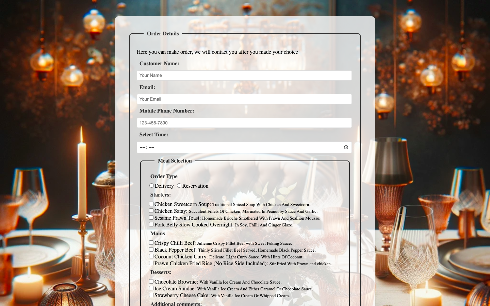
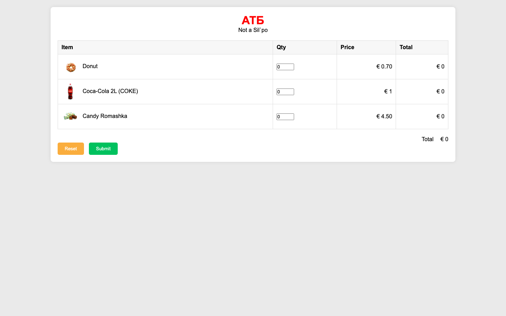

# Web Develenment Client-Side
**Module:** Web Develenment Client-Side `COMP H1035`  
**Lectorer:** Orla McMahon  
**Duration:** Semester 2 (Year 1)  
**Date:** January - May 2024  
**Credits:** 5 ECTS

> This module covers the basics of web development and the fundamentals of client-side web development. HTML, CSS, and JavaScript are the primary technologies used in this module. The module covers the structure and design of web pages, the use of CSS for styling, and the use of JavaScript for interactivity. The module includes practical activities to build and test web pages using HTML, CSS, and JavaScript. The primary goal is to develop an understanding of web development and its applications in real-world scenarios.

## Grades Breakdown
| **Assessment Type** | **Weighting** |
|---------------------|---------------|
| Weekly Labs | 30% |
| Assignment 1 (MCQ Test) | 20% |
| Assignment 2 (Project) | 50% |

## Table of Contents
- [Weeks](#weeks)
    - [Week 1 (Lab 1)](#week-1-lab-1-lab-revision): Lab Revision
    - [Week 2 (Lab 2)](#week-2-lab-2-basic-form-and-styling): Basic Form and Styling
    - [Week 3 (Lab 3)](#week-3-lab-3-form-and-styling): Form and Styling
    - [Week 4 (Lab 4)](#week-4-lab-4-javascript): JavaScript
    - [Week 5 (Lab 5)](#week-5-lab-5-javascript): JavaScript
    - [Week 6 (Lab 6)](#week-6-lab-6-javascript-and-jquery): JavaScript and jQuery
- [Project](#project)
    - [ATB Market](#atb-market)

## Weeks

### [Week 1 (Lab 1)](./week01/lab/): Lab Revision
[Brief](./week01/lab/web_development_client_side_week01_lab.pdf) | [Solutions (.html & .css)](./week01/lab/solution/)

This laboratory exercise is designed to revise the topics covered in the previous semester. The purpose of this lab session is to create a web page that includes topics for revision, flex boxes, links, and images.
1. Create html and css files named [index.html](./week01/lab/solution/index.html) and [styles.css](./week01/lab/solution/css/styles.css).
    
    - Create a web page with flex box, images, links, and a nav bar.
    - Insert a `<main>` in the body of the HTML document.
    - Insert three flex items using `div` tags.
        - The first flex item should have the class `flex1` and include 1 heading “Flex item 1”, followed by 2 paragraphs of text (use Lorem Ipsum).
        - The second flex item should have the class `flex2` and include 1 heading “Flex item 2”, followed by 1 paragraph of text (use Lorem Ipsum) and the [kingfisher.jpg](./week01/lab/solution/images/kingfisher.jpg) image from the images folder.
        - The third flex item should have the class `flex3` and include 1 heading “Flex item 3”, followed by 2 paragraphs of text (use Lorem Ipsum).
    - Style the page:
        - Ensure that the image width is set to 100% in the CSS.
        - Set the main flex container to:
            ```css
            background-color: lightgray;
            margin: 0.6rem;
            padding: 0.6rem;
            ```
        - Set the flex items to:
            ```css
            margin: 1rem;
            padding: 1rem;
            ```
        - Set each flex item to have a different color of background.
    - Insert Flex Rules:
        - Insert the two CSS properties that will turn the layout into a flex layout.
            - The flex property `display` is used to turn a normal layout into a flexbox layout. It should be applied to the flex container.
                ```css
                display: flex;
                ```
            - The flex property `flex` can be applied to the flex items to determine what proportion of space each flex item takes up.
                ```css
                flex: 1;
                ```
        - Apply the flex property to each of your flex items so that the `.flex2` takes up twice as much space as `.flex1` or `.flex3`.
    - Insert a nav bar:
        - Insert a horizontal nav bar underneath the header with the following options:
            - Home
            - Our Work
            - Publications
            - Gallery
            - Contact Us
            - Site Map
        - Use appropriate colors for the nav bar and provide a change of color for mouse overs.

### [Week 2 (Lab 2)](./week02/lab/): Basic Form and Styling
[Brief](./week02/lab/web_development_client_side_week02_lab.pdf) | [Solutions (.html & .css)](./week02/lab/solution/)

This laboratory exercise is designed to create a basic form and style it using CSS.
1. [contactForm.html](./week02/lab/solution/contactForm.html)
    
    - Add the following elements:
        - Title: Contact Us
        - H1: Contact Us
        - Fieldset with legend: Use the following form to send a message
    - Add the following under the paragraph that tells people to use the form to send a message:
        - Your email
        - Add an input box for the user’s email address using an `<input>` element. Ensure the type attribute has a value of email. You can also set the size of the form control and the maximum number of characters a user can enter.
    - Add a text area for the user’s message. The size of the text area is specified using the rows and cols attributes:
        ```html
        <textarea cols="50" rows="10"></textarea>
        ```
    - Add a select dropdown menu so that the user can tell you how they heard about us:
        ```html
        <select>
        <option>Google</option>
        <option>Local newspaper ad</option>
        <option>Friend</option>
        <option>Other</option>
        </select>
        ```
    - Add a checkbox to indicate whether the visitor wants to sign up for email updates. The checkbox should be selected by default:
        ```html
        <input type="checkbox" checked> Ensure this box is checked if you would like to receive email updates
        ```
    - Add submit and reset buttons at the end of the form.
    - When the person presses the Submit button, they should be sent to a page called [confirm.html](Lab2/confirm.html) that states:
        ```html
        Thank you for contacting us. We will email you shortly.
        ```
2. [contactForm.css](./week02/lab/solution/css/contactForm.css)
    - Form
        - Border
        - Width
        - padding
        - background-colour
    - Fieldset & legend
        - Blue border
        - Blue font color
    - `<class = “buttons”>`
        - margin
    - Remove the `<br>` from “Ensure ….” Put in a `<span>` tag
        - Style `<span>` tag – small font, red font color

### [Week 3 (Lab 3)](./week03/lab/): Form and Styling
[Brief](./week03/lab/web_development_client_side_week03_lab.pdf) | [Solutions (.html & .css)](./week03/lab/solution/)

This laboratory exercise is designed to design and create a form for a local restaurant that is doing take-away meals for customers.
1. HTML Form [index.html](./week03/lab/solution/index.html)
    
    - The form should contain the following details to allow the customer to place an order for collection:
        - Customer Name, email, mobile phone number
        - Details about starters, main courses, desserts, children’s menus, and specials User should be allowed to select more than one starter, main course, etc
    - The form should be designed to include the following in HTML:
        - Labels and Textfields
        - Radio Buttons
        - CheckBoxes
        - Data List
        - A text area so that the customer can enter some comments, eg not too spicy
        - Include appropriate FieldSets and Legends
    - Demonstrate the use of the following input attributes:
        - Autocomplete
        - Size
        - Maxlength
        - Autofocus
        - Placeholder
        - Required
    - Submit
        - When the user clicks on the submit button, a message should appear on the screen as follows:
            ```html
            Thank you for your order, please collect your order at 5pm
            ```
2. CSS Styling [styles.css](./week03/lab/solution/css/styles.css)
    - Image
        - Include an appropriate image as the background image.
    - Fieldsets and Legend
        - Ensure spacing is correct, padding and margins are correctly styled
        - Include a solid border with rounded corners
        - Use a different font and color for the legend
    - Radio and Checkboxes
        - Ensure that the text comes after the label in radio and checkboxes and that they are styled appropriately.
    - DataList
        - Ensure that they are styled appropriately.
    - Labels
        - Ensure the text area appears under the element
    - Inputs and Text Area
        - Input – set padding to appropriate em with a solid border
        - Width of email and text is 20em
        - Textarea should have a minimum height of 10em, appropriate padding, min width 100%, and a solid border
    - Submit Button
        - Customise the submit button to have a background color and text color.
    Large Screen Rules
        - Ensure that if the form is displayed on a large screen, it is centered
    - Focus
        - When a field is selected, include a shadow and background color on the focus.

### [Week 4 (Lab 4)](./week04/lab/): JavaScript
[Brief](./week04/lab/web_development_client_side_week04_lab.pdf) | [Solutions (.html & embed js)](./week04/lab/solution/)

This laboratory exercise is designed to use HTML and JavaScript to solve given exercises.
1. [console.html](./week04/lab/solution/console.html)
    
    - Create a new file called [console.html](./week04/lab/solution/console.html) with a Title “Arithmetic and Concatenation” and a Header “Tom and Mary”.
    - Use a script tag to embed JavaScript in the body of the document.
    - Create 4 variables – tomLN (value Smith), maryLN (value Jacobs), tomAge (value 30), and maryAge (value 25).
    - Using the variables above create four statements that will **log to the console** the following:
        1. Tom Smith is 30 years old
        2. Mary Jacobs is 25 years old
        3. Their combined age is 55
        4. Their children will have the last name SmithJacobs
2. [ifstmt.html](./week04/lab/solution/ifstmt.html)
    
    - Create a file called [ifstmt.html](./week04/lab/solution/ifstmt.html).
    - Add a title ‘Grade Check’.
    - Prompt the user to enter a student score and use an if statement to display a grade in the console based on the following criteria:
        - If the score is 80 or above, the grade is 'A'.
        - If the score is between 70 and 79, the grade is 'B+'.
        - If the score is between 60 and 69, the grade is 'B'.
        - If the score is between 50 and 59, the grade is 'C'.
        - If the score is between 40 and 49, the grade is 'D'.
        - If the score is below 40, the grade is 'F'.
3. [forloop.html](./week04/lab/solution/forloop.html)
    
    - Ask the user to input two numbers.
    - Using a for loop, calculate the sum of all numbers within the range defined by these two numbers (inclusive).
    - For example, if the user enters numbers 1 and 10 as the 2 numbers.
    - Compute the sum of all numbers between 1 and 10 inclusive.
    - Display the sum in the console.

### [Week 5 (Lab 5)](./week05/lab/): JavaScript
[Brief](./week05/lab/web_development_client_side_week05_lab.pdf) | [Solutions (.html & .js)](./week05/lab/solution/)

This laboratory exercise is designed to create a form that validates the user’s input.
1. [euroToUSD.html](./week05/lab/solution/euroToUSD.html), [euroToUSD.js](./week05/lab/solution/js/euroToUSD.js)
    
    - The purpose of this exercise is to convert Euro into US Dollars.
    - Create a form that will allow the user to enter a Euro amount.
    - Incorporate a 'Convert' button within the form. 
    - Upon clicking this button, the corresponding US Dollar amount will be presented below it.
    - Ensure that the JavaScript is written to an external file and that an input field is used to display the result.
    - The conversion rate is 1.09.
2. [euroConverter.html](./week05/lab/solution/euroConverter.html), [euroConverter.js](./week05/lab/solution/js/euroConverter.js)
    
    - Enhance exercise 1 by enabling users to choose the currency for conversion.
        - For instance, if the user opts for GBP and inputs an amount in euros, the corresponding amount in GBP will be presented.
    - Provide users with the option to select from the following currencies: British Pound (GBP), US Dollar (USD), Australian Dollar (AUD), and Japanese Yen (JPY).
    - Retrieve currency rates from Google for accurate conversion.
3. [waterUsage.html](./week05/lab/solution/waterUsage.html), [waterUsage.js](./week05/lab/solution/js/waterUsage.js)
    
    - The purpose of this exercise is to calculate the average water usage per day.
    - Create a form that allows the user to enter two numbers, Litres and No. of days.
    - When the user clicks the calculate button the average water usage is displayed.
    - Average = Litres / No. of Days
    - Ensure that the JavaScript code is saved in an external file.

### [Week 6 (Lab 6)](./week06/lab/): JavaScript and jQuery
[Brief](./week06/lab/web_development_client_side_week06_lab.pdf) | [Solutions (.html & .css & .js)](./week06/lab/solution/)

This laboratory exercise is designed to use JavaScript and jQuery to solve given exercises.
1. [shopCart.html](./week06/lab/solution/ex1/shopCart.html), [shopCart.js](./week06/lab/solution/ex1/js/shopCart.js), [shopCart.css](./week06/lab/solution/ex1/css/shopCart.css)
    
    - The purpose of this exercise is to allow the user to purchase various items.
    - The images and prices for each item should be displayed on a form.
    - It should also display the total cost of purchase per item and the overall total.
    - Create a Form that allows the user to purchase three items.
    - The form should display an image, price, quantity field, and total field for each item.
    - It should also display an overall total field.
    When the quantity is input, the total price for that particular item is displayed, and the grand total (at the bottom of the form) for all purchases.
    - When the user presses the submit button, an alert popup appears that displays the total amount.
    - The user must be able to select from at least 3 items.
    - HTML:
        - Create a form with appropriate buttons.
        - Insert headings and images.
        - Use CSS to align the items.
        - Show images associated with each item.
        - Display the price of each item in euros.
        - Create input boxes for the user to insert a quantity.
        - Create input boxes which are used to display a subtotal for each item.
        - Create an input box that is used to display the grand total.
        - Allow the user to enter the quantity they wish to buy (maximum quantity = 100).
        - When the user enters the quantity, a function is called which calculates the cost of buying the quantity entered * price of the item. This is displayed in the Total column.
        - The above process is repeated for each item when the user enters a quantity.
        - The grand total is continuously updated and is displayed in the final row of the output.
    - JavaScript:
        - Create the function which is called when the user enters a quantity in the form.
        - Set up the variables that you need --- price, quantity, and subtotal of each item.
        - For each item:
            - If the quantity entered is greater than zero, retrieve the value from the form.
            - Calculate the subtotal for the item.
            - Insert the subtotal for the item in the total column on the form.
        - Recalculate the grandTotal for each item and display it in the grandTotal field. (This grandTotal is continually updated).
        - Create a second function that is called when the user submits the form.
        - This function displays an alert box which states the amount due.
2. [jQueryexamples.html](./week06/lab/solution/ex2/jQueryexamples.html)
    
    - The purpose of this exercise is to demonstrate various jQuery selectors, events, and effects.
    - Use jQuery within one HTML file to achieve the following tasks.
    - Create a HTML file with heading text ‘Welcome to my Web Site’.
    - Add some paragraph text ‘Make me disappear’.
    - When the user clicks on ‘Make me disappear’, the text disappears.
    - Add an image (use an image from the Web, must be unique to you) and a button ‘Hide Image’ so that when the user clicks on this button the image disappears.
    - Add a second button ‘Show Image”, when the user clicks on this image, the image is displayed.
    - Add a panel with the Heading “w3Schools jQuery” with a lightgreen background.
    - When the user clicks on this panel a second panel appears displaying the text “Try out the great jQuery examples on our website”. (Refer to W3schools - jQuery Slide - `https://www.w3schools.com/jquery/jquery_slide.asp`).

### Week 7: Review Week
> No lectures or labs this week

### Week 8 (CA): MCQ Test
> Multiple Choice Questions (MCQ) Test covering all topics from Web Development Fundamentals (Semester 1) and Web Development Client Side, Lectures 1-7 inclusive.
> 
> **Volume** — 55 questions  
> **Worth** — 20%

## Project
This is have to be the final project for the module.

### [ATB Market](./assessment/01/)
**Deadline:** Tuesday, April 16, 2024

> [!IMPORTANT]  
> The project is located on [`project/year01/module-web_development_client_side/atb-market`](https://github.com/DanyilT/projects-in-university/tree/project/year01/module-web_development_client_side/atb-market) branch.  
> Please switch to this branch to see the project files.  
> The branch contains the implementation files, project assets, and the README for this standalone project.

[Brief](./assessment/01/web_development_client_side_assessment.pdf) | [Submission](./assessment/01/submission/project_link.txt)

This is copy real website [ATB Market](https://www.atbmarket.com). It's not actualy the copy, this is just a parody of the website. The website is made using HTML, CSS, and JavaScript.


> [!TIP]  
> You can visit this website project at the following links:  
> **Cloudflare Pages:** [web-development-client-side--atb-market](https://web-development-client-side--atb-market.pages.dev)

---

**More:**
> [!TIP]  
> Also you can find more my WebDev projects in my [WebDev repository](https://github.com/DanyilT/WebDev) on GitHub.
