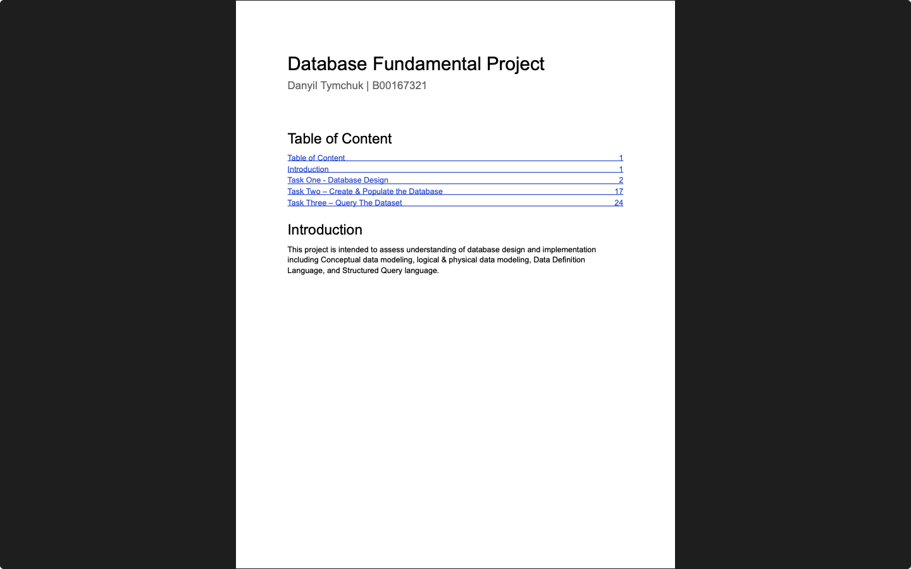
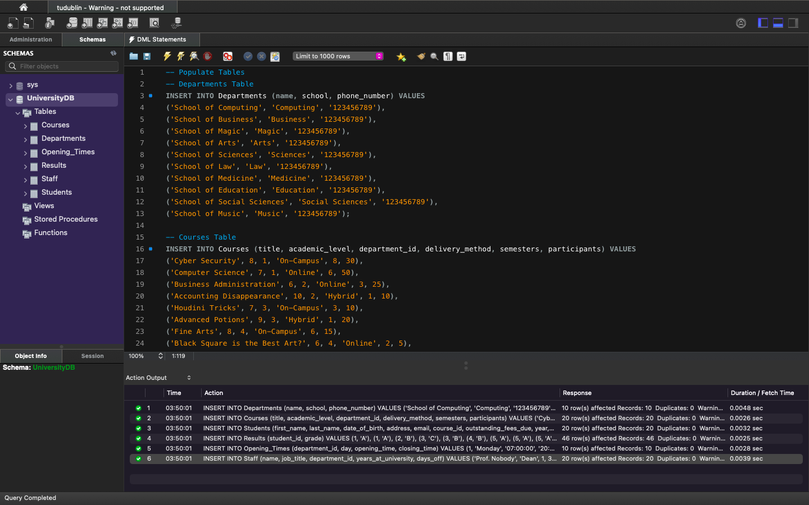
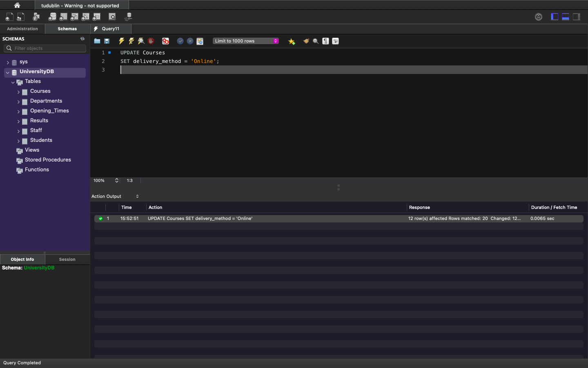
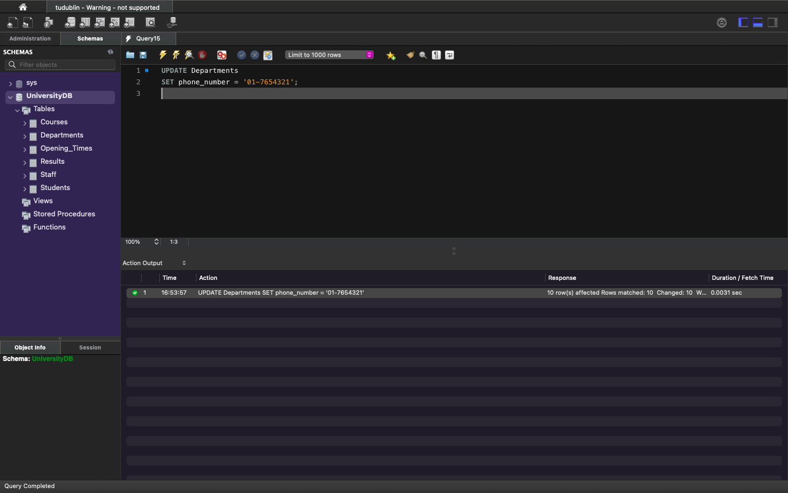

# Assessment 01 — Develop Database System for University Office
**Semester:** 03  
**Module:** Database Fundamentals  
**Weight:** 40%  
**Deadline:** 26th November 2024

This folder contains all files related to **Assessment 01** for the **Database Fundamentals** module.

> [!NOTE]  
> This assessment demonstrates comprehensive database design and implementation skills, from conceptual modeling through to complex SQL queries. The project involves designing a complete database system for a university office, including entity-relationship modeling, normalization, schema implementation, and advanced query writing.

## 📁 Assessment Folder Structure
```
assessment/
└── 01/
    ├── database_fundamentals_assessment.pdf
    └── submission/
        └── project_link.txt
```

## 📄 Assessment Brief
**Brief File:**  
[`database_fundamentals_assessment.pdf`](./01/database_fundamentals_assessment.pdf)

This assessment requires the design and implementation of a comprehensive database system for a university office. The project encompasses the full database development lifecycle:

**Key Requirements:**
- **Database Design:** Create conceptual, logical, and physical ERD models for a university office system
- **Normalization:** Apply normalization principles to ensure database integrity and eliminate redundancy
- **Implementation:** Develop DDL statements to create tables, define relationships, and enforce constraints
- **Data Management:** Write DML statements to populate the database with sample data
- **Query Development:** Create 20 complex SQL queries demonstrating various techniques including:
  - Multi-table joins
  - Aggregate functions and GROUP BY clauses
  - Subqueries and nested queries
  - Advanced filtering and conditional logic
  - Data retrieval optimization

**Database Entities Include:**
- Students and Student Enrollments
- Academic Programs and Courses
- Faculty and Staff Management
- Department Organization
- Course Schedules and Registrations

## ✔ My Submission
> 📸 **Assessment Screenshots**
**Main Overview:**

> 
> **Entity-Relationship Diagrams:**
> |  |  |  |
> | - | - | - |
> | Conceptual ERD | Logical ERD | Physical ERD |
>
> |  |
> | - |
> | Enhanced ER Diagram |
> 
> **Database Implementation:**
> |  |  |
> | - | - |
> | DDL Statements | DML Statements |
> 
> **Sample Queries (20 queries):**
> |  |  |  |  |  |
> | - | - | - | - | - |
> | Query 01 | Query 02 | Query 03 | Query 04 | Query 05 |
> |  |  |  |  |  |
> | Query 06 | Query 07 | Query 08 | Query 09 | Query 10 |
> |  |  |  |  |  |
> | Query 11 | Query 12 | Query 13 | Query 14 | Query 15 |
> |  |  |  |  |  |
> | Query 16 | Query 17 | Query 18 | Query 19 | Query 20 |
> 
> [View all 28 screenshots](../_screenshots/assessment/01/)

All my work for this assessment is located in a separate project branch.

```
submission/
└── project_link.txt
```

**Project Repository:**  
[`submission/project_link.txt`](./01/submission/project_link.txt)

- **Repository:** https://github.com/DanyilT/projects-in-university
- **Branch:** [`project/year02/module-database_fundamentals/develop-database-system-for-university-office`](https://github.com/DanyilT/projects-in-university/tree/project/year02/module-database_fundamentals/develop-database-system-for-university-office)

**Project Structure:**
- Complete ERD diagrams (Conceptual, Logical, Physical, and EER)
- DDL scripts for database schema creation
- DML scripts for sample data insertion
- 20 comprehensive SQL queries demonstrating various database operations
- Documentation and implementation notes

---

_✍️ Copy Dany_
