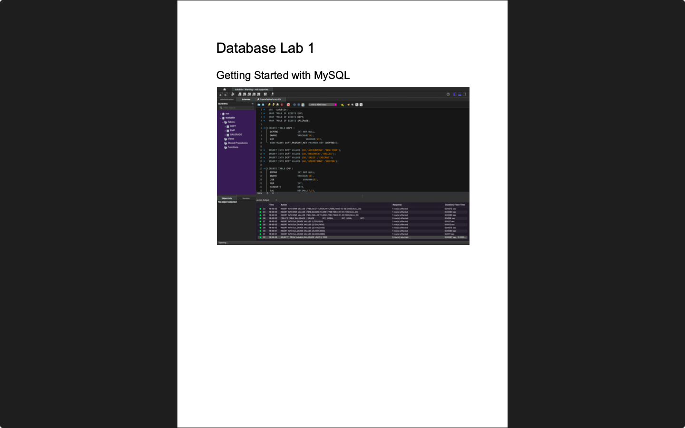

# Week 01 — Introduction to Database
**Semester:** 03  
**Module:** Database Fundamentals

This folder contains all work completed during Week 01 of the Database Fundamentals module

## 📁 Week Folder Structure
```
week01/
├── lab/
│   ├── database_fundamentals_week01_lab.pdf
│   ├── resources/
│   │   ├── CreateTablesForMySQL.sql
│   │   └── sql_server_and_workbench.pdf
│   └── solution/
│       ├── queries/
│       └── database_fundamentals_week01_lab_solution.pdf
└── README.md
```

> [!NOTE]  
> This is the first week of Database Fundamentals - Introduction to databases and SQL basics.

---

# 💾 Lab 01 — Introduction to Database and SQL
> 📸 **Lab Screenshot**  

> |  |
> | - |
> 
> [View all 2 screenshots](../_screenshots/week01/)

**Lab Brief:**  
This week's lab focuses on:
- Introduction to database concepts and terminology
- Setting up MySQL database environment
- Creating basic database tables
- Understanding primary keys and data types
- Writing basic SQL CREATE TABLE statements

📋 **Lab Brief Source:**  
[`lab/database_fundamentals_week01_lab.pdf`](./lab/database_fundamentals_week01_lab.pdf)

✔ **My Solution:**  
[`lab/solution/database_fundamentals_week01_lab_solution.pdf`](./lab/solution/database_fundamentals_week01_lab_solution.pdf)

🗃 **Resources:**  
[`lab/resources/`](./lab/resources/)
- [`CreateTablesForMySQL.sql`](./lab/resources/CreateTablesForMySQL.sql) — SQL table creation script
- [`sql_server_and_workbench.pdf`](./lab/resources/sql_server_and_workbench.pdf) — MySQL Server and Workbench setup guide

## 📁 Lab Folder Structure
```
lab/
├── database_fundamentals_week01_lab.pdf
├── resources/
│   ├── CreateTablesForMySQL.sql
│   └── sql_server_and_workbench.pdf
└── solution/
    ├── database_fundamentals_week01_lab_solution.pdf
    └── queries/
        └── CreateTablesForMySQL.sql
```

---

_✍️ Copy Dany_
