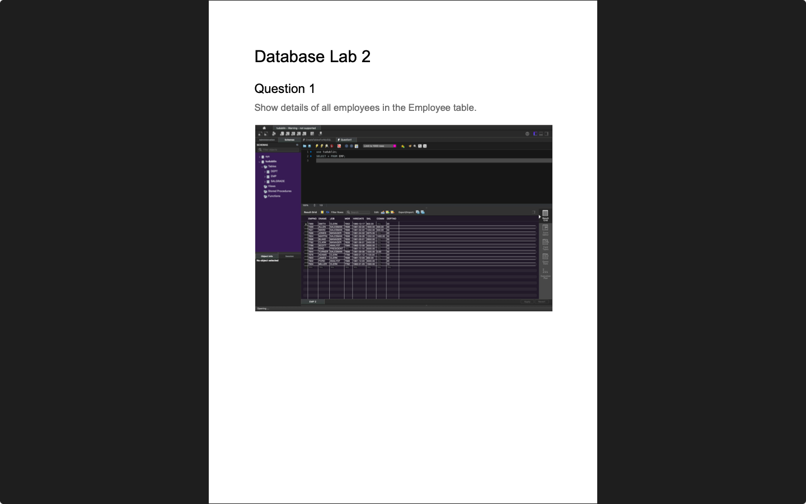
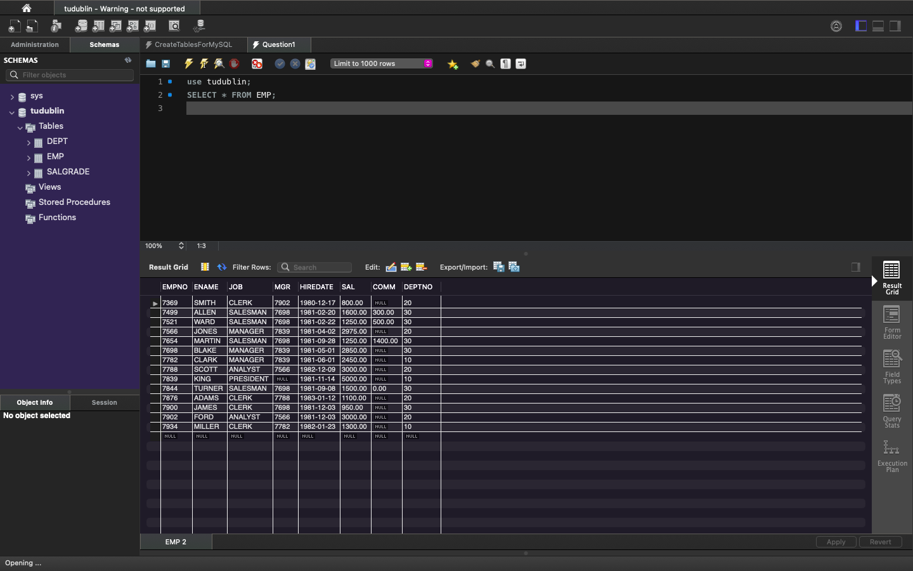
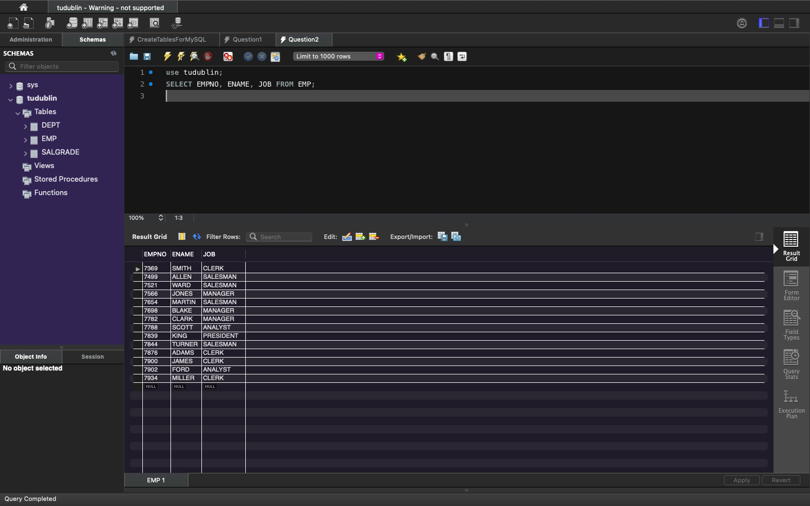

# Week 02 — SQL Queries and Data Manipulation
**Semester:** 03  
**Module:** Database Fundamentals

This folder contains all work completed during **Week 02** of the **Database Fundamentals** module.  
Each week may include the lab, resources, notes, and screenshots depending on the content of the module.

## 📁 Week Folder Structure
```
week02/
├── lab/
│   ├── resources/
│   └── solution/
│       ├── queries/
│       └── database_fundamentals_week02_lab_solution.pdf
├── resources/
└── README.md
```

> [!NOTE]  
> Introduction to SQL SELECT queries, WHERE clauses, and basic data manipulation.

---

# 💾 Lab 02 — SQL SELECT Queries and Filtering
> 📸 **Lab Screenshot**  
  
> |  |  |
> | - | - |
> 
> [View all 14 screenshots](../_screenshots/week02/)

**Lab Brief:**  
This week's lab focuses on:
- Writing basic SQL SELECT statements
- Using WHERE clauses for filtering data
- Working with comparison operators
- Using LIKE operator for pattern matching
- Ordering and limiting query results

📋 **Lab Brief Source:**  
[`lab/database_fundamentals_week02_lab.pdf`](./lab/database_fundamentals_week02_lab.pdf)

✔ **My Solution:**  
[`lab/solution/database_fundamentals_week02_lab_solution.pdf`](./lab/solution/database_fundamentals_week02_lab_solution.pdf)

**Solution Files:**
- [`lab/solution/`](./lab/solution/) — Complete solution folder
- [`lab/solution/queries/`](./lab/solution/queries/) — SQL query files
  - [`Question1.sql`](./lab/solution/queries/Question1.sql) — Basic SELECT query
  - [`Question2.sql`](./lab/solution/queries/Question2.sql) — SELECT with WHERE clause
  - [`Question3.sql`](./lab/solution/queries/Question3.sql) — Using comparison operators
  - [`Question4.sql`](./lab/solution/queries/Question4.sql) — Pattern matching with LIKE
  - [`Question5.sql`](./lab/solution/queries/Question5.sql) — Filtering numeric data
  - [`Question6.sql`](./lab/solution/queries/Question6.sql) — Multiple conditions
  - [`Question7.sql`](./lab/solution/queries/Question7.sql) — ORDER BY clause
  - [`Question8.sql`](./lab/solution/queries/Question8.sql) — LIMIT clause
  - [`Question9.sql`](./lab/solution/queries/Question9.sql) — Combined filters
  - [`Question10.sql`](./lab/solution/queries/Question10.sql) — Advanced filtering
  - [`Question11.sql`](./lab/solution/queries/Question11.sql) — Complex WHERE conditions
  - [`Question12.sql`](./lab/solution/queries/Question12.sql) — Date filtering
  - [`Question13.sql`](./lab/solution/queries/Question13.sql) — NULL value handling

🗃 **Resources:**  
[`lab/resources/`](./lab/resources/)
- [`CreateTablesForMySQL.sql`](./lab/resources/CreateTablesForMySQL.sql) — Database setup script

## 📁 Lab Folder Structure
```
lab/
├── database_fundamentals_week02_lab.pdf
├── resources/
│   └── CreateTablesForMySQL.sql
└── solution/
    ├── database_fundamentals_week02_lab_solution.pdf
    └── queries/
        ├── Question1.sql
        ├── Question2.sql
        ├── Question3.sql
        ├── Question4.sql
        ├── Question5.sql
        ├── Question6.sql
        ├── Question7.sql
        ├── Question8.sql
        ├── Question9.sql
        ├── Question10.sql
        ├── Question11.sql
        ├── Question12.sql
        └── Question13.sql
```

---

_✍️ Copy Dany_