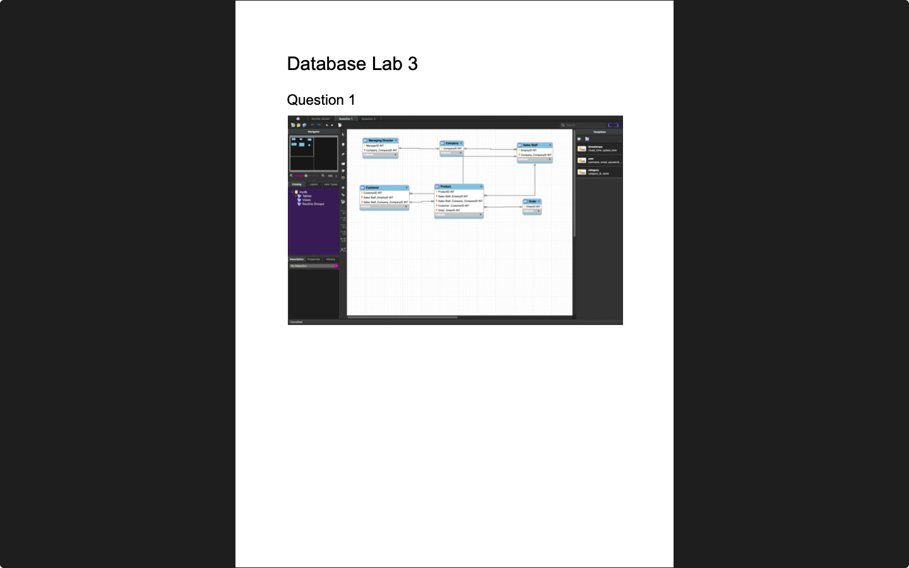
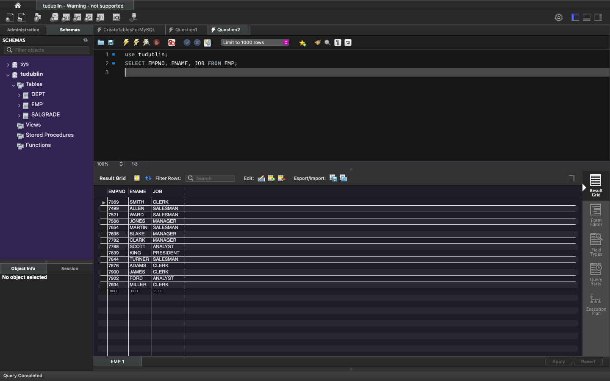

# Week 03 — Entity Relationship Models (ER-Models)
**Semester:** 03  
**Module:** Database Fundamentals

This folder contains all work completed during **Week 03** of the **Database Fundamentals** module.

## 📁 Week Folder Structure
```
week03/
├── lab/
│   ├── database_fundamentals_week03_lab.pdf
│   ├── teacher_solution/
│   │   └── database_fundamentals_week03_lab_teacher_solution.pdf
│   └── solution/
│       ├── diagrams/
│       └── database_fundamentals_week03_lab_solution.pdf
├── resources/
│   ├── erd_rules.pdf
│   └── good_practice_rules_for_constructing_entity_relationship_models.pdf
└── README.md
```

> [!NOTE]  
> Introduction to Entity Relationship Diagrams (ERD) and database design.

---

# 💾 Lab 03 — Create ERD’s using the GUI tool: MySQL workbench
> 📸 **Lab Screenshot**  

> |  |  |
> | - | - |
> 
> [View all 3 screenshots](../_screenshots/week03/)

**Lab Brief:**  
This week's lab focuses on:
- Understanding ER diagram components
- Creating entity relationship models
- Defining entities, attributes, and relationships
- Identifying cardinality and participation constraints
- Converting business requirements to ER diagrams

📋 **Lab Brief Source:**  
[`lab/database_fundamentals_week03_lab.pdf`](./lab/database_fundamentals_week03_lab.pdf)

🧑‍🏫 **Teacher's Solution:**  
[`lab/teacher_solution/database_fundamentals_week03_lab_teacher_solution.pdf`](./lab/teacher_solution/database_fundamentals_week03_lab_teacher_solution.pdf)

✔ **My Solution:**  
[`lab/solution/database_fundamentals_week03_lab_solution.pdf`](./lab/solution/database_fundamentals_week03_lab_solution.pdf)

**Solution Files:**
- [`lab/solution/`](./lab/solution/) — Complete solution folder
- [`lab/solution/diagrams/`](./lab/solution/diagrams/) — ER diagram files
  - [`Model.mwb`](./lab/solution/diagrams/Model.mwb) — MySQL Workbench model file
  - [`Question1.pdf`](./lab/solution/diagrams/Question1.pdf) — ER diagram for Question 1
  - [`Question2.pdf`](./lab/solution/diagrams/Question2.pdf) — ER diagram for Question 2

## 📁 Lab Folder Structure
```
lab/
├── database_fundamentals_week03_lab.pdf
├── teacher_solution/
│   └── database_fundamentals_week03_lab_teacher_solution.pdf
└── solution/
    ├── database_fundamentals_week03_lab_solution.pdf
    └── diagrams/
        ├── Model.mwb
        ├── Question1.pdf
        └── Question2.pdf
```

---

# 📚 Resources

## 📁 Resources Folder Structure
```
resources/
├── erd_rules.pdf
└── good_practice_rules_for_constructing_entity_relationship_models.pdf
```

### 📑 Resource Files
- [`erd_rules.pdf`](./resources/erd_rules.pdf) — Entity Relationship Diagram rules and conventions
- [`good_practice_rules_for_constructing_entity_relationship_models.pdf`](./resources/good_practice_rules_for_constructing_entity_relationship_models.pdf) — Best practices for ER modeling

---

_✍️ Copy Dany_
