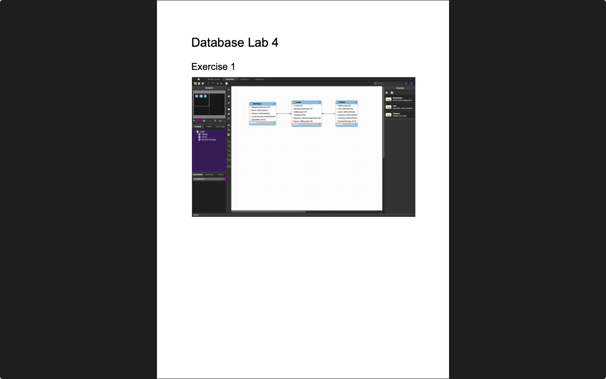
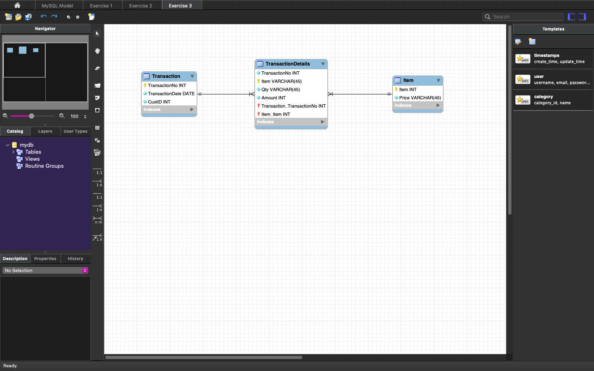

# Week 04 — Normalization
**Semester:** 03  
**Module:** Database Fundamentals

This folder contains all work completed during **Week 04** of the **Database Fundamentals** module.

## 📁 Week Folder Structure
```
week04/
├── lab/
│	├── database_fundamentals_week04_lab.pdf
│   ├── teacher_solution/
│   └── solution/
│		├── database_fundamentals_week04_lab_solution.pdf
│       └── diagrams/
├── resources/
│   ├── exercises/
│   └── normalisation.pdf
└── README.md
```

> [!NOTE]  
> Database normalization and normal forms (1NF, 2NF, 3NF).

---

# 💾 Lab 04 — Normalization Exercises
> 📸 **Lab Screenshot**  

> |  |  |  |
> | - | - | - |
> 
> [View all 4 screenshots](../_screenshots/week04/)

**Lab Brief:**  
This week's lab focuses on:
- Understanding database normalization
- Identifying functional dependencies
- Converting tables to 1NF, 2NF, 3NF
- Recognizing and eliminating anomalies
- Creating normalized database schemas

📋 **Lab Brief Source:**  
[`lab/database_fundamentals_week04_lab.pdf`](./lab/database_fundamentals_week04_lab.pdf)

🧑‍🏫 **Teacher's Solution:**  
- [`lab/teacher_solution/database_fundamentals_week04_lab_teacher_solution_exercise_1.pdf`](./lab/teacher_solution/database_fundamentals_week04_lab_teacher_solution_exercise_1.pdf)
- [`lab/teacher_solution/database_fundamentals_week04_lab_teacher_solution_exercise_2.png`](./lab/teacher_solution/database_fundamentals_week04_lab_teacher_solution_exercise_2.png)
- [`lab/teacher_solution/database_fundamentals_week04_lab_teacher_solution_exercise_3.pdf`](./lab/teacher_solution/database_fundamentals_week04_lab_teacher_solution_exercise_3.pdf)

✔ **My Solution:**  
[`lab/solution/database_fundamentals_week04_lab_solution.pdf`](./lab/solution/database_fundamentals_week04_lab_solution.pdf)

**Solution Files:**
- [`lab/solution/`](./lab/solution/) — Complete solution folder
- [`lab/solution/diagrams/`](./lab/solution/diagrams/) — Normalization diagram files
  - [`Model.mwb`](./lab/solution/diagrams/Model.mwb) — MySQL Workbench model file
  - [`Exercise1.pdf`](./lab/solution/diagrams/Exercise1.pdf) — Normalization exercise 1
  - [`Exercise2.pdf`](./lab/solution/diagrams/Exercise2.pdf) — Normalization exercise 2
  - [`Exercise3.pdf`](./lab/solution/diagrams/Exercise3.pdf) — Normalization exercise 3

## 📁 Lab Folder Structure
```
lab/
├── database_fundamentals_week04_lab.pdf
├── teacher_solution/
│   ├── database_fundamentals_week04_lab_teacher_solution_exercise_1.pdf
│   ├── database_fundamentals_week04_lab_teacher_solution_exercise_2.png
│   └── database_fundamentals_week04_lab_teacher_solution_exercise_3.pdf
└── solution/
    ├── database_fundamentals_week04_lab_solution.pdf
    └── diagrams/
        ├── Model.mwb
        ├── Exercise1.pdf
        ├── Exercise2.pdf
        └── Exercise3.pdf
```

---

# 📚 Resources

## 📁 Resources Folder Structure
```
resources/
├── exercises/
│   ├── normalization_exercise_1.pdf
│   └── normalization_exercise_1_solution.pdf
└── normalisation.pdf
```

### 📑 Resource Files
- [`normalisation.pdf`](./resources/normalisation.pdf) — Comprehensive guide to database normalization
- [`exercises/normalization_exercise_1.pdf`](./resources/exercises/normalization_exercise_1.pdf) — Practice exercise for normalization
- [`exercises/normalization_exercise_1_solution.pdf`](./resources/exercises/normalization_exercise_1_solution.pdf) — Solution to practice exercise

---

_✍️ Copy Dany_
