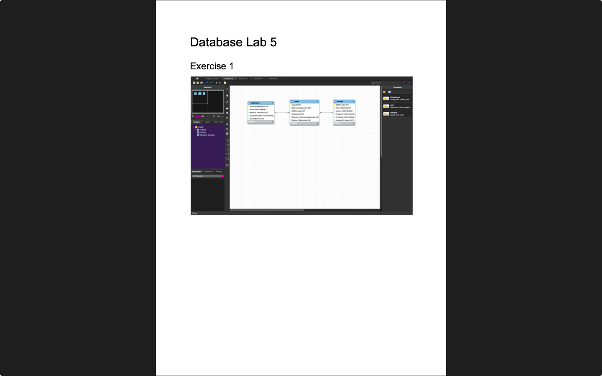

# Week 05 — SQL Functions
**Semester:** 03  
**Module:** Database Fundamentals

This folder contains all work completed during **Week 05** of the **Database Fundamentals** module.

## 📁 Week Folder Structure
```
week05/
├── lab/
│   ├── database_fundamentals_week05_lab.pdf
│   ├── teacher_solution/
│   │   └── database_fundamentals_week05_lab_teacher_solution.pdf
│   └── solution/
│       ├── database_fundamentals_week05_lab_solution.pdf
│       └── diagrams/
└── README.md
```

> [!NOTE]  
> SQL aggregate functions, string functions, and date functions.

---

# 💾 Lab 05 — SQL Functions
> 📸 **Lab Screenshot**  

> |  |  |
> | - | - |
> 
> [View all 5 screenshots](../_screenshots/week05/)

**Lab Brief:**  
This week's lab focuses on:
- Using SQL aggregate functions (COUNT, SUM, AVG, MIN, MAX)
- Working with string functions (CONCAT, SUBSTRING, UPPER, LOWER)
- Applying date and time functions
- Using GROUP BY and HAVING clauses
- Combining multiple functions in queries

📋 **Lab Brief Source:**  
[`lab/database_fundamentals_week05_lab.pdf`](./lab/database_fundamentals_week05_lab.pdf)

🧑‍🏫 **Teacher's Solution:**  
[`lab/teacher_solution/database_fundamentals_week05_lab_teacher_solution.pdf`](./lab/teacher_solution/database_fundamentals_week05_lab_teacher_solution.pdf)

✔ **My Solution:**  
[`lab/solution/database_fundamentals_week05_lab_solution.pdf`](./lab/solution/database_fundamentals_week05_lab_solution.pdf)

**Solution Files:**
- [`lab/solution/`](./lab/solution/) — Complete solution folder
- [`lab/solution/diagrams/`](./lab/solution/diagrams/) — SQL function diagram files
  - [`Model.mwb`](./lab/solution/diagrams/Model.mwb) — MySQL Workbench model file
  - [`Exercise1.pdf`](./lab/solution/diagrams/Exercise1.pdf) — SQL functions exercise 1
  - [`Exercise2.pdf`](./lab/solution/diagrams/Exercise2.pdf) — SQL functions exercise 2
  - [`Exercise3.pdf`](./lab/solution/diagrams/Exercise3.pdf) — SQL functions exercise 3
  - [`Exercise4.pdf`](./lab/solution/diagrams/Exercise4.pdf) — SQL functions exercise 4

## 📁 Lab Folder Structure
```
lab/
├── database_fundamentals_week05_lab.pdf
├── teacher_solution/
│   └── database_fundamentals_week05_lab_teacher_solution.pdf
└── solution/
    ├── database_fundamentals_week05_lab_solution.pdf
    └── diagrams/
        ├── Model.mwb
        ├── Exercise1.pdf
        ├── Exercise2.pdf
        ├── Exercise3.pdf
        └── Exercise4.pdf
```

---

_✍️ Copy Dany_
