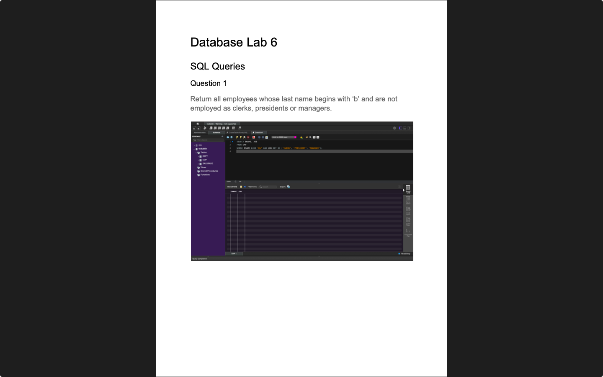

# Week 06 — SQL Joins
**Semester:** 03  
**Module:** Database Fundamentals

This folder contains all work completed during **Week 06** of the **Database Fundamentals** module.

## 📁 Week Folder Structure
```
week06/
├── lab/
│	├── database_fundamentals_week06_lab.pdf
│	├── resources/
│	│   └── CreateTablesforMySQL.sql
│	├── teacher_solution/
│	│   └── database_fundamentals_week06_lab_teacher_solutions.txt
│	└── solution/
│	    ├── database_fundamentals_week06_lab_solution.pdf
│	    └── queries/
├── resources/
│   └── sql_joins_detailed_overview.pdf
└── README.md
```

> [!NOTE]  
> SQL JOIN operations: INNER JOIN, LEFT JOIN, RIGHT JOIN, FULL JOIN, and CROSS JOIN.

---

# 💾 Lab 06 — SQL Joins
> 📸 **Lab Screenshot**  

> |  |  |
> | - | - |
> 
> [View all 13 screenshots](../_screenshots/week06/)

**Lab Brief:**  
This week's lab focuses on:
- Understanding different types of SQL joins
- Using INNER JOIN to combine tables
- Applying LEFT JOIN and RIGHT JOIN
- Working with multiple table joins
- Writing complex join queries with WHERE clauses

📋 **Lab Brief Source:**  
[`lab/database_fundamentals_week06_lab.pdf`](./lab/database_fundamentals_week06_lab.pdf)

🧑‍🏫 **Teacher's Solution:**  
[`lab/teacher_solution/database_fundamentals_week06_lab_teacher_solutions.txt`](./lab/teacher_solution/database_fundamentals_week06_lab_teacher_solutions.txt)

✔ **My Solution:**  
[`lab/solution/database_fundamentals_week06_lab_solution.pdf`](./lab/solution/database_fundamentals_week06_lab_solution.pdf)

**Solution Files:**
- [`lab/solution/`](./lab/solution/) — Complete solution folder
- [`lab/solution/queries/`](./lab/solution/queries/) — SQL join query files
  - [`Question1.sql`](./lab/solution/queries/Question1.sql) — SQL join query 1
  - [`Question2.sql`](./lab/solution/queries/Question2.sql) — SQL join query 2
  - [`Question3.sql`](./lab/solution/queries/Question3.sql) — SQL join query 3
  - [`Question4.sql`](./lab/solution/queries/Question4.sql) — SQL join query 4
  - [`Question5.sql`](./lab/solution/queries/Question5.sql) — SQL join query 5
  - [`Question6.sql`](./lab/solution/queries/Question6.sql) — SQL join query 6
  - [`Question7.sql`](./lab/solution/queries/Question7.sql) — SQL join query 7
  - [`Question8.sql`](./lab/solution/queries/Question8.sql) — SQL join query 8
  - [`Question9.sql`](./lab/solution/queries/Question9.sql) — SQL join query 9
  - [`Question10.sql`](./lab/solution/queries/Question10.sql) — SQL join query 10
  - [`Question11.sql`](./lab/solution/queries/Question11.sql) — SQL join query 11

🗃 **Resources:**  
[`lab/resources/`](./lab/resources/)
- [`CreateTablesforMySQL.sql`](./lab/resources/CreateTablesforMySQL.sql) — Database setup script

## 📁 Lab Folder Structure
```
lab/
├── database_fundamentals_week06_lab.pdf
├── resources/
│   └── CreateTablesforMySQL.sql
├── teacher_solution/
│   └── database_fundamentals_week06_lab_teacher_solutions.txt
└── solution/
    ├── database_fundamentals_week06_lab_solution.pdf
    └── queries/
        ├── Question1.sql
        ├── Question2.sql
        ├── Question3.sql
        ├── Question4.sql
        ├── Question5.sql
        ├── Question6.sql
        ├── Question7.sql
        ├── Question8.sql
        ├── Question9.sql
        ├── Question10.sql
        └── Question11.sql
```

---

# 📚 Resources

## 📁 Resources Folder Structure
```
resources/
└── sql_joins_detailed_overview.pdf
```

### 📑 Resource Files
- [`sql_joins_detailed_overview.pdf`](./resources/sql_joins_detailed_overview.pdf) — Comprehensive guide to SQL JOIN operations

---

_✍️ Copy Dany_
