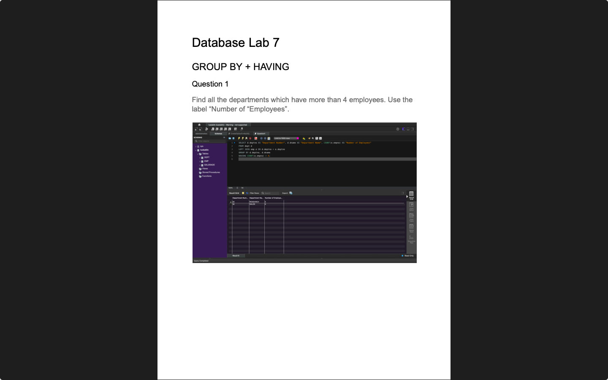

# Week 08 — SQL Revision
**Semester:** 03  
**Module:** Database Fundamentals

This folder contains all work completed during **Week 08** of the **Database Fundamentals** module.

## 📁 Week Folder Structure
```
week08/
├── lab/
│   ├── database_fundamentals_week08_lab.pdf
│   ├── solution/
│   │	├── database_fundamentals_week08_lab_solution.pdf
│   │   └── queries/
├── resources/
│   └── exercises/
└── README.md
```

> [!NOTE]  
> Comprehensive SQL revision covering all previous topics.

---

# 💾 Lab 07 — GROUP BY, HAVING and JOINS
> 📸 **Lab Screenshot**  

> |  |  |
> | - | - |
> 
> [View all 9 screenshots](../_screenshots/week08/)

**Lab Brief:**  
This week's lab focuses on:
- Reviewing SQL fundamentals
- Practicing complex queries
- Combining multiple SQL concepts
- Preparing for assessments
- Solving comprehensive SQL problems

📋 **Lab Brief Source:**  
[`lab/database_fundamentals_week08_lab.pdf`](./lab/database_fundamentals_week08_lab.pdf)

✔ **My Solution:**  
[`lab/solution/database_fundamentals_week08_lab_solution.pdf`](./lab/solution/database_fundamentals_week08_lab_solution.pdf)

**Solution Files:**
- [`lab/solution/`](./lab/solution/) — Complete solution folder
- [`lab/solution/queries/`](./lab/solution/queries/) — SQL revision query files
  - [`Question1.sql`](./lab/solution/queries/Question1.sql) — SQL query 1
  - [`Question2.sql`](./lab/solution/queries/Question2.sql) — SQL query 2
  - [`Question3.sql`](./lab/solution/queries/Question3.sql) — SQL query 3
  - [`Question4.sql`](./lab/solution/queries/Question4.sql) — SQL query 4
  - [`Question5.sql`](./lab/solution/queries/Question5.sql) — SQL query 5
  - [`Question6.sql`](./lab/solution/queries/Question6.sql) — SQL query 6
  - [`Question7.sql`](./lab/solution/queries/Question7.sql) — SQL query 7
  - [`Question8.sql`](./lab/solution/queries/Question8.sql) — SQL query 8

## 📁 Lab Folder Structure
```
lab/
├── database_fundamentals_week08_lab.pdf
└── solution/
    ├── database_fundamentals_week08_lab_solution.pdf
    └── queries/
        ├── Question1.sql
        ├── Question2.sql
        ├── Question3.sql
        ├── Question4.sql
        ├── Question5.sql
        ├── Question6.sql
        ├── Question7.sql
        └── Question8.sql
```

---

# 📚 Resources

## 📁 Resources Folder Structure
```
resources/
└── exercises/
    ├── exercise_1.pdf
    ├── exercise_1_solution.pdf
    └── exercise_1_solution.sql
```

### 📑 Resource Files
- [`exercises/exercise_1.pdf`](./resources/exercises/exercise_1.pdf) — SQL revision exercise 1
- [`exercises/exercise_1_solution.pdf`](./resources/exercises/exercise_1_solution.pdf) — Solution to exercise 1 (PDF)
- [`exercises/exercise_1_solution.sql`](./resources/exercises/exercise_1_solution.sql) — Solution to exercise 1 (SQL)

---

_✍️ Copy Dany_
