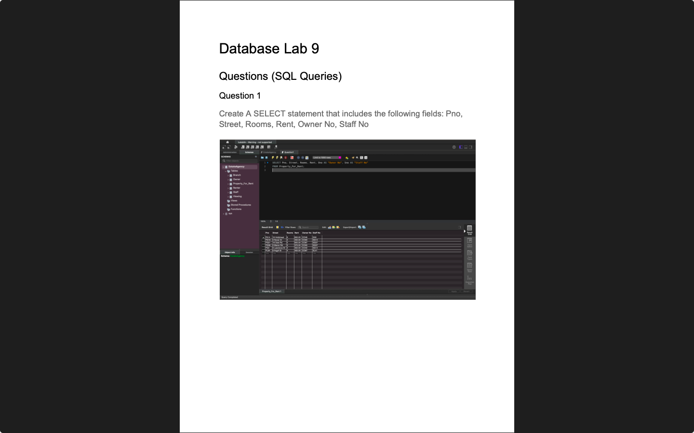

# Week 10 — Warehousing
**Semester:** 03  
**Module:** Database Fundamentals

This folder contains all work completed during **Week 10** of the **Database Fundamentals** module.

## 📁 Week Folder Structure
```
week10/
├── lab/
│   ├── database_fundamentals_week10_lab.pdf
│   ├── resources/
│   │   └── EstateAgency.sql
│   ├── teacher_solution/
│   │   ├── database_fundamentals_week10_lab_teacher_solution_1.pdf
│   │   └── database_fundamentals_week10_lab_teacher_solution_2.pdf
│   └── solution/
│       ├── database_fundamentals_week10_lab_solution.pdf
│       └── queries/
├── resources/
│   └── exercises/
└── README.md
```

> [!NOTE]  
> Data warehousing concepts and dimensional modeling. This week covers both Lab 9 and Lab 10.

---

# 💾 Lab 10 — Warehousing (Labs 9 & 10)
> 📸 **Lab Screenshot**  

> |  |  |
> | - | - |
> 
> [View all 13 screenshots](../_screenshots/week10/)

**Lab Brief:**  
This week's lab focuses on:
- Understanding data warehousing concepts
- Working with dimensional modeling
- Creating star and snowflake schemas
- Building fact and dimension tables
- Writing queries for data warehouses

📋 **Lab Brief Source:**  
[`lab/database_fundamentals_week10_lab.pdf`](./lab/database_fundamentals_week10_lab.pdf)

🧑‍🏫 **Teacher's Solution:**  
- [`lab/teacher_solution/database_fundamentals_week10_lab_teacher_solution_1.pdf`](./lab/teacher_solution/database_fundamentals_week10_lab_teacher_solution_1.pdf) — Lab 9 solution
- [`lab/teacher_solution/database_fundamentals_week10_lab_teacher_solution_2.pdf`](./lab/teacher_solution/database_fundamentals_week10_lab_teacher_solution_2.pdf) — Lab 10 solution

✔ **My Solution:**  
[`lab/solution/database_fundamentals_week10_lab_solution.pdf`](./lab/solution/database_fundamentals_week10_lab_solution.pdf)

**Solution Files:**
- [`lab/solution/`](./lab/solution/) — Complete solution folder
- [`lab/solution/queries/`](./lab/solution/queries/) — Warehousing query files
  - [`Question1.sql`](./lab/solution/queries/Question1.sql) — Warehousing query 1
  - [`Question2.sql`](./lab/solution/queries/Question2.sql) — Warehousing query 2
  - [`Question3.sql`](./lab/solution/queries/Question3.sql) — Warehousing query 3
  - [`Question4.sql`](./lab/solution/queries/Question4.sql) — Warehousing query 4
  - [`Question5.sql`](./lab/solution/queries/Question5.sql) — Warehousing query 5
  - [`Question6.sql`](./lab/solution/queries/Question6.sql) — Warehousing query 6
  - [`Question7.sql`](./lab/solution/queries/Question7.sql) — Warehousing query 7
  - [`Question8.sql`](./lab/solution/queries/Question8.sql) — Warehousing query 8
  - [`Question9.sql`](./lab/solution/queries/Question9.sql) — Warehousing query 9
  - [`Question10.sql`](./lab/solution/queries/Question10.sql) — Warehousing query 10
  - [`Question11.sql`](./lab/solution/queries/Question11.sql) — Warehousing query 11
  - [`Question12.sql`](./lab/solution/queries/Question12.sql) — Warehousing query 12

🗃 **Resources:**  
[`lab/resources/`](./lab/resources/)
- [`EstateAgency.sql`](./lab/resources/EstateAgency.sql) — Estate agency database setup script

## 📁 Lab Folder Structure
```
lab/
├── database_fundamentals_week10_lab.pdf
├── resources/
│   └── EstateAgency.sql
├── teacher_solution/
│   ├── database_fundamentals_week10_lab_teacher_solution_1.pdf
│   └── database_fundamentals_week10_lab_teacher_solution_2.pdf
└── solution/
    ├── database_fundamentals_week10_lab_solution.pdf
    └── queries/
        ├── Question1.sql
        ├── Question2.sql
        ├── Question3.sql
        ├── Question4.sql
        ├── Question5.sql
        ├── Question6.sql
        ├── Question7.sql
        ├── Question8.sql
        ├── Question9.sql
        ├── Question10.sql
        ├── Question11.sql
        └── Question12.sql
```

---

# 📚 Resources

## 📁 Resources Folder Structure
```
resources/
└── exercises/
    ├── exercise_3.pdf
    └── excersise_3_solution.pdf
```

### 📑 Resource Files
- [`exercises/exercise_3.pdf`](./resources/exercises/exercise_3.pdf) — Data warehousing exercise 3
- [`exercises/excersise_3_solution.pdf`](./resources/exercises/excersise_3_solution.pdf) — Solution to exercise 3

---

_✍️ Copy Dany_
