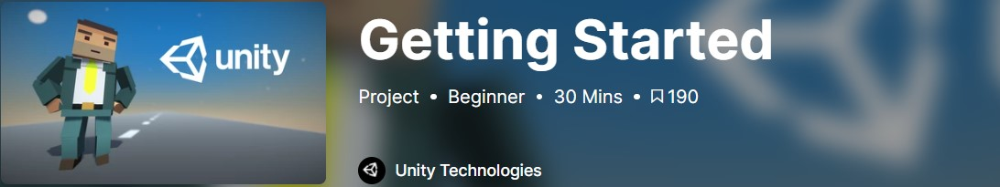
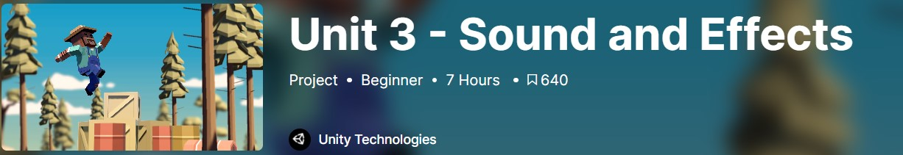
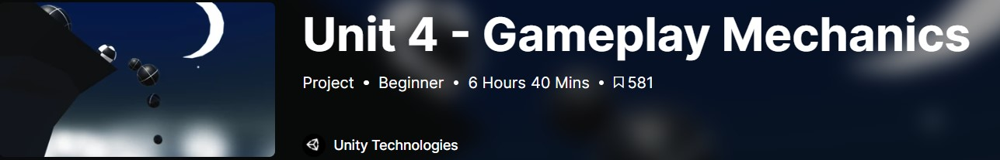
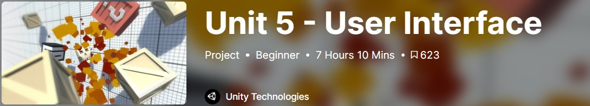

Overview
COMP H2033 Interactive Multimedia (IMM)

----------------------------------------------------------------------------------------------------------

CA breakdown for 2024/2025:

Course units 40% (5 x 8% each)
Alpha Submission 20%
Beta Submission 40%

Lectures:
1. Course outline
2. HCI (Human-Computer Interaction)
3. GitHub Submission Method (Setting up: GitHub, Unity Play)
4. Game Design
5. Ludology
6. Usability: Evaluation Methods
7. 3D Pipelines
    > [Button Menu Demo](https://github.com/TUD-RSmith/Lecture_Demo)  
    > This is a version of the demo provided in the lecture on 21/11/22. The URL provided in the code is no longer active, but the code works fine if the URL is changed.
8. Digital Realities

Practical Work:

```
The practical work for this module is divided into 5 units. Each unit is scheduled to be completed in a 2 week period. The challenge set out at the end of each unit should be uploaded to the submission links provided here before the end of each 2-week block in order to be graded. Be sure to submit the challenge and not the result of the lesson.

Despite the 2-week allocation, it is recommended that students try to complete each unit in a single week. This will allow some space in the second half of the semester for you to complete your assignment/project. It will also ensure that you have covered all new material before the project work really kicks in.

Each practical session will begin with a link, like the one below, that will redirect you to the learn.unity.com website. The getting started video below will guide you through downloading and installing unity3D on your own device. 
```

Week 01
[](https://learn.unity.com/project/getting-started?courseId=5cf96c41edbc2a2ca6e8810f)

Unit 1
[![Unit 1 - Player]](./resources/practical_work/unit_1/unit_1.jpg)(https://learn.unity.com/project/unit-1-driving-simulation?courseId=5cf96c41edbc2a2ca6e8810f)
> In this Unit, you will program a car moving side-to-side on a floating road, trying to avoid (or hit) obstacles in the way. In addition to becoming familiar with the Unity editor and workflow, you will learn how to create new C# scripts and do some simple programming. By the end of the Unit, you will be able to call basic functions, then declare and tweak new variables to modify the results of those functions.
[local](./resources/practical_work/unit_1/unit_1.pdf)
[local challenge](./resources/practical_work/unit_1/unit_1_challenge.pdf)
[local supported files (direct download)](./resources/practical_work/unit_1/unit_1_support_files_direct_download.zip)

Unit 2
[![Unit 2 - Basic Gameplay]](./resources/practical_work/unit_2/unit_2.jpg)(https://learn.unity.com/project/unit-2-basic-gameplay?courseId=5cf96c41edbc2a2ca6e8810f)
> In this Unit, you will program a top-down game with the objective of throwing food to hungry animals - who are stampeding towards you - before they can run past you. In order to do this, you will become much more familiar with some of the most important programming and Unity concepts, including if-then statements, random value generation, arrays, collision detection, prefabs, and instantiation. In completing this Unit, you will learn how to program a basic game with the ability to launch projectiles and maneuver the player to keep the game alive.
[local](./resources/practical_work/unit_2/unit_2.pdf)
[local challenge](./resources/practical_work/unit_2/unit_2_challenge.pdf)
[local supported files (direct download)](./resources/practical_work/unit_2/unit_2_support_files_direct_download.zip)

Unit 3
[](https://learn.unity.com/project/unit-3-sound-and-effects?courseId=5cf96c41edbc2a2ca6e8810f)
> In this Unit, you will program a fast-paced endless side-scrolling runner game where the player needs to time jumps over oncoming obstacles to avoid crashing. In creating this prototype, you will learn how to add music and sound effects, completely transforming the experience of your projects. You will also learn how to create dynamic endless repeating backgrounds, which are critical for any side-scrolling games. Finally, you will learn to incorporate particle effects like splatters and explosions, which make your games so much more satisfying to play.
[local](./resources/practical_work/unit_3/unit_3.pdf)
[local challenge](./resources/practical_work/unit_3/unit_3_challenge.pdf)
[local supported files (direct download)](./resources/practical_work/unit_3/unit_3_support_files_direct_download.zip)

Unit 4
[](https://learn.unity.com/project/unit-4-gameplay-mechanics?courseId=5cf96c41edbc2a2ca6e8810f)
> In this Unit, you will program an arcade-style Sumo battle with the objective of knocking increasingly difficult waves of enemies off of a floating island, using power ups to help defeat them. In creating this prototype, you will learn how to implement new gameplay mechanics into your projects, which are new rules or systems that make the game more interesting to play. On one hand, you will learn to program a powerup, which give the player a temporary advantage. On the other hand, you will learn to program increasingly difficult enemy waves, which make survival more challenging for the player. A good balance of powerups and increasing difficulty make for a much more interesting gameplay experience.
[local](./resources/practical_work/unit_4/unit_4.pdf)
[local challenge](./resources/practical_work/unit_4/unit_4_challenge.pdf)
[local supported files (direct download)](./resources/practical_work/unit_4/unit_4_support_files_direct_download.zip)

Unit 5 
[](https://learn.unity.com/project/unit-5-user-interface?courseId=5cf96c41edbc2a2ca6e8810f)
> In this Unit, you will program a game to test the player’s reflexes, where the goal is to click and destroy objects randomly tossed in the air before they can fall off the screen. In creating this prototype, you will learn how to implement a User Interface - or UI - into your projects. You will add a title screen with a difficulty select menu that will control how challenging the gameplay is, you will add a score display that will track how many points the player has earned, and you will add a Game Over screen, which will allow the player to restart and try again. In learning these skills, you will be able to create a fully “playable” experience that the user can enjoy from start to finish without having to restart the application to try it again.
[local](./resources/practical_work/unit_5/unit_5.pdf)
[local challenge](./resources/practical_work/unit_5/unit_5_challenge.pdf)
[local supported files (direct download)](./resources/practical_work/unit_5/unit_5_support_files_direct_download.zip)

Unit 6
[]
[unit_6](./resources/practical_work/unit_6/unit_6.pdf)

Next Step

https://learn.unity.com/mission/programming-systems-and-architecture?pathwayId=5f7e17e1edbc2a5ec21a20af
In this Junior Programmer mission, you’ll learn about data persistence, or how to manage the loading and unloading of data between both scenes and sessions. Along the way, you will be introduced to the core pillars of object-oriented programming, which will help you structure your code throughout the mission. There will only be one practical example throughout the mission, which will build on the new functionality you create with each tutorial. At the end of this mission, you’ll take everything you learned and apply it to a new project by building a persistent score system for a small game. Key details
You’re now over halfway through the Junior Programmer learning pathway!
This mission will take you approximately 5 hours to complete. Take it at your own pace — you’ll receive XP each step of the way.
Remember, you’re not alone: connect with the Unity community throughout the mission and check the Learn Live calendar for follow-along practical sessions with Unity established creators.
When you’ve finished the mission, you’ll get the mission badge for your profile and portfolio.
